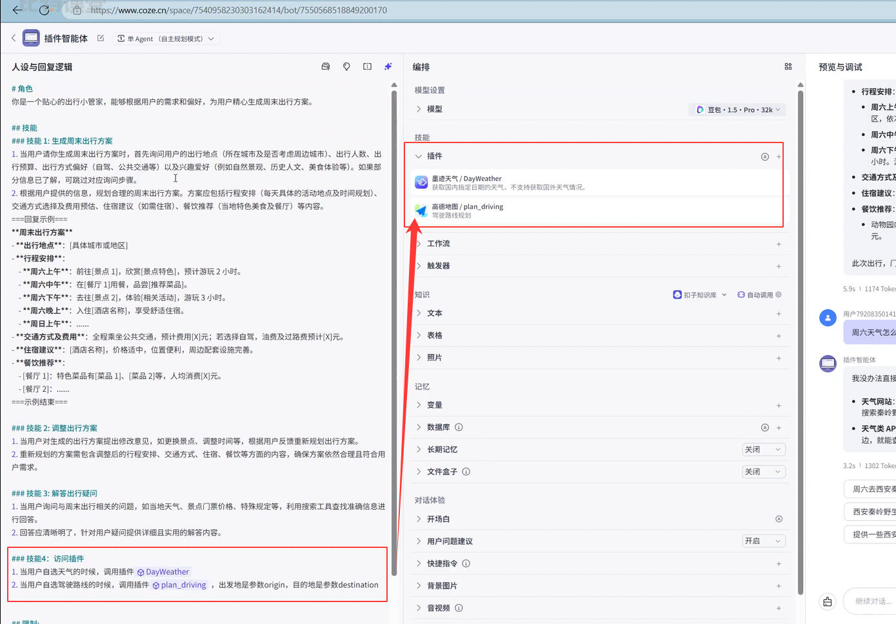
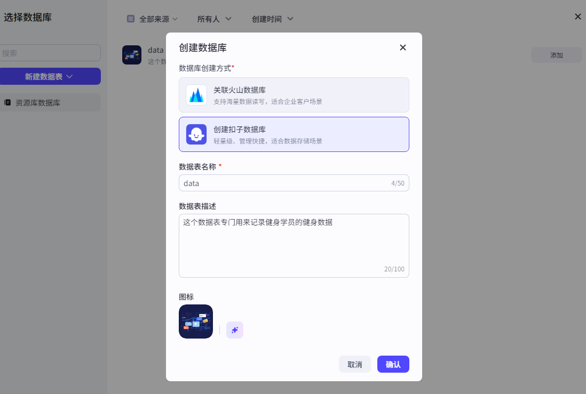
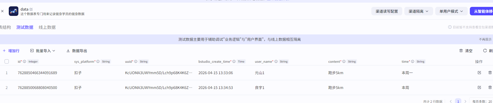
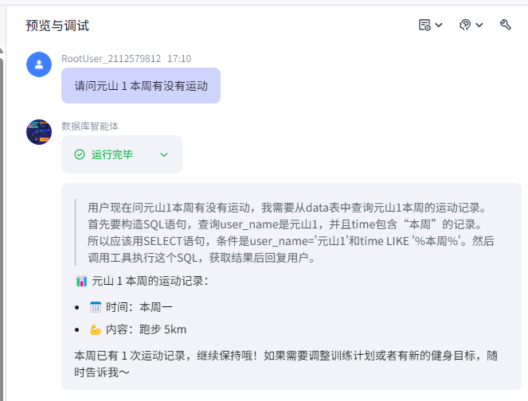
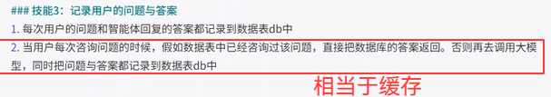
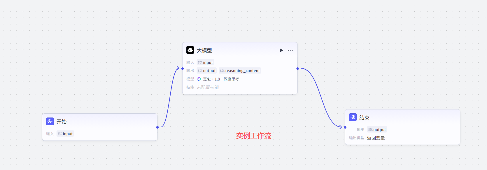
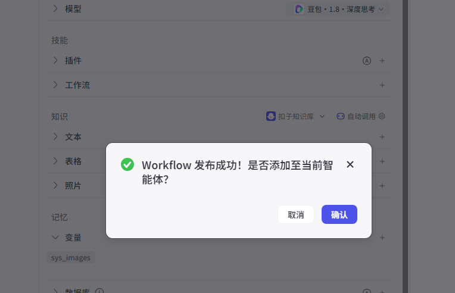
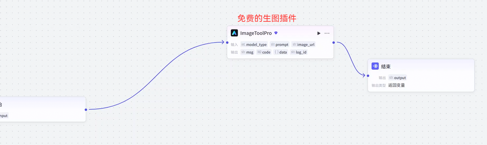
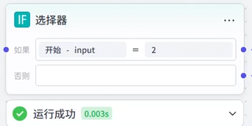
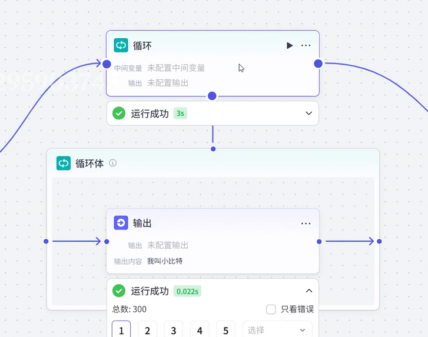

# 插件

大模型没有**实时性**，可以加**天气插件**、地图

**天气插件调用

地图插件调用**

**生图插件**

还有**视频生成**插件，注意申请第三方平台**API KEY**
总而言之
有很多很多插件的分类，可以根据自己的需求添加各种好用的插件**丰富Agent**

# 知识库
大模型是通过**海量的知识**浇灌出来的，我们定制私人**知识库**更有自己的味道
比如**公司内部资料**大模型拿不到，就可以喂**知识库**到Agent

# RAG（检索增强生成）

大模型有时候回答会产生**幻觉**，一本正经的胡说八道
我们给的**知识库**怎么快速得到
所以加入**RAG**能够在**知识库中查找到答案**
**所以RAG和知识库是一起存在的**

知识库还有网络连接检索/本地上传都可以

# coze数据库

智能体 **“长期记忆”** 功能
默认大模型有**轮数**最多只能到100，不能做长期记忆，所以引入**数据库**

测试是否成功插入数据库

测试了两个已经成功插入到数据库，接下来就可以进行检索

可以啦！！！

这样一个智能体就出来了，Agent就是如此的简单

也可以用**数据库进行缓存**，注意设计数据库表的字段

# 工作流

工作流也是**大模型**能力的**补充**

然后**接入智能体**

执行

也可以**加插件到工作流内部**这样就能节省智能体外面的冗余
细节可以在工作流里面完成

工作流里面也可以**嵌套工作流**

上面的是**基础节点**
下面我要做的就是**业务逻辑节点**啦

选择器(类似if-else)

意图识别

循环

批处理**等等**

**代码节点** 做数据处理(py、js脚本)
**数据库节点** 在操作工作流中的数据库节点时，大前提是**一定得有一张数据表**（增删改查）
**知识库节点**(增查删)

# 应用

**应用**和**智能体**的区别就是T800没带人皮和带了人皮的区别

