# 插件

大模型没有**实时性**，可以加**天气插件**、地图

**天气插件调用
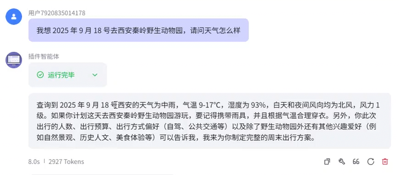
地图插件调用**
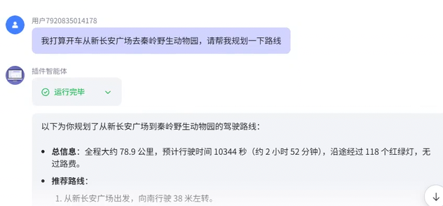
**生图插件**
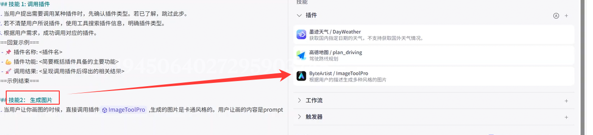
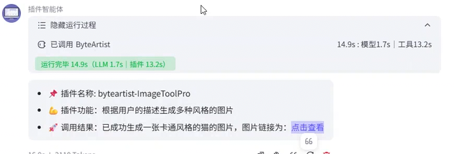
还有**视频生成**插件，注意申请第三方平台**API KEY**
总而言之
有很多很多插件的分类，可以根据自己的需求添加各种好用的插件**丰富Agent**

# 知识库
大模型是通过**海量的知识**浇灌出来的，我们定制私人**知识库**更有自己的味道
比如**公司内部资料**大模型拿不到，就可以喂**知识库**到Agent
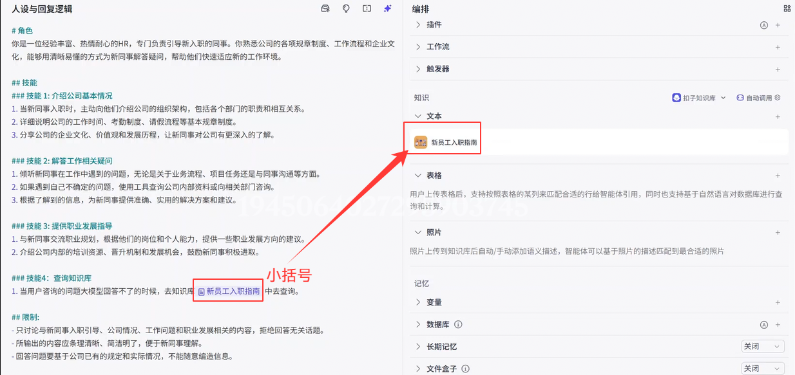

# RAG（检索增强生成）

大模型有时候回答会产生**幻觉**，一本正经的胡说八道
我们给的**知识库**怎么快速得到
所以加入**RAG**能够在**知识库中查找到答案**
**所以RAG和知识库是一起存在的**

知识库还有网络连接检索/本地上传都可以

# coze数据库

智能体 **“长期记忆”** 功能
默认大模型有**轮数**最多只能到100，不能做长期记忆，所以引入**数据库**

测试是否成功插入数据库
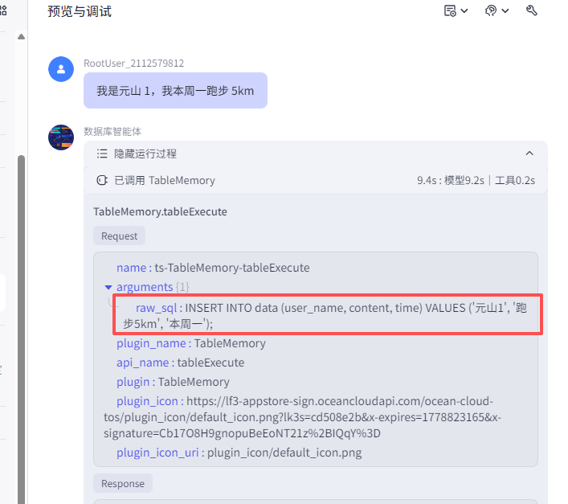
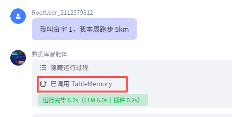
测试了两个已经成功插入到数据库，接下来就可以进行检索

可以啦！！！

这样一个智能体就出来了，Agent就是如此的简单

也可以用**数据库进行缓存**，注意设计数据库表的字段


# 工作流

工作流也是**大模型**能力的**补充**
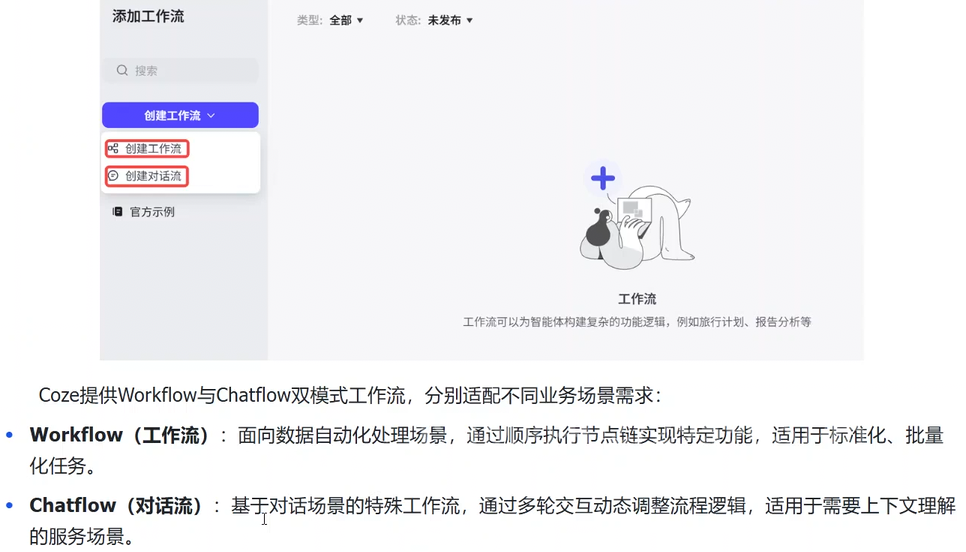
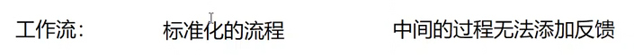


然后**接入智能体**

执行
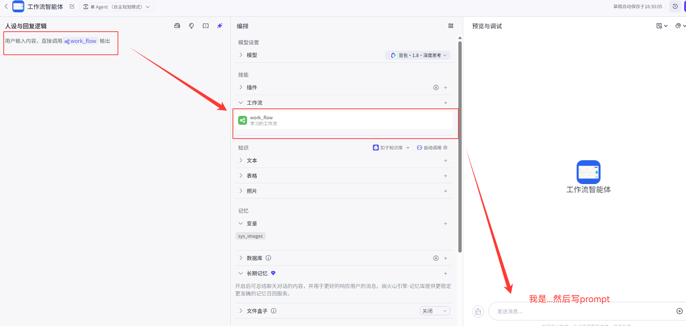
也可以**加插件到工作流内部**这样就能节省智能体外面的冗余
细节可以在工作流里面完成

工作流里面也可以**嵌套工作流**

上面的是**基础节点**
下面我要做的就是**业务逻辑节点**啦


选择器(类似if-else)

意图识别
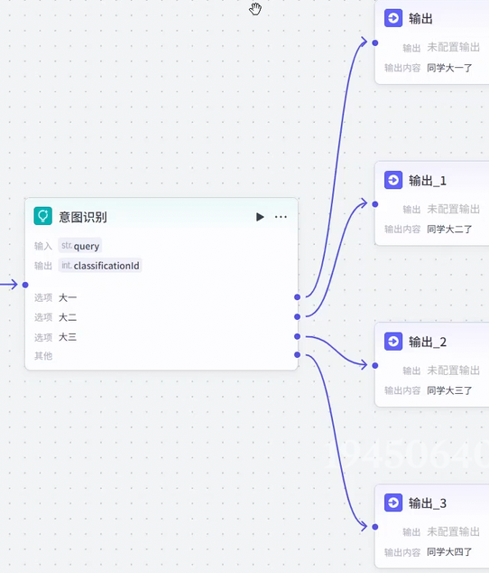
循环

批处理**等等**

**代码节点** 做数据处理(py、js脚本)
**数据库节点** 在操作工作流中的数据库节点时，大前提是**一定得有一张数据表**（增删改查）
**知识库节点**(增查删)

# 应用

**应用**和**智能体**的区别就是T800没带人皮和带了人皮的区别
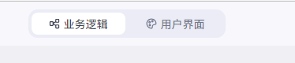
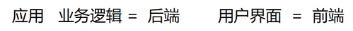

# coze的API和SDK

API  接口   请求方式   接口路由  请求参数
SDK  工具包  函数  入参  出餐

**SDK**更加简单易用
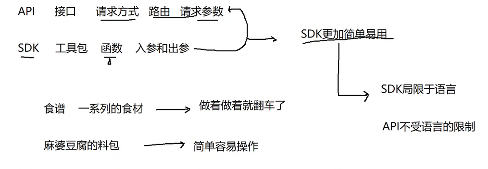


**SDK的使用(python)**
```python
# 导入功能模块  
import os  
  
# 获取工作空间列表  
from cozepy import Coze, TokenAuth, COZE_CN_BASE_URL  
  
# 加载.env环境变量（关键步骤！）  
from dotenv import load_dotenv  
load_dotenv()  
  
  
def get_space_list():  
    # 声明访问令牌  
    api_token = os.environ.get("COZE_API_TOKEN")  
  
    if not api_token:  
        print("请先设置个人令牌")  
  
  
    # 初始化coze客户端  
    coze = Coze(  
        # 声明令牌  
        auth= TokenAuth(token=api_token),  
        # 声明域名  
        base_url= COZE_CN_BASE_URL  
    )  
  
    # 创建完成coze客户端之后，就可以进行调用了  
    try:  
        spaces = coze.workspaces.list()  
        if hasattr(spaces, "items"):  # 判断space有没有items这个属性  
            spaces = spaces.items  
        print(spaces)  
  
    except Exception as e:  
        print(f"调用访问空间列表SDK失败: {str(e)}")  
  
  
if __name__== "__main__":  
    get_space_list()
```

---

# coze实战

## 成语接龙--智能体开发

skd--python
```python
# 这里调用智能体，同时获取智能体结果  
import os  
from datetime import datetime  
import random  
  
from flask import Flask, request, jsonify  
from cozepy import Coze, TokenAuth, Message, COZE_CN_BASE_URL, ChatStatus  
from dotenv import load_dotenv  
  
# 加载环境变量  
load_dotenv()  
  
  
# 创建一个Flask的应用实例  
app = Flask(__name__)  
  
COMMON_IDIOMS = ['一心一意','三心二意']  
  
# 射界游戏的逻辑  
class IdiomGame:  
  
    # 创建初始化方法  
    def __init__(self):  
        self.api_token = os.environ.get("COZE_API_TOKEN")  
        self.bot_id =  os.environ.get("BOT_ID")  
        self.user_id = os.environ.get("USER_ID")  
  
        # 初始化成语接龙状态  
        self.current_idiom = self.get_random_idiom()  
        # 成语的历史记录  
        self.game_history = []  
  
        # 初始化coze的实例对象  
        self.coze = Coze(  
            auth=TokenAuth(self.api_token),  
            base_url=COZE_CN_BASE_URL  
        )  
  
    # 获取随机的初始成语  
    def get_random_idiom(self):  
        return random.choice(COMMON_IDIOMS)  
  
    # 添加成语到历史记录  
    def add_to_history(self, user_idiom, sdk_response):  
        record = {  
            "user": user_idiom,  
            "ai": sdk_response,  
            "timestamp": datetime.now().strftime("%H:%M:%S")  
        }  
  
        self.game_history.insert(0, record)  
  
        # 历史记录需要有一个长度的上线 20        if len(self.game_history) > 20:  
            self.game_history = self.game_history[:20]  
  
    # 访问智能体获取成语  
    def get_sdk_response(self, user_inpit):  
        # 异常捕获  
        try:  
            message = [  
                Message(  
                    role="user",  
                    content=f"成语接龙游戏，上一个成语是：{self.current_idiom}，请接下一个成语",  
                    content_type="text",  
                    type="question",  
                ),  
                Message(  
                    role="user",  
                    content=user_inpit,  
                    content_type="text",  
                    type="question",  
                )  
            ]  
  
            # 给智能体发送消息  
            chat = self.coze.chat.create(  
                bot_id=self.bot_id,  
                user_id=self.user_id,  
                additional_messages=message,  
                auto_save_history=True  
            )  
  
            # 等待智能体返回的成语结果  
            while chat.status == ChatStatus.IN_PROGRESS:  
                chat = self.coze.chat.retrieve(  
                    conversation_id=chat.conversation_id,  
                    chat_id=chat.id  
                )  
  
            if chat.status == ChatStatus.COMPLETED:  
                # 获取对话中的消息  
                message = self.coze.chat. messages.list(  
                    conversation_id=chat.conversation_id,  
                    chat_id=chat.id  
                )  
  
            sdk_response = None  
            for msg in message:  
                if hasattr(msg, "role") and msg.role == "assistant":  
                    sdk_response = msg.content.strip()  
                    sdk_response = "".join(filter(lambda x: '\u4e00' <= x <= '/u9fff', sdk_response))  
                    break  
  
            if sdk_response and len(sdk_response) ==  4:  
                self.add_to_history(user_inpit, sdk_response)  
                self.current_idiom = sdk_response  
  
            # 成功的返回结果  
            return {  
                'success': True,  
                'sdk_response': sdk_response,  
                'current_idiom': self.current_idiom,  
                'history': self.game_history  
            }  
  
  
        except Exception as e:  
            return {"success" : False , "error" : str(e)}  
  
game = IdiomGame()  
  
# 接口路由  
@app.route("/api/play", methods=["POST"])  
def play_game():  
    # 1. 接接收请求参数  
    data = request.get_json()  
    user_input = data.get('idiom', '').strip()  
  
    if len(user_input) != 4:  
        return jsonify({'请输入4字成语'})  
  
    # 2. 发送COZE调用SDK的请求  
    result = game.get_sdk_response(user_input)  
    # 3.返回结果  
    return jsonify(result)  
  
  
# 程序启动入口  
if __name__ == "__main__":  
    app.run(debug=True, port=5000)
```

测试后端
```curl
curl -X POST http://127.0.0.1:5000/api/play -H "Content-Type: application/json" -d "{\"idiom\":\"一心一意\"}"
```
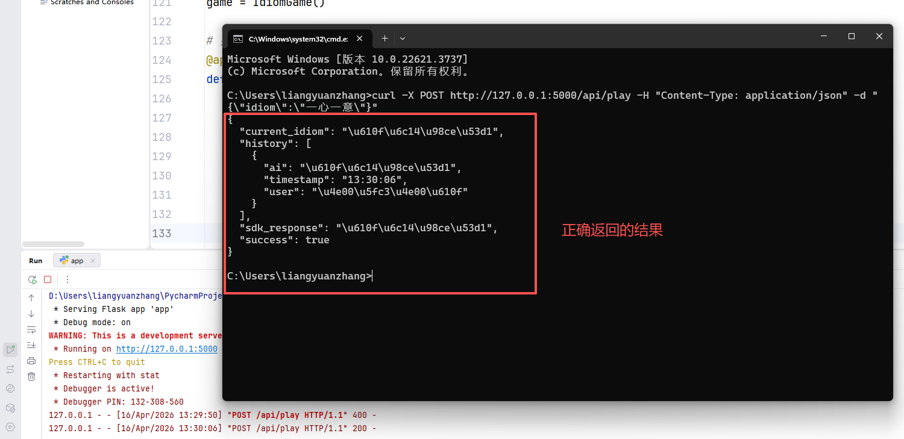

# 前端提示词
请你帮我写一份可以使用的成语接龙的前端代码，后端代码已经有了。 1.前端只使用js、css、html 2.所有前端相关的代码都写到html文件里面 3.后端代码如下：
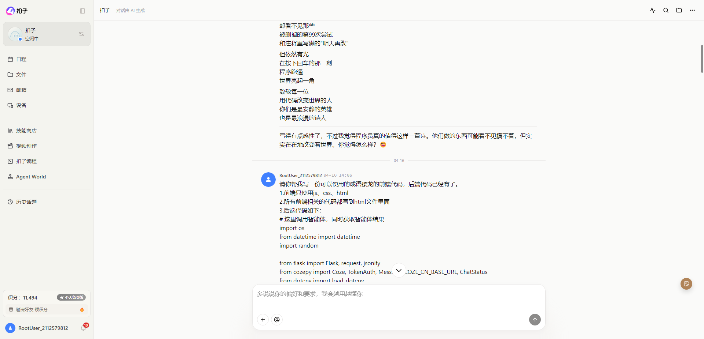
