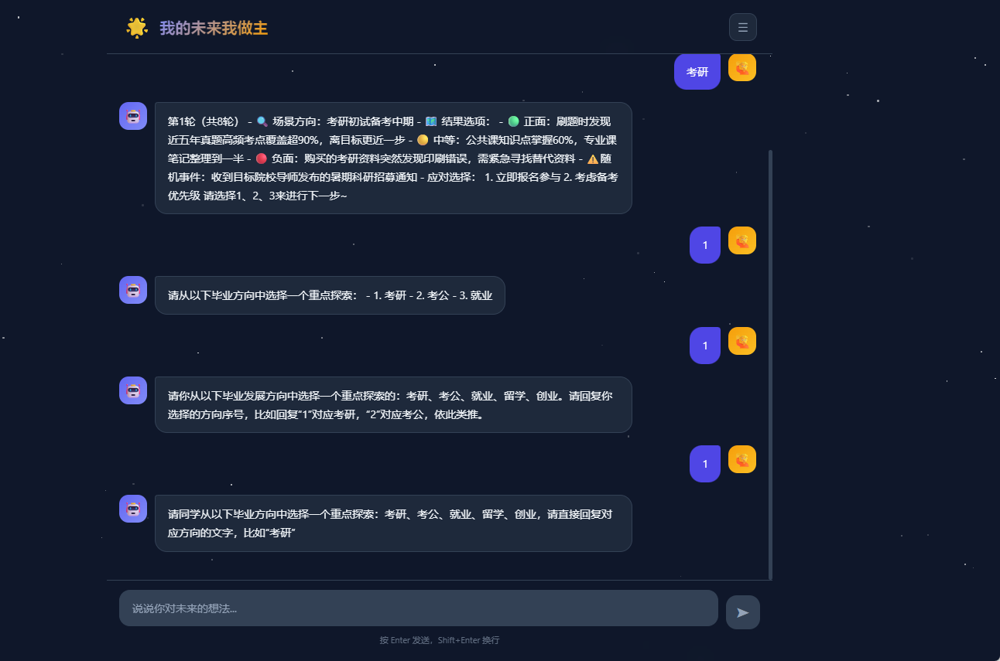

Coze系统体系此-->倾向于让AI生成第一版，再逐步去调试。 才是最大限度的利用了AI

# 回顾
在前面**成语接龙**的项目里
1.加载环境变量
2.初始化coze客户端
3..获取SDK响应
4.声明接口路由  post+json(推荐)
5.生成前端代码
6.整体的运行

创建完了**我的未来我做主**的智能体之后

就用python封装coze的**SDK**

到最后再部署一个**Web应用**

# 开始

1. 加载环境变量
2. 初始化coze客户端
3. 获取sdk的响应
4. 声明接口路由   post+json
5. 生成前端代码
6. 整体调试运行

用AI生成前端
：提示词
```txt
请你帮我写一份可以使用的成语接龙的前端代码，后端代码已经有了。 1.前端只使用js、css、html 2.所有前端相关的代码都写到html文件里面 3.后端代码如下：
```

**好像记不住前面的会话**
**之前的会话间断：没有记录会话ID**
**因为每次都去创建了一个新的会话**
**这种后面的选择基于前面的选择，每次都去建立新的会话不合适**


## 所以要做出改动
