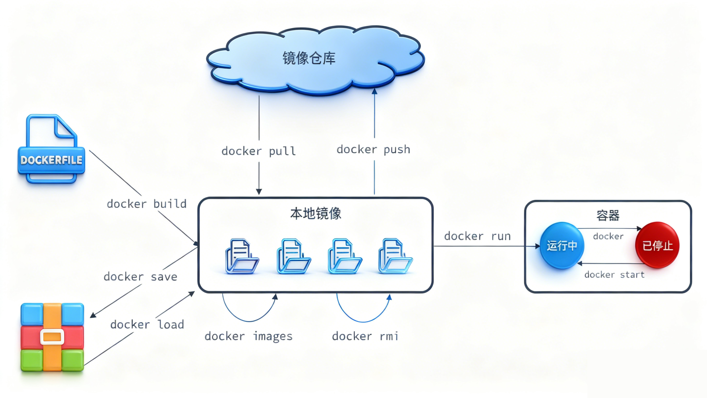

## 1.常见命令

Docker最常见的命令就是操作镜像、容器的命令，详见官方文档: https://docs.docker.com/

> [!NOTE] 注意
> docker run 和 docker start 的区别
> docker run 是创建并运行一个容器，多次运行就会创建多个容器
> docker start 只是启动而哦那个其而已

如图所示：


查看当前容器的运行状态： 
```powershell
docker ps -a
```
删除容器：
```powershell
docker rm
```
查看容器运行的日志：进行排错、查看异常
```powershell
docker logs
```
进入容器对容器内部进行一些修改：
```powershell
docker exec
```
简化查看容器状态
```powershell
docker ps --format "table {{.ID}}\t{{.Image}}\t{{.Ports}}\t{{.Status}}\t{{.Names}}"
```
命令别名--简化一些长命令
```powershell
vi ~/.bashrc

# 为查看容器状态添加别名 dps（格式化显示 ID、镜像、端口、状态、名称）
alias dps='docker ps --format "table {{.ID}}\t{{.Image}}\t{{.Ports}}\t{{.Status}}\t{{.Names}}"'

# 为查看镜像列表添加别名 dis（简化 docker images 命令）
alias dis='docker images'

# 简化完成后要想让其生效
source ~/.bashrc
```