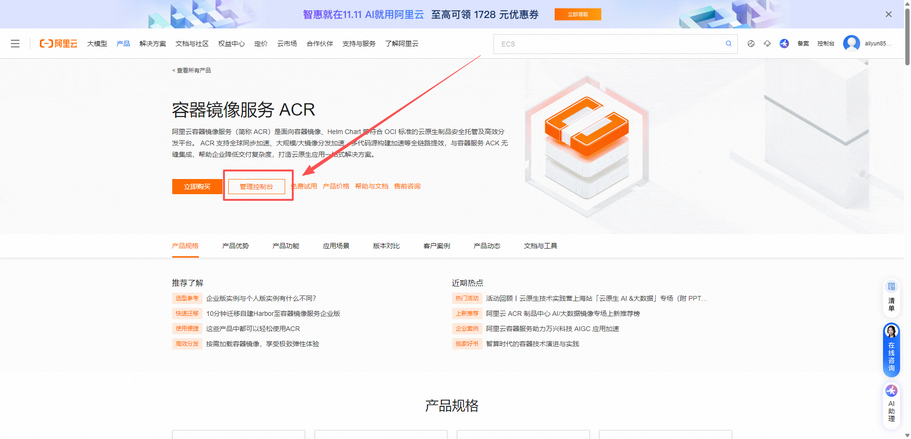
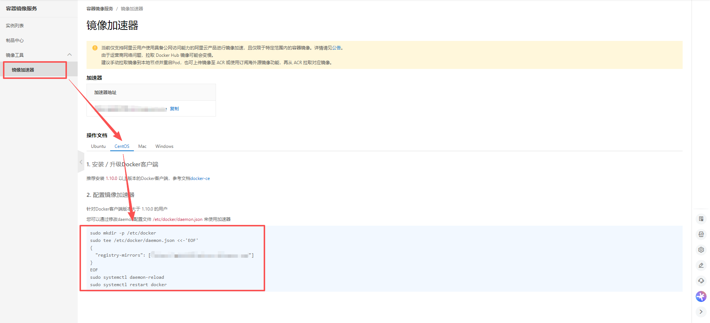
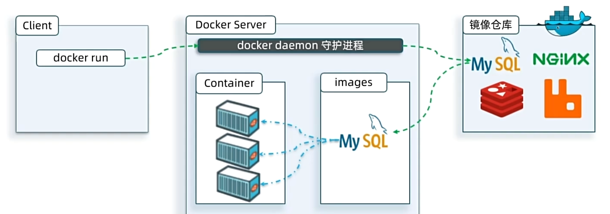

## 1.什么是Docker

**简单来说，就是帮助我们部署项目以及项目所依赖的各种各样的组件，就是一个简单的运维工具**

## 2. Linux（Centos 7）下安装Docker
```powershell
# 1. 卸载旧版本 Docker（若有）
yum remove -y docker \
  docker-client \
  docker-client-latest \
  docker-common \
  docker-latest \
  docker-latest-logrotate \
  docker-logrotate \
  docker-engine

# 2. 安装依赖工具
yum install -y yum-utils curl

# 3. 备份并替换系统基础源（解决 CentOS 7 源失效问题）
mkdir -p /etc/yum.repos.d/bak && mv /etc/yum.repos.d/*.repo /etc/yum.repos.d/bak/
curl -o /etc/yum.repos.d/CentOS-Base.repo https://mirrors.aliyun.com/repo/Centos-7.repo  # CentOS 7 用这个
# curl -o /etc/yum.repos.d/CentOS-Base.repo https://mirrors.aliyun.com/repo/Centos-8.repo  # CentOS 8 用这个
# curl -o /etc/yum.repos.d/CentOS-Base.repo https://mirrors.aliyun.com/repo/Centos-9.repo  # CentOS 9 用这个

# 4. 添加阿里云 Docker 国内源（稳定不超时）
yum-config-manager --add-repo http://mirrors.aliyun.com/docker-ce/linux/centos/docker-ce.repo

# 5. 清理缓存并生成新缓存
yum clean all && yum makecache fast

# 6. 安装最新版 Docker（包含 docker-ce、cli、容器运行时等）
yum install -y docker-ce docker-ce-cli containerd.io docker-buildx-plugin docker-compose-plugin

# 7. 启动 Docker 并设置开机自启
systemctl start docker
systemctl enable docker

# 8. 验证安装成功（输出版本即生效）
docker --version
docker compose version  # 验证 docker-compose 插件
```
### 配置阿里镜像加速

+ **点击[容器镜像服务 ACR - 云原生制品全生命周期管理 - 阿里云 (aliyun.com)](https://www.aliyun.com/product/acr?spm=5176.30371578.J_XmGx2FZCDAeIy2ZCWL7sW.24.77bf154a7RIKFp&scm=20140722.S_product@@%E4%BA%91%E4%BA%A7%E5%93%81@@88099._.RL_%E5%AE%B9%E5%99%A8-LOC_2024NSProductLink-OR_ser-PAR1_213e019517636573596663026eef97-V_4-RE_productNew-P0_1-P1_0-PAR2_descAbNew)**

+ 执行以下命令即可完成镜像加速


## 3. 用Docker部署MySQL
+ 先停掉虚拟机中的MySQL，确保你的虚拟机安装好了Docker，且网络开通情况下，执行下面命令即可安装MySQL
```powershell
docker run -d \
--name mysql \
-p 3306:3306 \
-e TZ=Asia/Shanghai \
-e MYSQL_ROOT_PASSWORD=123 \
mysql
```

**Docker的镜像能够忽略操作系统的环境，忽略系统本身的差异而去直接部署
Docker会在运行镜像时创建一个隔离环境，称为==容器(container)==**

## 4.镜像和镜像仓库

**镜像：就是包含应用运行所需要的环境、配置、系统函数库。
镜像仓库:存储和管理镜像的平台，Docker官方维护了一个公共仓库:[Docker Hub](https://hub.docker.com/)**


## 5.命令解读

```powershell
docker run -d \
  --name mysql \
  -p 3306:3306 \
  -e TZ=Asia/Shanghai \
  -e MYSQL_ROOT_PASSWORD=123 \
  mysql
```
+ docker run : 创建并运行一个容器，-d 是让容器在后台运行
+ --name mysql : 给容器起名字，唯一
+ -p 