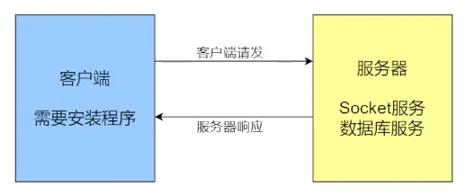
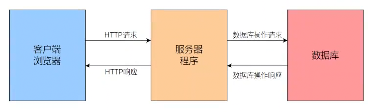

# 技术选型

| 技术分类           | 具体技术栈                                  |
| -------------- | -------------------------------------- |
| 前端技术           | vue3、html、JavaScript、scss、element plus |
| 服务架构           | Spring Cloud 微服务架构                     |
| 代理服务器          | Nginx                                  |
| 分布式任务调度中心      | Xxl-Job                                |
| 注册与发现中心 / 配置中心 | Nacos                                  |
| 服务间调用          | OpenFeign                              |
| 网关             | Spring Cloud Gateway                   |
| 数据存储           | MySQL                                  |
| 数据库持久层         | MyBatis/MyBatis-Plus                   |
| 缓存             | Redis                                  |
| 消息队列           | rabbitMQ                               |
| 搜索引擎           | ElasticSearch                          |
| 加密算法           | Bcrypt                                 |
| 身份认证           | JWT                                    |
| 代码沙箱           | Docker                                 |
| 对象存储           | OSS                                    |
| 短信服务           | 阿里云短信服务                                |

# 开发环境

Windows - 10/11
后端：
+ idea 社区版 2022.1.4
+ JDK17
+ SpringBoot 3 （3.0.1）
+ SpringCloud
+ docker
前端：
+ Node.js 18.3 或以上
部署环境：
+ 开发完成后再说

# 系统架构-CS与BS架构
## CS架构
Client客户端-Socket服务器

特点：
+ 必须要安装客户端程序，不同的应用需要安装不同的客户端程序
+ 客户端不能处理才会请求服务器
+ 客户端承担更多的业务逻辑，可以直接操作数据库等服务
例如：QQ、微信、王者荣耀

优点：
+ 大部分业务都可以在客户端完成，充分利用本地计算机资源
+ 相应速度快
+ 个性化定制能力强
+ 对信息安全的控制能力强
缺点：
+ 需要安装客户端才能使用
+ 维护成本高，不同版本客户端可能需要不同的维护策略

## BS架构
浏览器(browser)-服务器架构

特点：
+ 客户端是浏览器，不同的BS架构的应用客户端是同一个，并且都是浏览器
+ 客户端不处理任何的业务逻辑，所有业务逻辑交给服务器处理，如果操作第三方的组件或者服务也是通过服务器进行操作的
例如：学习的官网

优点：
+ 哭护短零维护，只安装一个浏览器即可，维护成本低
+ 所有业务集中在服务器端，乐舞扩展方便
缺点：
+ 服务器安全与业务处理能力需要花费很大成本
+ 不同浏览器支持不尽人意

## 如何选择

 CS架构
+ 实时交互性强的业务，比如在线游戏、实时监控等
+ 个性化定制业务，企业内部的办公系统，特定行业专业软件
+ 网络带宽受限的环境

BS架构
+ 简化客户端的维护和部署
+ 能够快速的更新迭代
+ 快速的推广

## 针对我们的系统

使用浏览器操作完全足够
用户一般会使用电脑使用我们的系统，浏览器的支持相对较好
目前没有太多定制化的业务
能够快速推广，降低用户使用的门槛

**所以选择BS架构**

# 为什么要选择微服务架构呢

## 单体
+ 可扩展性差，规模不断扩大，各个业务耦合度大
+ 技术栈受限，单体通常使用单一技术栈，无法充分利用团队技术专长和现有资源，浪费
+ 可靠性问题，单体钟一个模块故障可能导致整个应用崩溃

## 集群
+ 资源利用率低，资源分配和管理通常较为集中，可能导致资源分配不够灵活，无法满足各个服务或者应用的实际需求
+ 容错与隔离性不足，各个业务耦合度大，组件之间的紧密耦合使故障传播可能性增加
+ 部署与升级复杂，需要协调多个组件或节点，可能导致复杂性和风险增加

## 分布式架构
+ 高耦合度，分布式对于服务的拆分，往往粗粒度，这使得各个业务的耦合问题并没有解决，限制了系统的灵活性和扩展性
+ 容错与隔离性不足，由于耦合大，组件之间紧密依赖，故障传播也大

## 微服务架构优势

和上面架构相比，进行了更细粒度的垂直拆分
+ 易于开发和维护
+ 容错性高
+ 扩展性好
+ 技术选型灵活

## 划分我们的系统

+ 按照业务划分

|服务名称|具体功能|
|---|---|
|后台数据管理|题库管理、竞赛管理、C 端用户管理、定时任务管理|
|用户服务|登录、注册、退出登录、个人中心、我的竞赛、我的消息|
|题库竞赛服务|题库列表、竞赛列表、竞赛报名、查看排名、竞赛或者刷题时题目切换、提交代码、运行代码、获取代码执行结果|

+ 按照技术划分

|服务名称|具体功能|拆分原因（不包含原有服务）|
|---|---|---|
|网关服务|统一的权限控制，统一的请求入口动态路由转发等|功能即原因|
|后台数据管理服务|题库管理、竞赛管理、C 端用户管理、定时任务管理||
|定时任务服务|定时任务增删改查、定时任务功能实现|从技术的角度分析定时任务的执行可能需要和多个服务配合完成。并且定时任务的执行可能会周期性或长时间占用资源。那么我们可以将定时任务管理拆分出来。|
|登录注册服务|登录、注册|可能需要与第三方的认证服务进行交互，存在性能瓶颈|
|用户服务|登录、注册、退出登录、个人中心、我的竞赛、我的消息||
|消息服务|发送消息，接收消息|消息种类较多，短信、站内信、邮件等等。和多个第三方组件交互。|
|题库竞赛服务|题库列表、竞赛列表、竞赛报名、查看排名、竞赛或者刷题时题目切换、提交代码、运行代码、判题、获取代码执行结果、竞赛结果统计||
|答题服务|竞赛或者刷题时题目切换、提交代码、获取代码执行结果|竞赛、刷题时高频使用功能。|
|判题服务|判题|判题逻辑可能比较复杂，不同类型的题目判题逻辑不一致，存在大量复杂计算。|
|代码沙箱服务|运行代码|与第三方组件进行交互，可能是性能瓶颈|
PS:什么是代码沙箱：既要执行系统代码，也要执行用户提交的代码，保证用户提交的代码不影响我们本身项目的正常运行，使用docker

## 合并
|服务名称|具体功能|合并原因|
|---|---|---|
|网关服务|统一的权限控制，统一的请求入口动态路由转发等||
|后台数据管理服务|题库管理、竞赛管理、C 端用户管理||
|定时任务服务|定时任务增删改查、定时任务功能实现（竞赛结果统计、发送消息）|消息发送我们仅实现系统消息，暂不实现实时通讯。掌握消息系统表结构设计、缓存设计等。  （消息服务构建可深可浅，如果要做的完整，可能需要专门做一个新的课程详细阐述。我也期待各位通过我们的项目学会做项目的方式方法，自主开展技术调研与设计）|
|用户端端服务|登录、注册、退出登录、个人中心、我的竞赛、我的消息  题库列表、竞赛列表、竞赛报名、查看排名、竞赛或者刷题时题目切换、提交代码、获取代码执行结果|我们登录注册不需要与第三方的认证服务进行交互。身份认证通过 token 性能可以保障。  提供给用户的功能多为查询功能  （目前我们设计的提供给用户的功能，能满足在线 OJ 系统基本需求，也能满足大家学习的广度。）|
|判题 + 代码沙箱服务|判题、运行代码|我们目前题目只有编程题，并且仅支持 Java 代码。判题逻辑并不繁琐。性能瓶颈只是代码沙箱服务，我们需要借助 docker。  我们的重心将放在代码沙箱实现，因为这是我们本次项目的核心。|
## 最终敲定的服务架构如下：

## Vue Router

单页面应用(SPA)

优点：
+ 用户体验更加流畅，SPA最大的特点就是页面无需刷新重新加载即可更新视图
+ 更好的交互性和相应性，SPA通过动态更新页面的部分内容，SPA可以实现更丰富的交互效果和更快速的相应
+ 更好的前后端分离，SPA通常与RESTful API等后端技术结合使用，实现前后端完全分离
缺点：
+ 初次加载时间长
+ SEO挑战，传统的SPA对搜索引擎来说不够友好，因为搜索引擎爬虫可能无法很好的解析JS动态生成的内容，可能影响网站的排名；不过，通过服务器渲染（RSS）或预渲染等技术可以部分解决这个问题