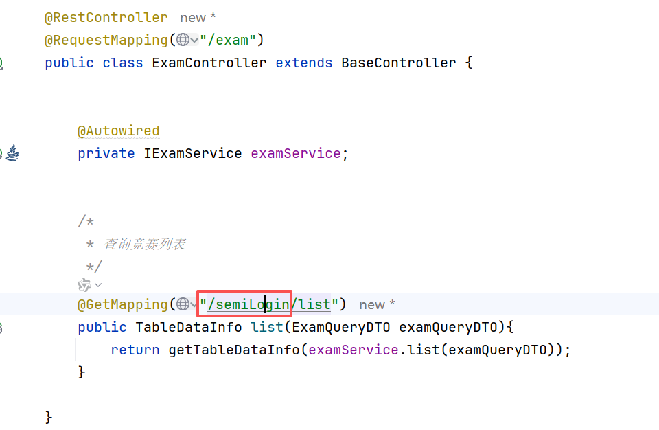
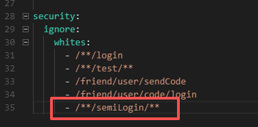
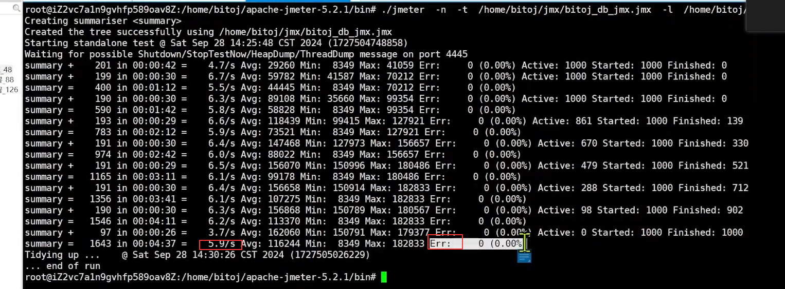

后端判断token是否过期，还有获取用户信息，头像昵称
获取用户信息接口
```java
/*  
 * 获取用户信息  
 */@Override  
public R<LoginUserVO> info(String token) {  
    if (StrUtil.isNotEmpty(token) &&  
            token.startsWith(HttpConstants.PREFIX)) {  
        token = token.replaceFirst(HttpConstants.PREFIX, StrUtil.EMPTY);  
    }  
    LoginUser loginUser = tokenService.getLoginUser(token, secret);  
    if (loginUser == null){  
        return R.fail();  
    }  
    LoginUserVO loginUserVO = new LoginUserVO();  
    loginUserVO.setNickName(loginUser.getNickName());  
    loginUserVO.setHeadImage(loginUser.getHeadImage());  
    return R.ok(loginUserVO);  
}
```
注意要新增参数，VO、实体类啥的还有调用的地方。


## C端竞赛列表页面

不同：
展示形式不同（前端处理）
每个竞赛展示的数据不同，C端的更少一些。（只需要调整查询sql）
搜索条件不同 + 默认加上对于是否发布的搜索条件（只需要调整查询sql）
C端支持游客使用，B端必须先登录完成（网关配置跳过用户身份认证）


**既然竞赛列表的显示跟B端不一样，那就在前端传输过来的参数进行增加一个标识，已参赛，未参赛，在DTO里加**
```java
//属性就是发起请求时候前端会传递什么参数  
@Getter  
@Setter  
public class ExamQueryDTO extends PageQueryDTO {  
  
    private String title;  
  
    private String startTime;  
  
/*    private String excludeIdStr;  
  
    private Set<Long> excludeIdSet;*/  
    private String endTime;  
  
    private Integer type; //0 未完赛 1 历史竞赛  
  
}
```

还有查询的xml文件
```xml
    <select id="selectExamList" resultType="com.bite.friend.domain.exam.vo.ExamVO">
        SELECT
            te.exam_id,
            te.title,
            te.start_time,
            te.end_time,
        FROM
            tb_exam te
        where
            status = 1
            <if test="title !=null and title !='' ">
                AND te.title LIKE CONCAT('%',#{title},'%')
            </if>
            <if test="startTime != null and startTime != '' ">
                AND te.start_time >= #{startTime}
            </if>
            <if test="endTime != null and endTime != '' ">
                AND te.end_time &lt;= #{endTime}
            </if>
            <if test="type == 0">
                AND te.end_time > NOW()
            </if>
            <if test="type == 1">
                AND te.end_time &lt;= NOW()
            </if>
        ORDER BY
            te.create_time DESC
    </select>
```

好的既然要所有的人包括游客能看到竞赛列表，可以在网关配置，just do it
为了让后续有的接口也能实现半登录就能查看的效果，可以加上一个前缀




### 现在竞赛列表查询只从数据库钟查询的话呢，性能其实是不过关的

通过压测工具**Jmeter**
cao测试还是先不用，这里跳过

重点看这两个就指导性能合不合格

对于**部分**数据存到redis，mysql也要存，提升性能。两个配合既准确又高效
先走redis，没有再走mysql，然后将查到的存到redis，后续再有请求就可以再redis查


### 从redis中查询数据

什么时候将C端的竞赛数据存储到redis中？
特点：***都是已经发布的竞赛***。在**发布竞赛**的时候应该将C端的竞赛数据存储到redis中。
       **取消发布**的时候需要将C端的竞赛数据从redis中移除。

选择怎样的**数据结构**来存储C端的竞赛数据？
特点：分页  有序  选择：List     选择两个List结构，分别存储未完赛的竞赛列表和  历史竞赛列表。

key 是什么  value是什么
key： e:t:l   e:h:l
	value:  存储竞赛的基本信息  json形式 (会重复存储数据，所以不能这么存)

**最终确定  value 中存储 examId**

将竞赛的基本信息只存储一份：数据结构：String       key : e:d:examId     
										   value : 存储竞赛的基本信息  json形式 


