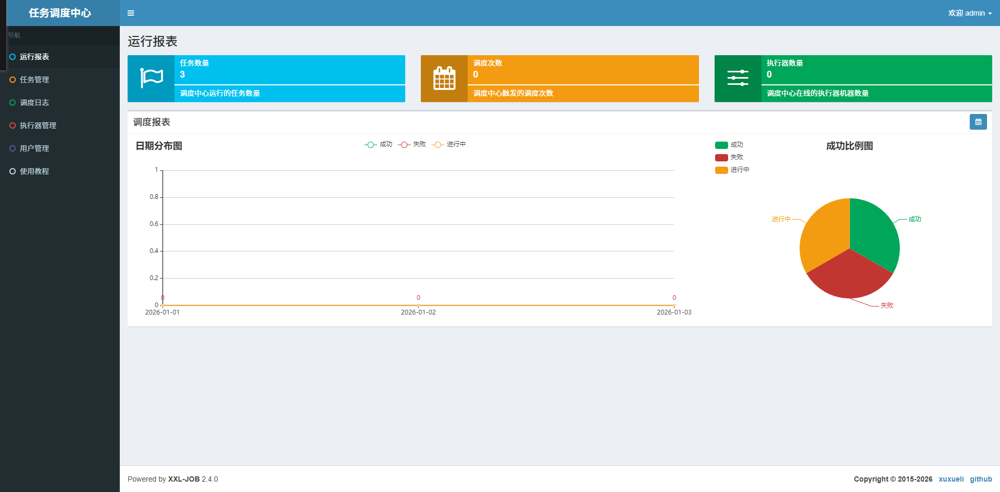
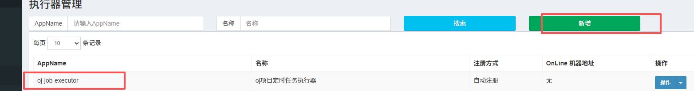

后端判断token是否过期，还有获取用户信息，头像昵称
获取用户信息接口
```java
/*  
 * 获取用户信息  
 */@Override  
public R<LoginUserVO> info(String token) {  
    if (StrUtil.isNotEmpty(token) &&  
            token.startsWith(HttpConstants.PREFIX)) {  
        token = token.replaceFirst(HttpConstants.PREFIX, StrUtil.EMPTY);  
    }  
    LoginUser loginUser = tokenService.getLoginUser(token, secret);  
    if (loginUser == null){  
        return R.fail();  
    }  
    LoginUserVO loginUserVO = new LoginUserVO();  
    loginUserVO.setNickName(loginUser.getNickName());  
    loginUserVO.setHeadImage(loginUser.getHeadImage());  
    return R.ok(loginUserVO);  
}
```
注意要新增参数，VO、实体类啥的还有调用的地方。


## C端竞赛列表页面

不同：
展示形式不同（前端处理）
每个竞赛展示的数据不同，C端的更少一些。（只需要调整查询sql）
搜索条件不同 + 默认加上对于是否发布的搜索条件（只需要调整查询sql）
C端支持游客使用，B端必须先登录完成（网关配置跳过用户身份认证）


**既然竞赛列表的显示跟B端不一样，那就在前端传输过来的参数进行增加一个标识，已参赛，未参赛，在DTO里加**
```java
//属性就是发起请求时候前端会传递什么参数  
@Getter  
@Setter  
public class ExamQueryDTO extends PageQueryDTO {  
  
    private String title;  
  
    private String startTime;  
  
/*    private String excludeIdStr;  
  
    private Set<Long> excludeIdSet;*/  
    private String endTime;  
  
    private Integer type; //0 未完赛 1 历史竞赛  
  
}
```

还有查询的xml文件
```xml
    <select id="selectExamList" resultType="com.bite.friend.domain.exam.vo.ExamVO">
        SELECT
            te.exam_id,
            te.title,
            te.start_time,
            te.end_time,
        FROM
            tb_exam te
        where
            status = 1
            <if test="title !=null and title !='' ">
                AND te.title LIKE CONCAT('%',#{title},'%')
            </if>
            <if test="startTime != null and startTime != '' ">
                AND te.start_time >= #{startTime}
            </if>
            <if test="endTime != null and endTime != '' ">
                AND te.end_time &lt;= #{endTime}
            </if>
            <if test="type == 0">
                AND te.end_time > NOW()
            </if>
            <if test="type == 1">
                AND te.end_time &lt;= NOW()
            </if>
        ORDER BY
            te.create_time DESC
    </select>
```

好的既然要所有的人包括游客能看到竞赛列表，可以在网关配置，just do it
为了让后续有的接口也能实现半登录就能查看的效果，可以加上一个前缀


### 现在竞赛列表查询只从数据库钟查询的话呢，性能其实是不过关的

通过压测工具**Jmeter**
cao测试还是先不用，这里跳过

重点看这两个就指导性能合不合格

对于**部分**数据存到redis，mysql也要存，提升性能。两个配合既准确又高效
先走redis，没有再走mysql，然后将查到的存到redis，后续再有请求就可以再redis查


### 从redis中查询数据

什么时候将C端的竞赛数据存储到redis中？
特点：***都是已经发布的竞赛***。在**发布竞赛**的时候应该将C端的竞赛数据存储到redis中。
       **取消发布**的时候需要将C端的竞赛数据从redis中移除。

选择怎样的**数据结构**来存储C端的竞赛数据？
特点：分页  有序  选择：List     选择两个List结构，分别存储未完赛的竞赛列表和  历史竞赛列表。

key 是什么  value是什么
key： e:t:l   e:h:l
	value:  存储竞赛的基本信息  json形式 (会重复存储数据，所以不能这么存)

**最终确定  value 中存储 examId**

将竞赛的基本信息只存储一份：数据结构：String       key : e:d:examId     
										   value : 存储竞赛的基本信息  json形式 


创建一个manger包，里面的ExamCacheManger全都是关于redis的缓存操作
撤销发布也只能是操作那些未完赛的竞赛

将未结束竞赛存到redis中，或者从redis中删除未结束竞赛
```java
/*  
发布竞赛  
 */@Override  
public int publish(Long examId) {  
    //判断竞赛是否存在  
    Exam exam = getExam(examId);  
  
    //已经结束的竞赛不能发布  
    if (exam.getEndTime().isBefore(LocalDateTime.now())){  
        throw new ServiceException(ResultCode.EXAM_IS_FINISH);  
    }  
  
    //判断竞赛中是否有题目 select count(*) from tb_exam_question where exam_id = #{examId}    Long count = examQuestionMapper.selectCount(new LambdaQueryWrapper<ExamQuestion>()  
            .eq(ExamQuestion::getExamId, examId));  
    if (count == null || count <= 0){  
        throw new ServiceException(ResultCode.EXAM_NOT_HAS_QUESTION);  
    }  
    //改变状态并同步到数据库  
    exam.setStatus(Constants.TRUE);  
    //要将新发布的竞赛数据存储到redis中  新发布竞赛往两个缓存里面存 e:t:l   e:d:examId    examCacheManager.addCache(exam);  
    return examMapper.updateById(exam);  
}  
  
/*  
撤销发布  
 */@Override  
public int cancelpublish(Long examId) {  
    //判断竞赛是否存在  
    Exam exam = getExam(examId);  
    //判断竞赛是否开始  
    checkExam(exam);  
    //已经结束的竞赛不能发布  
    if (exam.getEndTime().isBefore(LocalDateTime.now())){  
        throw new ServiceException(ResultCode.EXAM_IS_FINISH);  
    }  
    exam.setStatus(Constants.FALSE);// 改变状态并同步到数据库  
    examCacheManager.deleteCache(examId);  
    return examMapper.updateById(exam);  
}
```

上面只是把数据存储到redis中，存进去的目的就是为了查出来，现在我们还要查询代码进行完善

既然B端有了个操控redis的manger，C端也要有一个manger

之前发布竞赛的这些新数据，可以存到redis中也可以从redis中查询出来，但是之前已经发布过的老数据（老竞赛）没办法从redis中查出来，应该让这些老数据出现在redis中，怎么做呢？

**刷新缓存**：先从数据库中查询，如果查出来了，就可以将数据库中查询出来的数据同步，同步完成之后再将查询的数据返回回去。

然后数据库和redis中的**数据就一致了**，那我们再一次查询的时候就可以直接走redis了。

还有个比较**极限**的问题：就是刚发布了一个竞赛，然后刚发布这个竞赛可以在redis中，但是老数据呢？其实方法有很多，调一下接口就行......

注意随着时间推移从redis中拿到的**历史竞赛**可能不全。

### 如何维护历史竞赛

未完赛列表中竞赛如果结束了，怎么从未完赛列表移入历史竞赛列表。
随时都有可能有竞赛结束。
**长期 反复 的 去执行 竞赛移动的方法。** （定时任务）
### （定时任务）
频率：每天凌晨 1:00

#### 分布式任务调度平台 -- XXL-JOB

我们的微服务oj-job就是 “执行器项目” 的微服务

**1.部署和配置分布式任务调度中心**
[先执行对应的sql创建xxl-job的数据库]([doc/db/tables_xxl_job.sql · 许雪里/xxl-job - 码云 - 开源中国 (gitee.com)](https://gitee.com/xuxueli0323/xxl-job/blob/master/doc/db/tables_xxl_job.sql#))

拉取镜像之后启动，访问地址：**http://localhost:8080/xxl-job-admin**
```powershell
docker run -e PARAMS="--spring.datasource.url=jdbc:mysql://host.docker.internal:3307/xxl_job?useUnicode=true&characterEncoding=UTF-8&autoReconnect=true&serverTimezone=Asia/Shanghai --spring.datasource.username=root --spring.datasource.password=123456" -p 8080:8080 --name xxl-job-admin -d xuxueli/xxl-job-admin:2.4.0
```

记得改一下数据库的密码：admin 123456
```sql
USE xxl_job;  
SELECT * FROM xxl_job_user WHERE username = 'admin';  
  
UPDATE xxl_job_user  
SET password = 'e10adc3949ba59abbe56e057f20f883e'  
WHERE username = 'admin';
```

然后就成功启动了



**2.配置部署执行器项目**
.
新增任务
