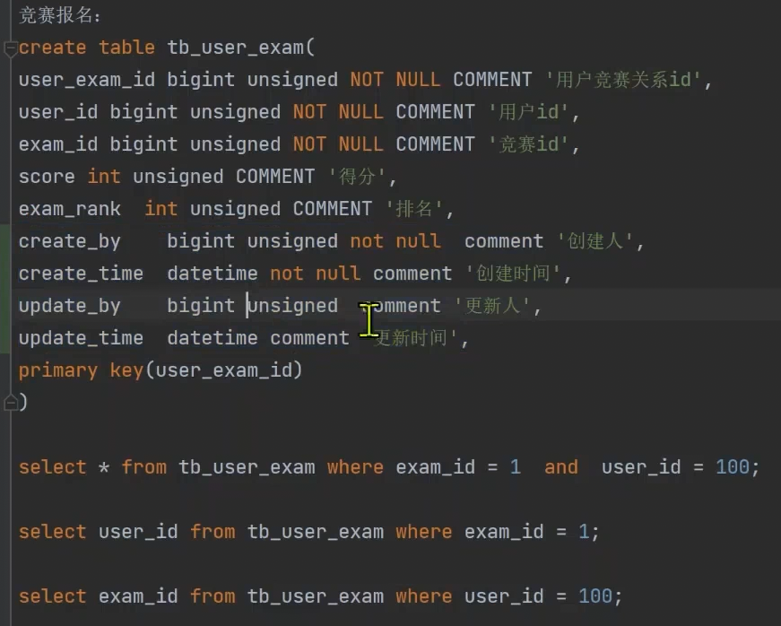
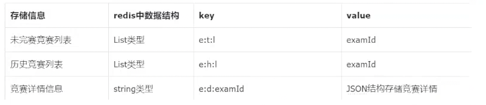
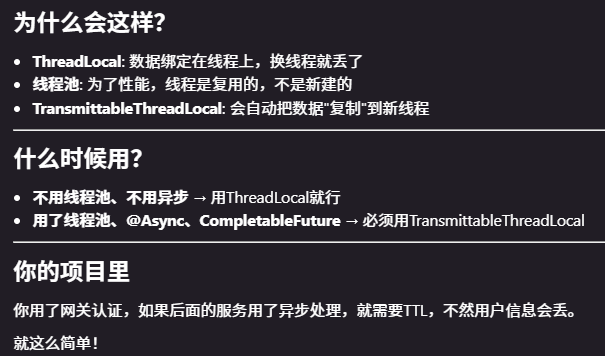
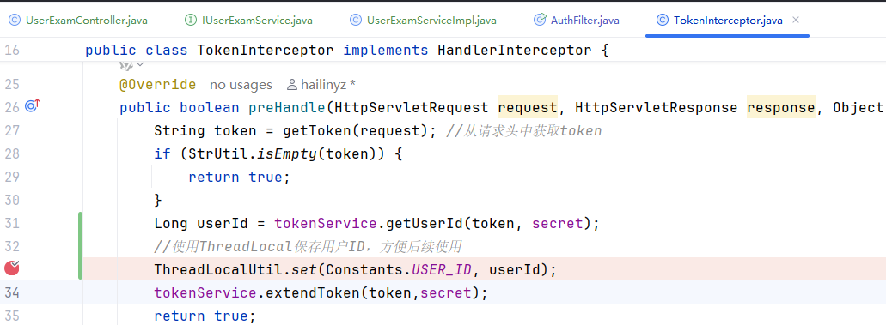

问题：
想要根据开始/结束时间查竞赛列表有如下问题
+ 当Redis有缓存时，直接从Redis取数据，完全忽略了startTime和endTime参数
+ Redis缓存的是全部竞赛列表，没有按时间过滤

优化一下**查询竞赛列表接口**(如果有时间过滤条件，直接查数据库 )
```java
@Override  
public TableDataInfo redisList(ExamQueryDTO examQueryDTO) {  
    // 如果有时间过滤条件，直接查数据库  
    if (examQueryDTO.getStartTime() != null || examQueryDTO.getEndTime() != null) {  
        List<ExamVO> examVOList = list(examQueryDTO);  
        long total = new PageInfo<>(examVOList).getTotal();  
        return TableDataInfo.success(examVOList, total);  
    }  
  
    // 没有时间过滤，走缓存逻辑  
    //从redis中获取 竞赛列表数据  
    Long total = examCacheManager.getListSize(examQueryDTO.getType());  
    List<ExamVO> examVOList;  
    if (total == null || total <= 0){  
        //从数据库中获取 竞赛列表数据  
        examVOList = list(examQueryDTO);  
        //同步到redis中  
        examCacheManager.refreshCache(examQueryDTO.getType());  
        total = new PageInfo<>(examVOList).getTotal(); //获取总记录数  
    } else {  
        //从redis中获取 竞赛列表数据  
        examVOList = examCacheManager.getExamVOList(examQueryDTO);  
        total =  examCacheManager.getListSize(examQueryDTO.getType()); // 获取总记录数  
    }  
    if (CollectionUtil.isEmpty(examVOList)){ //使用hutool工具包判断集合是否为空  
        return TableDataInfo.empty(); //未查出任何数据时调用  
    }  
    return TableDataInfo.success(examVOList, total);  
}
```

## 竞赛报名功能

竞赛报名和比赛、竞赛排名、我的竞赛、竞赛列表有关

**比赛**：已经报名、已经开塞          哪些用户报名需要记录下来。
**竞赛排名**：比赛已经结束、统计的时候统计的对象是报名参加这个比赛的用户。 哪些用户报名需要记录下来。
**我的比赛**：当前用户已经报名的竞赛     哪些用户报名需要记录下来。
**竞赛列表**：哪些用户报名需要记录下来。

用户的竞赛报名信息存储到**数据库中 和 redis中**

表结构设计竞赛报名：tb_user_exam：


设计缓存结构（提高查询效率）
这是之前竞赛列表的缓存结构设计，可以参考一下：


我的竞赛列表 key ： u:e:l:用户id


先登录，成功后在竞赛列表中找到要报名的竞赛，点击报名参赛按钮，前端携带竞赛id和token项后端发请求。

后端接收到请求后，先判断是否符合报名条件。 如果不满足，返回报名失败原因
									    如果满足，将用户的报名信息存储到数据库和redis。  如果成功，如果失败...也是返回原因

前端接收到后端响应之后，根据返回结果提示用户报名成功/失败。
  如果成功，竞赛列表中该竞赛展示 “已报名” 标签，并且在我的竞赛列表中要能找到报名的竞赛。

报名条件：1.用户必须处于登录状态（在网关层已经实现）  2.不能报名不存在的比赛  3.不能重复报名   4.已经开赛的竞赛不能再进行报名

#### OK，开始开发这个功能

创建表tb_user_exam
```sql
create table tb_user_exam(  
    user_exam_id bigint unsigned NOT NULL COMMENT '用户竞赛关系id',  
    user_id bigint unsigned NOT NULL COMMENT '用户id',  
    exam_id bigint unsigned NOT NULL COMMENT '竞赛id',  
    score int unsigned COMMENT '得分',  
    exam_rank int unsigned COMMENT '排名',  
    create_by bigint unsigned not null comment '创建人',  
    create_time datetime not null comment '创建时间',  
    update_by bigint unsigned comment '更新人',  
    update_time datetime comment '更新时间',  
    primary key(user_exam_id)  
);
```

根据这个表创建对应的实体类、controller、service、mapper等

竞赛报名接口设计
```java
/*  
 * 竞赛报名  
 */@PostMapping("/enter")  
public R<Void> enter(@RequestHeader(HttpConstants.AUTHENTICATION) String token, @RequestBody ExamDTO examDTO){  
  
}
```
关于参数因为姚明竞赛要想要知道用户id得从token中解析出来，所以要获取前端传过来的token，然后POST请求对应的是请求体用@RequestBody。

获取userId
```java
Long userId = tokenService.getUserId(token, secret); //secret在nacos上维护，可以@Value引入，应该是一个盐值
```

其实在网管层进行身份认证的时候userId就能获取到了，可以存起来，解决了重复的解析获取用户id的麻烦

**ThreadLocal 线程本地变量，它会为使用这个变量的线程创建一个独立的副本。意味着每个线程去操作的时候始终都是自己的副本，对于其他线程造不成任何影响。**

**userId 可以存到 ThreadLocal 。**

但是由于Java原生的ThreadLocal在线程池里会丢数据，TransmittableThreadLocal（TTL）不会。



### TTL

引入依赖
```xml
<transmittable-thread-local.version>2.14.4</transmittable-thread-local.version>

<dependency>
 <groupId>com.alibaba</groupId>
 <artifactId>transmittable-thread-local</artifactId>
 <version>${transmittable-thread-local.version}</version>
</dependency>
```

封装一个工具类，操作ThreadLocal
```java
public class ThreadLocalUtil {  
    private static final TransmittableThreadLocal<Map<String, Object>> THREAD_LOCAL = new TransmittableThreadLocal<>();  
  
    public static void set(String key, Object value) {  
        Map<String, Object> map = getLocalMap();  
        map.put(key, value == null ? StrUtil.EMPTY : value);  
    }  
  
    public static <T> T get(String key, Class<T> clazz) {  
        Map<String, Object> map = getLocalMap();  
        return (T) map.getOrDefault(key, null);  
    }  
  
    public static Map<String, Object> getLocalMap() {  
        Map<String, Object> map = THREAD_LOCAL.get();  
        if (map == null) {  
            map = new ConcurrentHashMap<String, Object>();  
            THREAD_LOCAL.set(map);  
        }  
        return map;  
    }  
  
    public static void remove() {  
        THREAD_LOCAL.remove();  
    }  
}
```

存userId的时候是在gateway这个微服务村的，取得时候是在friend这个微服务取的，是两个不同的微服务，不可能是在一个线程里了，就会有线程隔离。

这时候可以用到拦截器，因为拦截器是和具体的某一个服务是绑定的，所以就可以取到。

