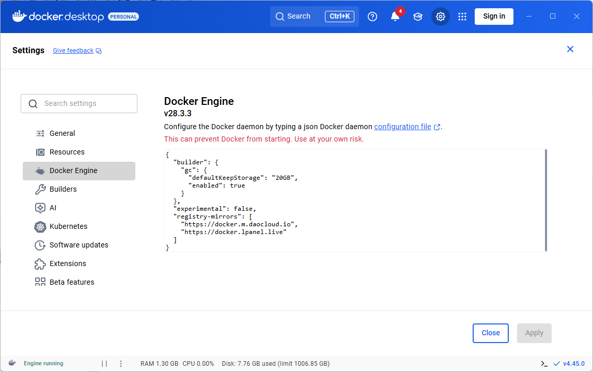
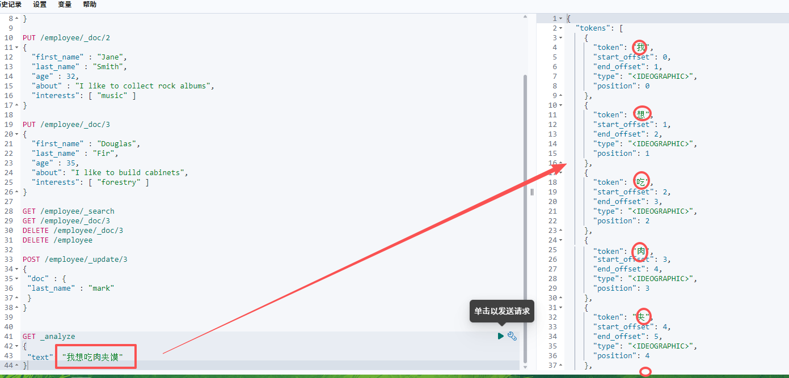
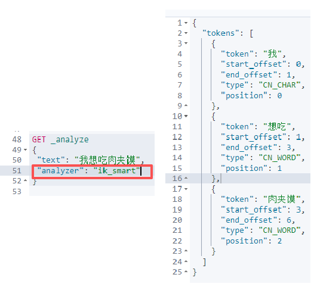
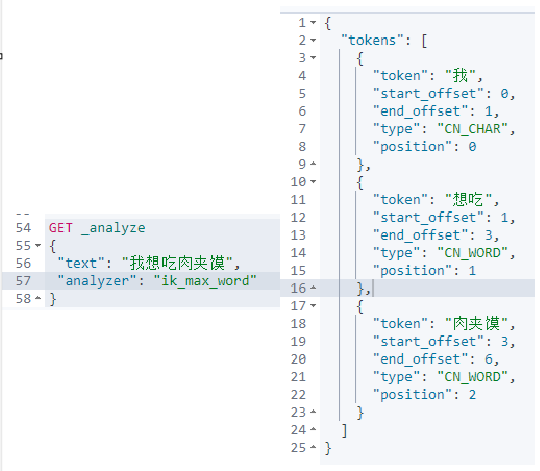

## C端题目列表功能

竞赛列表： 引入redis

数据结构： list                       key  q:l                          value   question_id                    

题目详情缓存： string类型     key   q:d:questionId      value    json题目详情

模糊查找：1.Java原生的方式， 通过for循环 进行模糊搜索
                 2. list结构 key  q:l:合并    q:l:有序   q:l:两 ...          valuse   qiestionId

#### 针对于这种搜索这块包含模糊查询我们业界会选择ES

ES解决 全文搜索（全部字段） 、模糊查询（搜索） 、数据分析（提供分析语法，例如聚合）

正排索引：通过唯一标识，作为键，数据作为值，根据键搜索。
倒排索引：根据关键词来组织

倒排索引其实跟我们模糊查询的形式是非常吻合的。

现在**主流**每个索引现在只会存放一种数据Type。这样可以将索引下降到看作一张类似数据库table。


这些基础概念了解清除之后，就可以开始用ES了
##### 安装ES
拉取镜像
```powershell
docker pull elasticsearch:8.5.3
```
如果镜像拉取失败配置一下国内镜像：

```json
{
  "builder": {
    "gc": {
      "defaultKeepStorage": "20GB",
      "enabled": true
    }
  },
  "experimental": false,
  "registry-mirrors": [
    "https://docker.m.daocloud.io",
    "https://docker.lpanel.live"
  ]
}
```
为什么创建网络，配置同一个网络？可以通过容器名称进行容器连接，容器之间的通信。
```powershell
docker network create oj-network
```
启动ES
```powershell
docker run -d --name oj-es-dev -e "ES_JAVA_OPTS=-Xms256m -Xmx256m" -e "discovery.type=single-node" -v E:\bitepro\oj\bite-oj\deploy\dev\elasticSearch\es-plugins:/usr/share/elasticsearch/plugins -e "xpack.security.enabled=false" --privileged --network oj-network -p 9200:9200 -p 9300:9300 elasticsearch:8.5.3


# 避免端口被占用 换成了9201  访问：http://localhost:9201/，验证启动成功。
docker run -d --name oj-es-dev -e "ES_JAVA_OPTS=-Xms256m -Xmx256m" -e "discovery.type=single-node" -v D:\Project\bite-oj\deploy\dev\elasticSearch\es-plugins:/usr/share/elasticsearch/plugins -e "xpack.security.enabled=false" --privileged --network oj-network -p 9201:9200 -p 9301:9300 elasticsearch:8.5.3
```

安装Kibana,  Kibana **就是 Elasticsearch（ES）官方配套的可视化工具**
```powershell
docker pull kibana:8.5.3
```
启动kibana容器
```powershell
docker run -d --name oj-kibana-dev -e "ELASTICSEARCH_HOSTS=http://oj-es-dev:9200" -e "I18N_LOCALE=zh-CN" -p 15601:5601 --net=oj-network kibana:8.5.3
```

增加数据
```json
PUT /employee/_doc/1
{
  "first_name" : "John",
  "last_name" : "Smith",
  "age" : 25,
  "about" : "I love to go rock climbing",
  "interests": [ "sports", "music" ]
}

PUT /employee/_doc/2
{
  "first_name" : "Jane",
  "last_name" : "Smith",
  "age" : 32,
  "about" : "I like to collect rock albums",
  "interests": [ "music" ]
}

PUT /employee/_doc/3
{
  "first_name" : "Douglas",
  "last_name" : "Fir",
  "age" : 35,
  "about": "I like to build cabinets",
  "interests": [ "forestry" ]
```

查询所有数据
```json
GET /employee/_search
```

根据id搜索
```json
GET /employee/_doc/3
```

删除单个数据（某个数据）
```json
DELETE /employee/_doc/3
```

删除整个数据
```json
DELETE /employee
```

修改单条数据（某个数据）
```json
POST /employee/_update/3
{
 "doc" : {
 "last_name" : "mark"
 }
}
```

**安装中文分词器 ik** ，因为倒排索引是按照文档中的关键词组织的，索引的键是文档集合中出现过的每个独特词汇或者关键词。
```json
GET _analyze 
{
 "text": "我想吃⾁夹馍"
}
```

这种一个词一个词，不符合我们的使用习惯

[下载中文分词器]([Index of: analysis-ik/stable/ (infinilabs.com)](https://release.infinilabs.com/analysis-ik/stable/))8.5.3
放在项目的D:\Project\bite-oj\deploy\dev\elasticSearch\es-plugins目录下

安装好之后在kibana验证出现即可
```json
GET _cat/plugins
```

ik分词器有两种分词算法
ik_smart算法：（最少切分）’偏向用户心理


ik_max_word：（最新粒度划分）会更可能的分出一些额外的词汇，可能没有多大关系的也能搜索出来。



到这里，既然ES作为我们的公共组件，就要创建一个公共的包oj-common-elasticsearch
引入依赖
```xml
<dependency>  
    <groupId>org.springframework.boot</groupId>  
    <artifactId>spring-boot-starter-data-elasticsearch</artifactId>  
</dependency>
```
