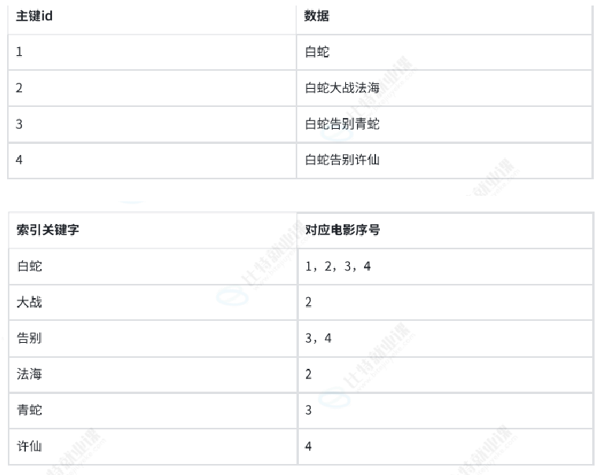
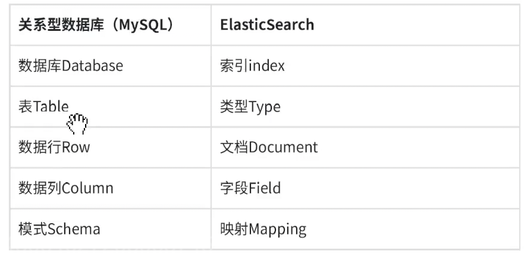

## C端题目列表功能

竞赛列表： 引入redis

数据结构： list                       key  q:l                          value   question_id                    

题目详情缓存： string类型     key   q:d:questionId      value    json题目详情

模糊查找：1.Java原生的方式， 通过for循环 进行模糊搜索
                 2. list结构 key  q:l:合并    q:l:有序   q:l:两 ...          valuse   qiestionId

#### 针对于这种搜索这块包含模糊查询我们业界会选择ES

ES解决 全文搜索（全部字段） 、模糊查询（搜索） 、数据分析（提供分析语法，例如聚合）

正排索引：通过唯一标识，作为键，数据作为值，根据键搜索。
倒排索引：根据关键词来组织

倒排索引其实跟我们模糊查询的形式是非常吻合的。

现在**主流**每个索引现在只会存放一种数据Type。这样可以将索引下降到看作一张类似数据库table。

这些基础概念了解清除之后，就可以开始用ES了
##### 安装ES
拉取镜像

为什么创建网络，配置同一个网络？可以通过容器名称进行容器连接，容器之间的通信。
