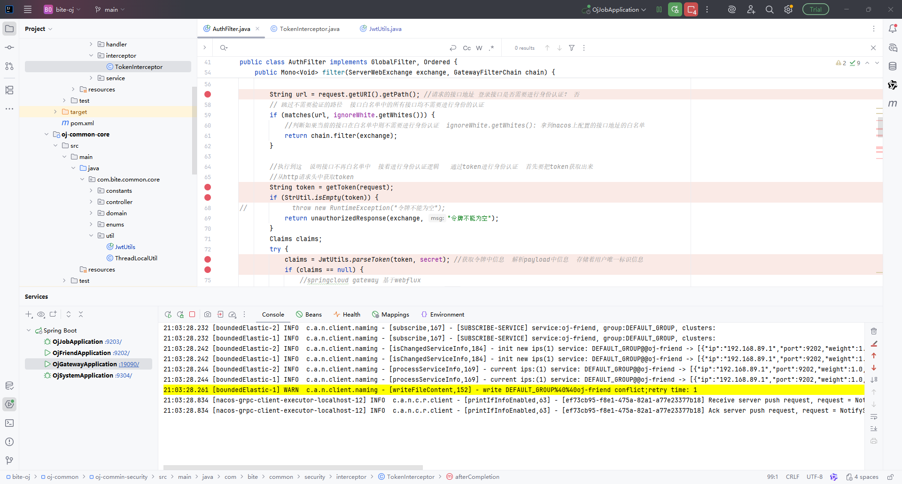
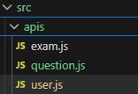

## 个人中心 

### 查看用户详情 & 用户基本信息编辑

目前有个问题，就是C端用户登录/注册的时候，前端存不下token令牌，但是redis能存入token。
目前先这么将就着吧，可以先不通过网关。（理论上获取用户信息和用户详细信息都是要走到网关才行的）

###### !!!!!!!!!!!!!重磅，经过我的不断调试网关的过滤以及统一了nacos上的jwt配置

注意，之前的nacos不统一，是这样的：
```cao
system：sdfghuijasxdjkawskuigy
friend：sdfghuijasxdjkawskuigysms
gateway：sdfghuijasxdjkawskuigy
job：sdfghuijasxdjkawskuigy
```

统一后才对，因为生成token和解析token的jwt应该是一样的才能正确解析出userId
```cao
system：sdfghuijasxdjkawskuigy
friend：sdfghuijasxdjkawskuigy
gateway：sdfghuijasxdjkawskuigy
job：sdfghuijasxdjkawskuigy
```

###### !!!!!!!!!!!!!!!!!!!!!!所以注意接口测试的时候切莫操之过急，每一步都不能忽略！！！！

核心问题：新用户注册时，ThreadLocalUtil 中没有 USER_ID（因为还没登录），但 MyMetaObjectHandler 会从 ThreadLocalUtil 获取 USER_ID 来填充 createBy 字段，结果获取到 null，导致数据库插入失败。

解决方案：在插入新用户之前，手动设置 createBy 字段。有两种方式：

方式 1（推荐）：手动设置 createBy 和 createTime
```java
if (user == null){ //新用户
    //注册逻辑
    user = new User();
    user.setPhone(phone);
    user.setStatus(UserStatus.Normal.getValue());
    // 新用户自注册，createBy设为0或-1表示系统创建
    user.setCreateBy(0L);
    user.setCreateTime(LocalDateTime.now());
    userMapper.insert(user);
}
```

--- 


#### 用户信息编辑的接口
```java
/*  
修改用户信息  
 */@Override  
public int edit(UserUpdateDTO userUpdateDTO) {  
    Long userId = ThreadLocalUtil.get(Constants.USER_ID, Long.class);  
    if (userId == null) {  
        throw new ServiceException(ResultCode.FAILED_USER_NOT_EXISTS);  
    }  
    User user = userMapper.selectById(userId);  
    if (user == null) {  
        throw new ServiceException(ResultCode.FAILED_USER_NOT_EXISTS);  
    }  
    user.setNickName(userUpdateDTO.getNickName());  
    user.setSex(userUpdateDTO.getSex());  
    user.setSchoolName(userUpdateDTO.getSchoolName());  
    user.setMajorName(userUpdateDTO.getMajorName());  
    user.setPhone(userUpdateDTO.getPhone());  
    user.setEmail(userUpdateDTO.getEmail());  
    user.setWechat(userUpdateDTO.getWechat());  
    user.setIntroduce(userUpdateDTO.getIntroduce());  
    ////更新用户缓存  
    userCacheManager.refreshUser(user); //用户详情的缓存  
    tokenService.refreshLoginUser(user.getNickName(), user.getHeadImage(), //刷新当前用户的登录信息  
            ThreadLocalUtil.get(Constants.USER_KEY, String.class));  
    return userMapper.updateById(user);  
}
```

更改的时候不仅仅是用户详情信息的缓存，注意还有当前登录用户的缓存。

vue中前后端交互的方法一般都写在js文件中


然后views文件中调用，发起请求，别忘要引入。

###### 为了解决头像这个问题

要集成OSS到项目中
```java
<dependency>
 <groupId>com.aliyun.oss</groupId>
 <artifactId>aliyun-sdk-oss</artifactId>
 <version>3.17.4</version>
</dependency>
<dependency>
 <groupId>javax.xml.bind</groupId>
 <artifactId>jaxb-api</artifactId>
 <version>2.3.1</version>
</dependency>
<dependency>
 <groupId>javax.activation</groupId>
 <artifactId>activation</artifactId>
 <version>1.1.1</version>
</dependency>
<!-- no more than 2.3.3-->
<dependency>
 <groupId>org.glassfish.jaxb</groupId>
 <artifactId>jaxb-runtime</artifactId>
 <version>2.3.3</version>
</dependency>

```