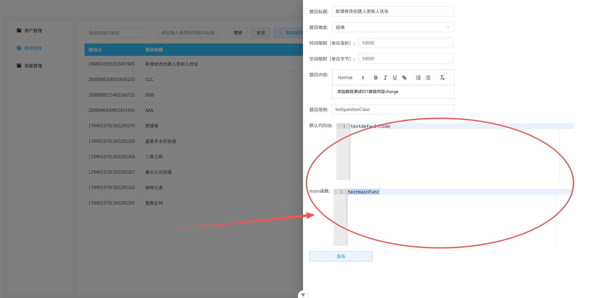
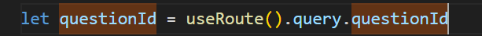
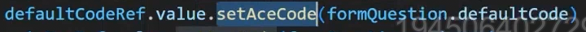
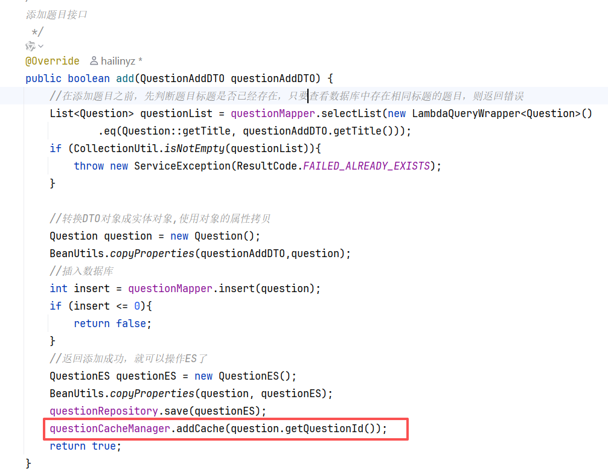

## 用户答题功能

表设计(用户提交表)
```sql
CREATE TABLE tb_user_submit (
    submit_id BIGINT UNSIGNED NOT NULL COMMENT '提交记录id',
    user_id BIGINT UNSIGNED NOT NULL COMMENT '用户id',
    question_id BIGINT UNSIGNED NOT NULL COMMENT '题目id',
    exam_id BIGINT UNSIGNED COMMENT '竞赛id',
    program_type TINYINT NOT NULL COMMENT '代码类型 0 java 1 CPP',
    user_code TEXT NOT NULL COMMENT '用户代码',
    pass TINYINT NOT NULL COMMENT '0:未通过 1:通过',
    exe_message VARCHAR(500) NOT NULL COMMENT '执行结果',
    score INT NOT NULL DEFAULT '0' COMMENT '得分',
    create_by BIGINT UNSIGNED NOT NULL COMMENT '创建人',
    create_time DATETIME NOT NULL COMMENT '创建时间',
    update_by BIGINT UNSIGNED COMMENT '更新人',
    update_time DATETIME COMMENT '更新时间',
    PRIMARY KEY (`submit_id`)
);
```

点击开始答题之后向后端提交**获取题目详情请求**
如果ES查不到，再去数据库查，然后同步给ES
```java
/*  
获取题目详情  
 */@Override  
public QuestionDetailVO detail(Long questionId) {  
  
    // 从ES中查询  
    QuestionES questionES = questionRespository.findById(questionId).orElse(null); //获取的是options字段,所以需要.orElse(null)  
    QuestionDetailVO questionDetailVO = new QuestionDetailVO();  
    if (questionES != null){  
        BeanUtils.copyProperties(questionES,questionDetailVO);  
        return questionDetailVO;  
    }  
  
    // 从数据库中查询  
    Question question = questionMapper.selectById(questionId);  
    if (question == null){  
        return null;  
    }  
    refreshQuestion(); //将数据库中的数据同步到ES中  
    BeanUtils.copyProperties(question,questionDetailVO);  
    return questionDetailVO;  
}
```

然后是前端，因为有可以编写代码的编译器区域，可以跟之前B端的一样，引入一个库：

##### ace-builds

```powershell
npm install ace-builds@1.4.13
```

和B端同样的方式，将参数questionId传过去
然后另一个页面就可以了
```vue
function goQuestTest(questionId) {
  router.push(`/c-oj/anwser?questionId=${questionId}`)
}
```

然后在Answer.vue就能拿到questionId，就能向后端发起请求了


和B端一样，获取到默认代码块之后放到aceCode里面



#### 获取上一题&下一题

获取上一题  
题目的顺序列表：先从reids  reids没有再查询数据库
当前题目是哪个(questionId)  
redis  list数据类型(顺序,已经排好序了) key:  q:l   value:  questionId

需要把顺序存到**redis**里面，可以先从中获得顺序列表，然后查出来当前题目所在位置，
然后上一题、下一题也就清楚了

主要是操作redis的index操作获取上一题、下一题
```java
/*  
获取下一题  
 */@Override  
public String nextQuestion(Long questionId) {  
    Long listSize = questionCacheManager.getListSize();  
    if (listSize == null || listSize == 0){ // Redis中没有数据  
        questionCacheManager.refreshCache(); // 同步数据  
    }  
    //到这里才去redis中获取上一题的 id    return questionCacheManager.nextQuestion(questionId).toString();  
}
```

**注意**：在数据库进行增删题目之后，redis还是老数据，所以在我们添加、删除题目的时候把添加到缓存和从缓存中删除的逻辑补充上就好了。



### 竞赛开始答题

需要后端提供一个**获取竞赛中第一道题目的id接口**
//代码逻辑：获取竞赛中题目的顺序列表， 先从redis  redis没有再从数据库 key：e:q:l:examId  value：questionId  
// 排在第一个的题目 返回给前端
```java
/*  
 * 获取竞赛的第一道题  
 */@Override  
public String getFirstQuestion(Long examId) {  
  
    //先判断缓存中有没有数据  
    Long listSize = examCacheManager.getExamQuestionListSize(examId);  
    if (listSize == null || listSize <= 0){  
        examCacheManager.refreshExamQuestionCache(examId); //现在刷新的是竞赛中题目列表数据  
    }  
  
    return examCacheManager.getFirstQuestion(examId).toString();  
}
```

###### reids数据同步问题

**注意：** 第一次从缓存中查不到数据才回到数据库查询并且更新缓存，后续直接从redis中查，这就导致了以后每次获取到的都是旧数据，增加/删除竞赛中的题目后，系统是没办法拿到最新数据的。

