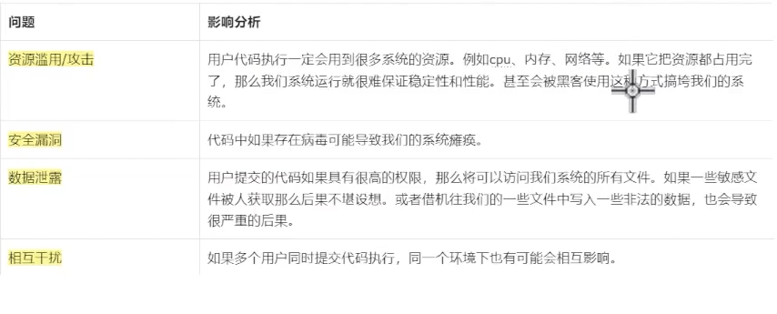
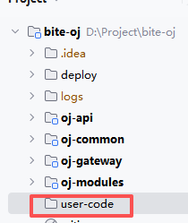

### 竞赛中获取上一题/下一题

```java
/*  
 * 获取上一题（竞赛内）  
 */@Override  
public String preQuestion(Long examId, Long questionId) {  
    checkAndRefresh(examId);  
    //到这里才去redis中获取上一题的 id    return examCacheManager.preQuestion(examId, questionId).toString();  
}  
  
  
/*  
 * 获取下一题(竞赛内)  
 */@Override  
public String nextQuestion(Long examId, Long questionId) {  
    checkAndRefresh(examId);  
    //到这里才去redis中获取上一题的 id    return examCacheManager.nextQuestion(examId, questionId).toString();  
}
```

### 用户提交 & 题目答案比对

**业务逻辑**


**friend**
后端接收到前端请求之后，获取参数，根据programType判断用户提交代码的语言类型，根据语言类型进行不同的处理。

根据questionId从ES中查询出题目对应的main函数和测试用例（入参），将代码拼接完整。查询的时候还需查询题目时间、空间限制、难以程度。


**judge**
执行代码：javac 编译  java执行

javac  如果成功：继续执行后续逻辑
      如果失败：终止逻辑，失败原因返回前端
      
java   如果成功：继续执行后续逻辑
      如果失败：终止逻辑，失败原因返回前端

题目答案的比对：根据执行代码实际输出结果和测试用例的output进行比对。
	如果比对一致：题目作答正确，继续执行后续逻辑
     如果不一致：题目作答错误，错误的原因返回前端
 
时间限制&空间限制比对：代码执行使用实际时间&空间和期望时间&空间进行比对。
如果 <= 期望值：符合要求，判定题目作答正确，并将结果返回前端，否则......

对于用户答题结果，无论成功/失败，都应该存储到MYSQL中，供后续使用。
答题结果计算时，分值的计算和题目难易程度相关。



处理方案:
- 分配有限的资源。限制cpu、内存等资源的使用。
- 运行时间限制。不允许用户代码长时间占用资源。
- 限制用户代码执行的权限。限制文件的读写、限制网络的访问等。
- 和系统运行环境隔离开，不同用户代码执行环境也隔离开。
- 如果发现恶意攻击的用户，随时将这个用户进行拉黑处理。

docker 容器相互隔离，相互干扰out；资源滥用数据泄露，可以限制；安全漏洞，在容器里面执行，大部分能化解，容器挂掉再拉一个就行了

这些操作都是Java代码执行，所以就要通过Java操作docker  judge服务主要是拿来判题,所以docker相关依赖应该引入到judge服务。

服务间调用（friend --> judge）的问题：openfign发起服务间调用（说白了就是发起HTTP请求）

创建oj-api的一个模块：把openfeign的客户端统一放在这。 
```xml
<dependency>  
    <groupId>org.springframework.cloud</groupId>  
    <artifactId>spring-cloud-starter-openfeign</artifactId>  
</dependency>  
<dependency>  
    <groupId>org.springframework.cloud</groupId>  
    <artifactId>spring-cloud-starter-loadbalancer</artifactId>  
</dependency>  
  
<dependency>  
    <groupId>com.bite</groupId>  
    <artifactId>oj-common-core</artifactId>  
    <version>1.0-SNAPSHOT</version>  
</dependency>
```

用户提交代码
    ↓
Friend 服务（当前服务）
    ↓
组装 JudgeSubmitDTO（题目信息、用户代码、测试用例等）
    ↓
调用 remoteJudgeService.doJudgeJavaCode(judgeSubmitDTO)
    ↓
Feign 通过 Nacos 找到 Judge 服务
    ↓
Judge 服务执行判题（编译、运行、对比输出）
    ↓
返回判题结果（通过/失败、运行时间、内存占用等）
    ↓
Friend 服务返回结果给用户

judge微服务
```xml
<dependency>  
    <groupId>com.bite</groupId>  
    <artifactId>oj-api</artifactId>  
    <version>1.0-SNAPSHOT</version>  
    <scope>compile</scope>  
</dependency>  
<dependency>  
    <groupId>com.mysql</groupId>  
    <artifactId>mysql-connector-j</artifactId>  
</dependency>  
<dependency>  
    <groupId>com.github.docker-java</groupId>  
    <artifactId>docker-java</artifactId>  
    <version>3.3.4</version>  
</dependency>
```

判题（好长啊）
```java
    /*  
    判题接口  
     */    @Override  
    public UserQuestionResultVO doJudgeJavaCode(JudgeSubmitDTO judgeSubmitDTO) {  
        SandBoxExecuteResult sandBoxExecuteResult =  
                sandboxService.exeJavaCode(judgeSubmitDTO.getUserCode(), judgeSubmitDTO.getInputList()); //拿到在docker的执行结果  
        UserQuestionResultVO userQuestionResultVO = new UserQuestionResultVO();  
  
        if (sandBoxExecuteResult != null && sandBoxExecuteResult.getRunStatus().equals(CodeRunStatus.SUCCEED)){  
            //对比执行结果 时间限制、空间限制的比对  
            userQuestionResultVO = doJudge(judgeSubmitDTO, sandBoxExecuteResult, userQuestionResultVO);  
  
        } else {  
            userQuestionResultVO.setPass(Constants.FALSE); //未通过  
            if (sandBoxExecuteResult != null){  
                userQuestionResultVO.setExeMessage(sandBoxExecuteResult.getExeMessage());  
            }else {  
                userQuestionResultVO.setExeMessage(CodeRunStatus.UNKNOWN_FAILED.getMsg());  
            }  
            userQuestionResultVO.setScore(JudgeConstants.ERROR_SCORE); //0分  
        }  
  
        return saveUserSubmit(judgeSubmitDTO, userQuestionResultVO);  
    }  
  
    private static UserQuestionResultVO doJudge(JudgeSubmitDTO judgeSubmitDTO,  
                                SandBoxExecuteResult sandBoxExecuteResult,  
                                UserQuestionResultVO userQuestionResultVO) {  
        //比对执行结果  时间限制、空间限制的比对  
        List<String> exeOutoutList = sandBoxExecuteResult.getOutputList();  
        List<String> outputList = judgeSubmitDTO.getOutputList();  
        if (outputList.size() != exeOutoutList.size()){  //长度不一致(数量上是否相等的判断)  
            userQuestionResultVO.setScore(JudgeConstants.ERROR_SCORE);  
            userQuestionResultVO.setPass(Constants.FALSE);  
            userQuestionResultVO.setExeMessage(CodeRunStatus.NOT_ALL_PASSED.getMsg());  
            return userQuestionResultVO;  
        }  //长度一致，然后对输出结果进行逐个比对  
            List<UserExeResult> userExeResultList = new ArrayList<>();  
        //结果比对  
        boolean passed = resultCompare(judgeSubmitDTO, outputList, exeOutoutList);  
  
        //组装结果（判断时间、空间限制）  
        return assembleUserQuestionResultVO(judgeSubmitDTO, sandBoxExecuteResult, userQuestionResultVO, userExeResultList, passed);  
    }  
  
    /*  
    通过一些判断将结果组装成UserQuestionResultVO  
     */    private static UserQuestionResultVO assembleUserQuestionResultVO(JudgeSubmitDTO judgeSubmitDTO,  
                                                                     SandBoxExecuteResult sandBoxExecuteResult,  
                                                                     UserQuestionResultVO userQuestionResultVO,  
                                                                     List<UserExeResult> userExeResultList,  
                                                                     boolean passed) {  
        userQuestionResultVO.setUserExeResultList(userExeResultList);  
        if (!passed){  
            userQuestionResultVO.setScore(JudgeConstants.ERROR_SCORE);  
            userQuestionResultVO.setPass(Constants.FALSE);  
            userQuestionResultVO.setExeMessage(CodeRunStatus.NOT_ALL_PASSED.getMsg());  
            return userQuestionResultVO;  
        }  
        //输出结果一致，比对时间限制&空间限制  
        if (sandBoxExecuteResult.getUseMemory() > judgeSubmitDTO.getSpaceLimit()){  
            userQuestionResultVO.setScore(JudgeConstants.ERROR_SCORE);  
            userQuestionResultVO.setPass(Constants.FALSE);  
            userQuestionResultVO.setExeMessage(CodeRunStatus.OUT_OF_MEMORY.getMsg());  
            return userQuestionResultVO;  
        }  
        if (sandBoxExecuteResult.getUseTime() > judgeSubmitDTO.getTimeLimit()){  
            userQuestionResultVO.setScore(JudgeConstants.ERROR_SCORE);  
            userQuestionResultVO.setPass(Constants.FALSE);  
            userQuestionResultVO.setExeMessage(CodeRunStatus.OUT_OF_TIME.getMsg());  
            return userQuestionResultVO;  
        }  
        //输出结果一致，时间限制&空间限制一致 --> 正确  
        userQuestionResultVO.setPass(Constants.TRUE);  
        int score = judgeSubmitDTO.getDifficulty() * JudgeConstants.DEFAULT_SCORE;  
        userQuestionResultVO.setScore(score);  
        return userQuestionResultVO;  
    }  
  
    /*  
    结果比对  
     */    private static boolean resultCompare(JudgeSubmitDTO judgeSubmitDTO, List<String> outputList, List<String> exeOutoutList) {  
        boolean passed = true;  
        for (int index = 0; index < outputList.size(); index++) {  
            String output = outputList.get(index);  
            String exeOutput = exeOutoutList.get(index);  
            String input = judgeSubmitDTO.getInputList().get(index);  
            UserExeResult userExeResult = new UserExeResult();  
            userExeResult.setInput(input);  
            userExeResult.setOutput(output);  
            userExeResult.setExeOutput(exeOutput);  
            if (!output.equals(exeOutput)){  
                passed = false;  
            }  
        }  
        return passed;  
    }  
  
  
    private UserQuestionResultVO saveUserSubmit(JudgeSubmitDTO judgeSubmitDTO, UserQuestionResultVO userQuestionResultVO) {  
        UserSubmit userSubmit = new UserSubmit(); //需要存入的实体 存入数据库  
        BeanUtils.copyProperties(judgeSubmitDTO, userSubmit);  
        userSubmit.setUserId(judgeSubmitDTO.getUserId());  
        userSubmit.setQuestionId(judgeSubmitDTO.getQuestionId());  
        userSubmit.setExamId(judgeSubmitDTO.getExamId());  
        userSubmit.setProgramType(judgeSubmitDTO.getProgramType());  
        userSubmit.setUserCode(judgeSubmitDTO.getUserCode());  
//        userSubmitMapper.insert(userSubmit); //我们现在以最后一次提交为准，但是这个是每次提交都保存,所以我们先删除再插入  
        userSubmitMapper.delete(new LambdaQueryWrapper<UserSubmit>()  
                .eq(UserSubmit::getUserId, judgeSubmitDTO.getUserId())  
                .eq(UserSubmit::getQuestionId, judgeSubmitDTO.getQuestionId())  
                .isNull(judgeSubmitDTO.getExamId() == null, UserSubmit::getExamId)  
                .eq(judgeSubmitDTO.getExamId() != null, UserSubmit::getExamId, judgeSubmitDTO.getExamId()));  
        userSubmitMapper.insert(userSubmit); //先删除再插入  
        return userQuestionResultVO;  
    }
```
docker代码沙箱（安全机制，隔离限制代码执行的环境，防止恶意代码）


将代码写进文件，然后将文件挂载，就可以了。
第一步：
要写进文件，首先得有一个**目录**

```java
// 创建并返回用户代码的文件  
private void createUserCodeFile(Long userId, String userCode) {  
    String examCodeDir = System.getProperty("user.dir") + File.separator + JudgeConstants.EXAM_CODE_DIR;  
    if (!FileUtil.exist(examCodeDir)) {  
        FileUtil.mkdir(examCodeDir); // 创建存放用户代码的目录  
    }  
  
    String time = LocalDateTimeUtil.format(LocalDateTime.now(), DateTimeFormatter.ofPattern("yyyyMMddHHmmss"));  
    // 拼接用户代码文件路径  
    userCodeDir = examCodeDir + File.separator + userId + Constants.UNDERLINE_SEPARATOR + time;  
    userCodeFileName = userCodeDir + File.separator + JudgeConstants.USER_CODE_JAVA_CLASS_NAME;  
  
    FileUtil.writeString(userCode, userCodeFileName, Constants.UTF8);  
}
```

第二步：
将容器创建好（初始化），并且将user-code挂载
```java
/*  
 初始化docker容器  
 */private void initDockerSanBox() {  
    DefaultDockerClientConfig clientConfig = DefaultDockerClientConfig.createDefaultConfigBuilder()  
            .withDockerHost(dockerHost)  
            .build();  
  
    dockerClient = DockerClientBuilder  
            .getInstance(clientConfig)  
            .withDockerCmdExecFactory(new NettyDockerCmdExecFactory())  
            .build();  
  
    // 拉取镜像  
    pullJavaEnvImage();  
  
    // 创建容器 限制资源 控制权限  
    HostConfig hostConfig = getHostConfig();  
    CreateContainerCmd containerCmd = dockerClient  
            .createContainerCmd(JudgeConstants.JAVA_ENV_IMAGE)  
            .withName(JudgeConstants.JAVA_CONTAINER_NAME);  
  
    CreateContainerResponse createContainerResponse = containerCmd  
            .withHostConfig(hostConfig)  
            .withAttachStderr(true)  
            .withAttachStdout(true)  
            .withTty(true)  
            .exec();  
  
    // 记录容器id  
    containerId = createContainerResponse.getId();  
    // 启动容器  
    dockerClient.startContainerCmd(containerId).exec();  
}  
  
  
// 限制资源 控制权限  
private HostConfig getHostConfig() {  
    HostConfig hostConfig = new HostConfig();  
  
    // 设置挂载目录，指定用户代码路径  
    hostConfig.setBinds(new Bind(userCodeDir, new Volume(JudgeConstants.DOCKER_USER_CODE_DIR)));  
  
    // 限制docker容器使用资源  
    hostConfig.withMemory(memoryLimit);  
    hostConfig.withMemorySwap(memorySwapLimit);  
    hostConfig.withCpuCount(cpuLimit);  
    hostConfig.withNetworkMode("none"); // 禁用网络  
    hostConfig.withReadonlyRootfs(true); // 禁止在root目录写文件  
  
    return hostConfig;  
}
```

