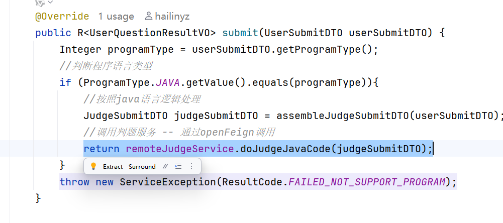
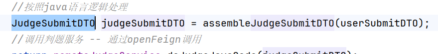
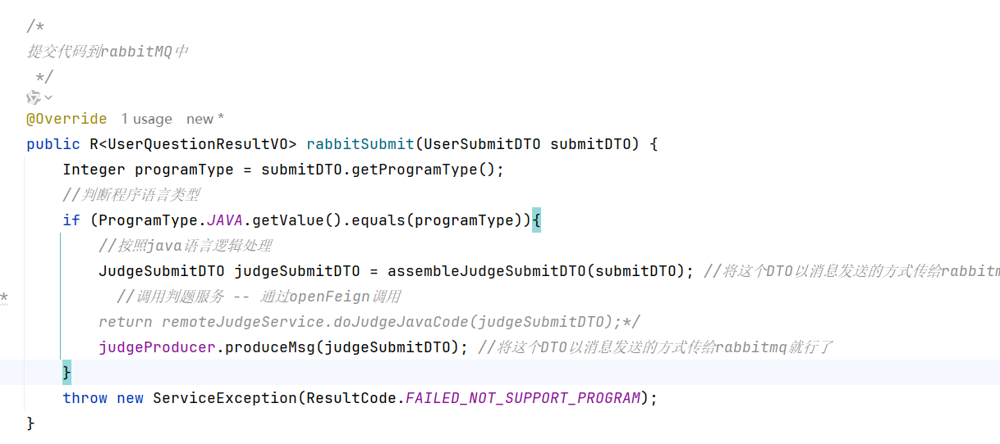
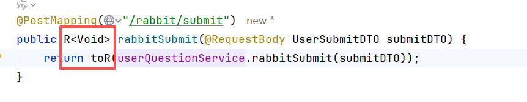

用户每次提交代码都要经过停止容器->删除容器，就很慢

面临着多线程一样的问题，new之后还要删除，搞了个线程池；同样的，我们也可以有容器池。

我们的DockerClient有了，后续我们使用DockerSandBox是从容器池里面拿这个容器去使用的

阻塞队列

代码的改动：把之前那种每提交一次代码都要创建一个新容器**改成**从容器池中直接拿容器的方式；清理不在是删除容器而是**归还**的方式。

短时间内可能会有大量的请求，导致崩溃（就该用rabbitmq的**流量削峰**）


拉取镜像
```powershell
docker pull rabbitmq:3.8.30-management
```
启动容器
```powershell
docker run -d --name oj-rabbit-dev -e RABBITMQ_DEFAULT_USER=admin -e RABBITMQ_DEFAULT_PASS=admin -p 15672:15672 -p 5672:5672 rabbitmq:3.8.30-management
```
进入容器内部并启动管理插件

```powershell
rabbitmq-plugins enable rabbitmq_management
```


创建oj-common-rabbitmq⼯程
```xml
<dependency>  
    <groupId>org.springframework.boot</groupId>  
    <artifactId>spring-boot-starter-amqp</artifactId>  
</dependency>  
<dependency>  
    <groupId>com.bite</groupId>  
    <artifactId>oj-common-core</artifactId>  
    <version>${oj-common-core.version}</version>  
</dependency>
```

实体类
```java
public class RabbitMQConstants {  
    public static final String OJ_WORK_QUEUE = "oj-work-queue";  
}
```

配置类
```java
@Configuration  
public class RabbitConfig {  
    @Bean  
    public Queue workQueue() {  
        return new Queue(RabbitMQConstants.OJ_WORK_QUEUE, true);  
    }  
    @Bean  
    public MessageConverter messageConverter() {  
        return new Jackson2JsonMessageConverter();  
    }  
}
```
作为公用组件，要想让其他服务能用，得完成这一步


好的，项目引入babbitmq完成。

判题这块因为我们**要解决的问题就是判题如果大量的用户提交代码以后整体的判题功能支撑不聊这么多用户的处理，所以才引入了rabbitmq进行流量削峰**。

生产者：friend
消费者：judge

生产者代码：
```java
@Component  
@Slf4j  
public class JudgeProducer {  
    @Autowired  
    private RabbitTemplate rabbitTemplate;  
    public void produceMsg(JudgeSubmitDTO judgeSubmitDTO) {  
        try {  
            rabbitTemplate.convertAndSend(RabbitMQConstants.OJ_WORK_QUEUE,  
                    judgeSubmitDTO);  
        } catch (Exception e) {  
            log.error("⽣产者发送消息异常", e);  
            throw new ServiceException(ResultCode.FAILED_RABBIT_PRODUCE);  
        }  
    }  
}
```
消费者代码
```java
@Slf4j  
@Component  
public class JudgeConsumer {  
    @Autowired  
    private IJudgeService judgeService;  
    @RabbitListener(queues = RabbitMQConstants.OJ_WORK_QUEUE)  
    public void consume(JudgeSubmitDTO judgeSubmitDTO) {  
        log.info("收到消息为: {}", judgeSubmitDTO);  
        judgeService.doJudgeJavaCode(judgeSubmitDTO);  
    }  
}
```

用户提交代码sumbit方法之后，前端（用户）传进来的信息它是有些信息不包含的，我们题目将来要进行判题的时候要用到的有些数据没有（不全），所以代码中从ES当中查询，查询到了以后进行组装，组装成完整的在判题时候使用的DTO，这个时候通过服务间调用（引入的Openfeign）的方式来完成判题工作。

现在改成生产(friend)-消费(judge)的方式
消费者judge会自动的去消费rabbitmq中的消息然后再完成判题，意味着提交代码之后，不用手动去通过服务间调用的方式调用判题的方法：


把这个消息提供给rabbitmq就行了，提供之后就会进行消费，消费之后就进行判题


我们直接提供新接口就行了，以前旧的代码留着以后看（欣赏）

记得引入消息的生产者
```java
@Autowired  
private JudgeProducer judgeProducer;
```

现在我们只需要把组装好的数据传给rabbitmq就行了，只要rabbitmq中有消息，judge就能够监听到并且消费-->判题。

所以现在的这个rabbitSubmit接口已经没有判题的功能了，只是提交。所以根本没有办法把结果返回。

这怎么办呢？前端需要判题结果，后面说 //TODO，现在先将这个接口改成boolean类型



现在再来看下消费者

因为这个注解会监听有没有消息，有消息会自动出发这个消费的方法自动执行判题。


现在完成上面的//TODO判题结果的获取
在后端再提供一个新的接口，就是用来前端查询判题结果的。

因为判题是需要时间的，前端可能不会直接获取到，怎么把握这个时间呢

既然前端不知道什么时间能把判题搞定，每隔一段时间（前端定时任务）请求这个接口


### 热榜排行列表-自写（Redis + 定时任务xxljob）

