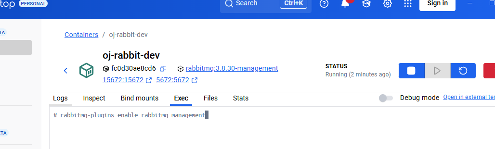

用户每次提交代码都要经过停止容器->删除容器，就很慢

面临着多线程一样的问题，new之后还要删除，搞了个线程池；同样的，我们也可以有容器池。

我们的DockerClient有了，后续我们使用DockerSandBox是从容器池里面拿这个容器去使用的

阻塞队列

代码的改动：把之前那种每提交一次代码都要创建一个新容器**改成**从容器池中直接拿容器的方式；清理不在是删除容器而是**归还**的方式。

短时间内可能会有大量的请求，导致崩溃（就该用rabbitmq的**流量削峰**）


拉取镜像
```powershell
docker pull rabbitmq:3.8.30-management
```
启动容器
```powershell
docker run -d --name oj-rabbit-dev -e RABBITMQ_DEFAULT_USER=admin -e RABBITMQ_DEFAULT_PASS=admin -p 15672:15672 -p 5672:5672 rabbitmq:3.8.30-management
```
进入容器内部并启动管理插件

```powershell
rabbitmq-plugins enable rabbitmq_management
```


创建oj-common-rabbitmq⼯程
```xml
<dependency>  
    <groupId>org.springframework.boot</groupId>  
    <artifactId>spring-boot-starter-amqp</artifactId>  
</dependency>  
<dependency>  
    <groupId>com.bite</groupId>  
    <artifactId>oj-common-core</artifactId>  
    <version>${oj-common-core.version}</version>  
</dependency>
```

实体类
```java
public class RabbitMQConstants {  
    public static final String OJ_WORK_QUEUE = "oj-work-queue";  
}
```

配置类
```java
@Configuration  
public class RabbitConfig {  
    @Bean  
    public Queue workQueue() {  
        return new Queue(RabbitMQConstants.OJ_WORK_QUEUE, true);  
    }  
    @Bean  
    public MessageConverter messageConverter() {  
        return new Jackson2JsonMessageConverter();  
    }  
}
```
作为公用组件，要想让其他服务能用，得完成这一步


好的，项目引入babbitmq完成。

判题这块因为我们**要解决的问题就是判题如果大量的用户提交代码以后整体的判题功能支撑不聊这么多用户的处理，所以才引入了rabbitmq进行流量削峰**。

生产者：friend
消费者：judge

生产者代码：
```java
@Component  
@Slf4j  
public class JudgeProducer {  
    @Autowired  
    private RabbitTemplate rabbitTemplate;  
    public void produceMsg(JudgeSubmitDTO judgeSubmitDTO) {  
        try {  
            rabbitTemplate.convertAndSend(RabbitMQConstants.OJ_WORK_QUEUE,  
                    judgeSubmitDTO);  
        } catch (Exception e) {  
            log.error("⽣产者发送消息异常", e);  
            throw new ServiceException(ResultCode.FAILED_RABBIT_PRODUCE);  
        }  
    }  
}
```
消费者代码
```java
@Slf4j  
@Component  
public class JudgeConsumer {  
    @Autowired  
    private IJudgeService judgeService;  
    @RabbitListener(queues = RabbitMQConstants.OJ_WORK_QUEUE)  
    public void consume(JudgeSubmitDTO judgeSubmitDTO) {  
        log.info("收到消息为: {}", judgeSubmitDTO);  
        judgeService.doJudgeJavaCode(judgeSubmitDTO);  
    }  
}
```
