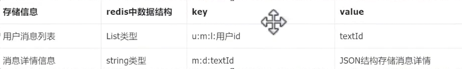

### 我的消息功能

业务分析：
先登录，点击右上角小铃铛，有消息列表，竞赛结果通知，竞赛结束后，系统自动统计排名。

**站内信**：网站内部的通信方式。
1.用户和用户之间的通信（点对点）
2.管理员/系统   和   某个用户之间的通信（点对点）
3.管理员/系统   和   某个用户群（指的是满足某一条件的用户的群体）之间的通信。（点对面）

竞赛结果的通信消息（属于第二种点对点）


数据库表设计：
消息内容表
```sql
create table tb_message_text(  
    text_id bigint unsigned NOT NULL COMMENT '消息内容id（主键）',  
    message_title varchar(10) NOT NULL COMMENT '消息标题',  
    message_content varchar(200) NOT NULL COMMENT '消息内容',  
    create_by bigint unsigned not null comment '创建人',  
    create_time datetime not null comment '创建时间',  
    update_by bigint unsigned comment '更新人',  
    update_time datetime comment '更新时间',  
    primary key (text_id)  
);
```

消息表
```sql
create table tb_message(  
    message_id bigint unsigned NOT NULL COMMENT '消息id（主键）', 
    text_id bigint unsigned NOT NULL COMMENT '消息内容id（主键）',  
    send_id bigint unsigned NOT NULL COMMENT '消息发送人id',  
    rec_id bigint unsigned NOT NULL COMMENT '消息接收人id',  
    create_by bigint unsigned not null comment '创建人',  
    create_time datetime not null comment '创建时间',  
    update_by bigint unsigned comment '更新人',  
    update_time datetime comment '更新时间',  
    primary key (message_id)  
);
```


消息发送：
1. 消息是如何产生的（竞赛结果通知消息）
每天凌晨，会对前一天结束竞赛进行用户排名统计。消息在统计过程中随即产生了。
竞赛结束时间不能超过晚上 10:00 凌晨统计可以一次统计完所有竞赛（xxl-job 每天1:00）。

2. 消息如何发送
只需要将产生的消息存储到数据库中 + redis
设计redis当中的缓存


---
好的上面分析完成。

