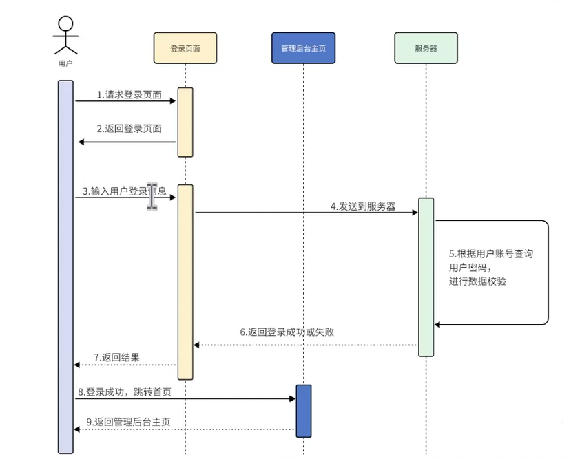
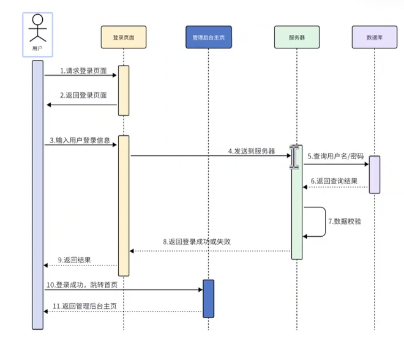
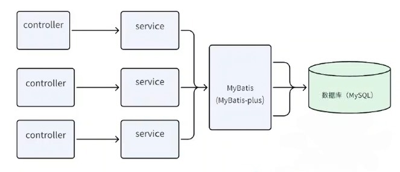
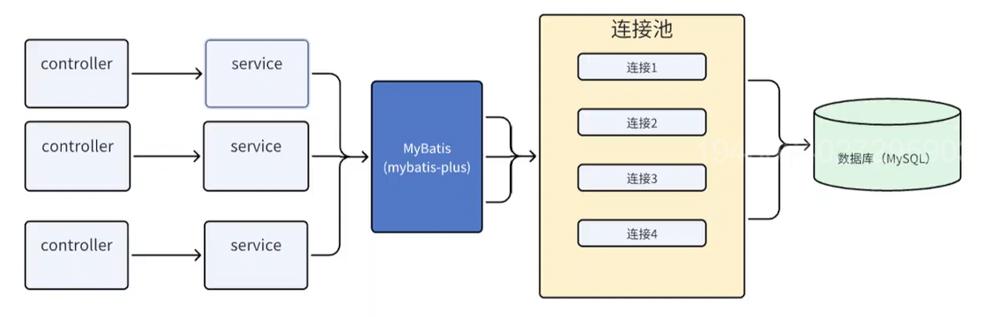

# 先开发后端

## 管理登录

父工程pom文件
```pom
<?xml version="1.0" encoding="UTF-8"?>  
<project xmlns="http://maven.apache.org/POM/4.0.0"  
         xmlns:xsi="http://www.w3.org/2001/XMLSchema-instance"  
         xsi:schemaLocation="http://maven.apache.org/POM/4.0.0  
http://maven.apache.org/xsd/maven-4.0.0.xsd">  
    <modelVersion>4.0.0</modelVersion>  
    <parent>  
        <groupId>org.springframework.boot</groupId>  
        <artifactId>spring-boot-starter-parent</artifactId>  
        <version>3.0.1</version>  
        <relativePath/> <!-- lookup parent from repository -->  
    </parent>  
    <groupId>com.bite</groupId>  
    <artifactId>bite-oj</artifactId>  
    <version>1.0-SNAPSHOT</version>  
    <packaging>pom</packaging>  
    <modules>  
        <module>oj-modules</module>  
    </modules>  
    <properties>  
        <maven.compiler.source>17</maven.compiler.source>  
        <maven.compiler.target>17</maven.compiler.target>  
        <spring-boot.version>3.0.1</spring-boot.version>  
        <spring-cloud-alibaba.version>2022.0.0.0-RC2</spring-cloud-alibaba.version>  
        <spring-cloud.version>2022.0.0</spring-cloud.version>  
    </properties>  
    <dependencies>  
        <!-- bootstrap 启动器 -->  
        <dependency>  
            <groupId>org.springframework.cloud</groupId>  
            <artifactId>spring-cloud-starter-bootstrap</artifactId>  
        </dependency>  
    </dependencies>  
    <dependencyManagement>  
        <dependencies>  
            <!-- SpringCloud Alibaba 微服务 -->  
            <dependency>  
                <groupId>com.alibaba.cloud</groupId>  
                <artifactId>spring-cloud-alibaba-dependencies</artifactId>  
                <version>${spring-cloud-alibaba.version}</version>  
                <type>pom</type>  
                <scope>import</scope>  
            </dependency>  
            <!-- SpringCloud 微服务 -->  
            <dependency>  
                <groupId>org.springframework.cloud</groupId>  
                <artifactId>spring-cloud-dependencies</artifactId>  
                <version>${spring-cloud.version}</version>  
                <type>pom</type>  
                <scope>import</scope>  
            </dependency>  
            <!-- SpringBoot 依赖配置 -->  
            <dependency>  
                <groupId>org.springframework.boot</groupId>  
                <artifactId>spring-boot-dependencies</artifactId>  
                <version>${spring-boot.version}</version>  
                <type>pom</type>  
                <scope>import</scope>  
            </dependency>  
        </dependencies>  
    </dependencyManagement>  
</project>
```

module的pom文件
```pom
<?xml version="1.0" encoding="UTF-8"?>  
<project xmlns="http://maven.apache.org/POM/4.0.0"  
         xmlns:xsi="http://www.w3.org/2001/XMLSchema-instance"  
         xsi:schemaLocation="http://maven.apache.org/POM/4.0.0 http://maven.apache.org/xsd/maven-4.0.0.xsd">  
    <modelVersion>4.0.0</modelVersion>  
    <parent>  
        <groupId>com.bite</groupId>  
        <artifactId>bite-oj</artifactId>  
        <version>1.0-SNAPSHOT</version>  
    </parent>  
  
    <artifactId>oj-modules</artifactId>  
    <packaging>pom</packaging>  
    <modules>  
        <module>oj-system</module>  
        <module>oj-system</module>  
        <module>oj-friend</module>  
        <module>oj-job</module>  
        <module>oj-judge</module>  
    </modules>  
  
    <properties>  
        <maven.compiler.source>17</maven.compiler.source>  
        <maven.compiler.target>17</maven.compiler.target>  
        <project.build.sourceEncoding>UTF-8</project.build.sourceEncoding>  
    </properties>  
  
    <dependencies>  
        <dependency>  
            <groupId>org.springframework.boot</groupId>  
            <artifactId>spring-boot-starter-web</artifactId>  
        </dependency>  
    </dependencies>  
  
  
</project>
```

然后是每个项目启动的端口都在各自微服务下的bootstrap.yml⽂件中设置好。

管理登录：账号密码        **不提供管理员注册 不对外开放的接口用于新增管理员用户**
C端用户登录：手机验证码


登录验证：服务查询用户的信息，和输入的是否一致

查询的用户信息在哪？
这些用户信息肯定是要持久化的----------> 数据库（MySQL）

再根据查询结果进行登录校验。
## 这时候就要引入MySQL这个组件到咱们的项目当中了

先启动docker，然后直接在”在线判题系统“文件夹下拉去并且启动mysql
```powershell
docker run -d --name oj-mysql -p 3307:3306 -e "TZ=Asia/Shanghai" -e "MYSQL_ROOT_PASSWORD=123456" mysql:5.7
```
因为我的主机3306端口已经被占用了，所以用3307，然后docker容器内部还是3306

进入到mysql容器中：
```powershell
docker exec -it 914748ac42e3 bash
```

因为直接用root连接的话不是很安全，所以创建一个oj项目用户
```powershell
CREATE USER 'ojtest'@'%' IDENTIFIED BY '123456';
```

然后建库建表
```powershell
CREATE database if NOT EXISTS `bitoj_dev` ；
```

赋予⽤⼾操作权限,只限定在我们创建的这个bitoj_dev库就行了
```powershell
GRANT CREATE,DROP,SELECT, INSERT, UPDATE, DELETE ON bitoj_dev.* TO 'ojtest'@'%';
```

然后通过刚才创建的oj项目用户进入mysql进行建表
```powershell
CREATE TABLE `tb_test` (
 `test_id` bigint unsigned NOT NULL,
 `title` text NOT NULL,
 `content` text NOT NULL,
 PRIMARY KEY (`test_id`)
) ENGINE=InnoDB DEFAULT CHARSET=utf8mb4;


INSERT INTO tb_test values(1,'test','test');
select * from tb_test;
update tb_test set title = 'test_update' where test_id = 1;
delete from tb_test;

```

注意用图形化界面工具的时候要用3307，因为我上面改成3307了


### MyBatisPlus

工作流程图


### 数据库连接池


初始连接数、最大连接数、空闲时间、超时时间
数据库连接池直接与数据库进行交互，如果连接池有4个能进行连接，要是ABC处理得快，资源还给了数据库连接池，那么后来的D就可以连接上


频繁的创建连接和销毁连接，保罗TCP握手和MySQL协议握手，耗时
连接数不受控制，大量应用服务可能同时请求数据库连接

