# 先开发后端

## 管理登录

父工程pom文件
```pom
<?xml version="1.0" encoding="UTF-8"?>  
<project xmlns="http://maven.apache.org/POM/4.0.0"  
         xmlns:xsi="http://www.w3.org/2001/XMLSchema-instance"  
         xsi:schemaLocation="http://maven.apache.org/POM/4.0.0  
http://maven.apache.org/xsd/maven-4.0.0.xsd">  
    <modelVersion>4.0.0</modelVersion>  
    <parent>  
        <groupId>org.springframework.boot</groupId>  
        <artifactId>spring-boot-starter-parent</artifactId>  
        <version>3.0.1</version>  
        <relativePath/> <!-- lookup parent from repository -->  
    </parent>  
    <groupId>com.bite</groupId>  
    <artifactId>bite-oj</artifactId>  
    <version>1.0-SNAPSHOT</version>  
    <packaging>pom</packaging>  
    <modules>  
        <module>oj-modules</module>  
    </modules>  
    <properties>  
        <maven.compiler.source>17</maven.compiler.source>  
        <maven.compiler.target>17</maven.compiler.target>  
        <spring-boot.version>3.0.1</spring-boot.version>  
        <spring-cloud-alibaba.version>2022.0.0.0-RC2</spring-cloud-alibaba.version>  
        <spring-cloud.version>2022.0.0</spring-cloud.version>  
    </properties>  
    <dependencies>  
        <!-- bootstrap 启动器 -->  
        <dependency>  
            <groupId>org.springframework.cloud</groupId>  
            <artifactId>spring-cloud-starter-bootstrap</artifactId>  
        </dependency>  
    </dependencies>  
    <dependencyManagement>  
        <dependencies>  
            <!-- SpringCloud Alibaba 微服务 -->  
            <dependency>  
                <groupId>com.alibaba.cloud</groupId>  
                <artifactId>spring-cloud-alibaba-dependencies</artifactId>  
                <version>${spring-cloud-alibaba.version}</version>  
                <type>pom</type>  
                <scope>import</scope>  
            </dependency>  
            <!-- SpringCloud 微服务 -->  
            <dependency>  
                <groupId>org.springframework.cloud</groupId>  
                <artifactId>spring-cloud-dependencies</artifactId>  
                <version>${spring-cloud.version}</version>  
                <type>pom</type>  
                <scope>import</scope>  
            </dependency>  
            <!-- SpringBoot 依赖配置 -->  
            <dependency>  
                <groupId>org.springframework.boot</groupId>  
                <artifactId>spring-boot-dependencies</artifactId>  
                <version>${spring-boot.version}</version>  
                <type>pom</type>  
                <scope>import</scope>  
            </dependency>  
        </dependencies>  
    </dependencyManagement>  
</project>
```

module的pom文件
```pom
<?xml version="1.0" encoding="UTF-8"?>  
<project xmlns="http://maven.apache.org/POM/4.0.0"  
         xmlns:xsi="http://www.w3.org/2001/XMLSchema-instance"  
         xsi:schemaLocation="http://maven.apache.org/POM/4.0.0 http://maven.apache.org/xsd/maven-4.0.0.xsd">  
    <modelVersion>4.0.0</modelVersion>  
    <parent>  
        <groupId>com.bite</groupId>  
        <artifactId>bite-oj</artifactId>  
        <version>1.0-SNAPSHOT</version>  
    </parent>  
  
    <artifactId>oj-modules</artifactId>  
    <packaging>pom</packaging>  
    <modules>  
        <module>oj-system</module>  
        <module>oj-system</module>  
        <module>oj-friend</module>  
        <module>oj-job</module>  
        <module>oj-judge</module>  
    </modules>  
  
    <properties>  
        <maven.compiler.source>17</maven.compiler.source>  
        <maven.compiler.target>17</maven.compiler.target>  
        <project.build.sourceEncoding>UTF-8</project.build.sourceEncoding>  
    </properties>  
  
    <dependencies>  
        <dependency>  
            <groupId>org.springframework.boot</groupId>  
            <artifactId>spring-boot-starter-web</artifactId>  
        </dependency>  
    </dependencies>  
  
  
</project>
```

然后是每个项目启动的端口都在各自微服务下的bootstrap.yml⽂件中设置好。

管理登录：账号密码        **不提供管理员注册 不对外开放的接口用于新增管理员用户**
C端用户登录：手机验证码


登录验证：服务查询用户的信息，和输入的是否一致

查询的用户信息在哪？
这些用户信息肯定是要持久化的----------> 数据库（MySQL）

再根据查询结果进行登录校验。
### 这时候就要引入MySQL这个组件到咱们的项目当中了

先启动docker，然后直接在”在线判题系统“文件夹下拉去并且启动mysql
```powershell
docker run -d --name oj-mysql -p 3307:3306 -e "TZ=Asia/Shanghai" -e "MYSQL_ROOT_PASSWORD=123456" mysql:5.7
```
因为我的主机3306端口已经被占用了，所以用3307，然后docker容器内部还是3306

进入到mysql容器中：
```powershell
docker exec -it 914748ac42e3 bash
```

因为直接用root连接的话不是很安全，所以创建一个oj项目用户
```powershell
CREATE USER 'ojtest'@'%' IDENTIFIED BY '123456';
```

然后建库建表
```powershell
CREATE database if NOT EXISTS `bitoj_dev` ;
```

赋予⽤⼾操作权限,只限定在我们创建的这个bitoj_dev库就行了
```powershell
GRANT CREATE,DROP,SELECT, INSERT, UPDATE, DELETE ON bitoj_dev.* TO 'ojtest'@'%';
```

然后通过刚才创建的oj项目用户进入mysql进行建表
```powershell
CREATE TABLE `tb_test` (
 `test_id` bigint unsigned NOT NULL,
 `title` text NOT NULL,
 `content` text NOT NULL,
 PRIMARY KEY (`test_id`)
) ENGINE=InnoDB DEFAULT CHARSET=utf8mb4;


INSERT INTO tb_test values(1,'test','test');
select * from tb_test;
update tb_test set title = 'test_update' where test_id = 1;
delete from tb_test;

```

注意用图形化界面工具的时候要用3307，因为我上面改成3307了


### MyBatisPlus

工作流程图


### 数据库连接池

工作特点：

初始连接数、最大连接数、空闲时间、超时时间
数据库连接池直接与数据库进行交互，如果连接池有4个能进行连接，要是ABC处理得快，资源还给了数据库连接池，那么后来的D就可以连接上
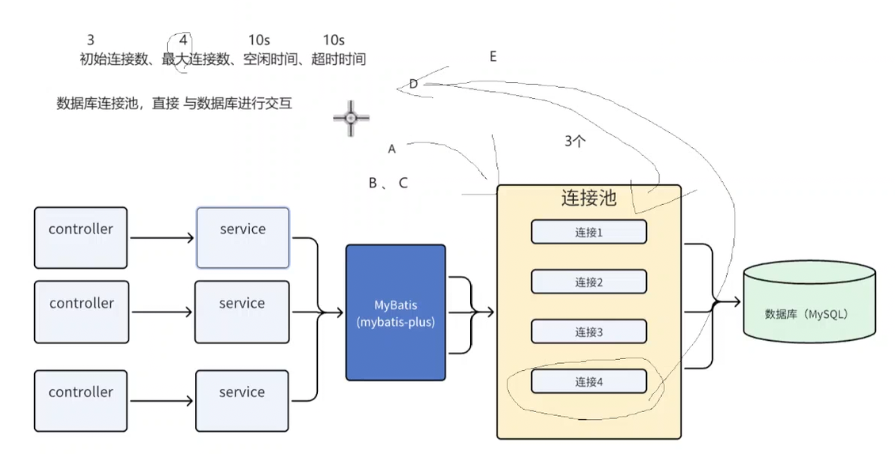
如果ABCD业务都完了，就可以自动把不是初始连接数的第四个连接去掉，节省资源

### 为什么用数据库连接池？
频繁的创建连接和销毁连接，保罗TCP握手和MySQL协议握手，耗时
连接数不受控制，大量应用服务可能同时请求数据库连接
提供统⼀的管理，对数据库统一管理
提高性能
资源利用率
提高稳定性

### 我们使用的数据库连接池是HikariCP
各大公司对这个连接池使用是很高的
+ 高性能
+ 资源优化，减少不必要线程和锁的竞争
+ 配置灵活
+ 与Spring Boot集成良好

### 集成MyBatisPlus与数据库连接池（HikariCP已经是springboot默认连接池）

先在oj-system引入pom依赖
```pom
<dependencies>  
    <!-- mybatis-plus -->  
    <dependency>  
        <groupId>com.baomidou</groupId>  
        <artifactId>mybatis-plus-spring-boot3-starter</artifactId>  
        <version>${mybatis-plus.version}</version>  
    </dependency>  
  
    <dependency>  
        <groupId>com.mysql</groupId>  
        <artifactId>mysql-connector-j</artifactId>  
    </dependency>  
</dependencies>
```

然后测试以下即将用到的MyBatisPlus与数据库连接池
在com.bite.system下创建一个test包
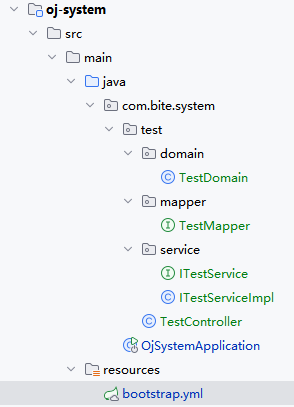

实体TestDomain要有对应的MyBatisPlus的注解
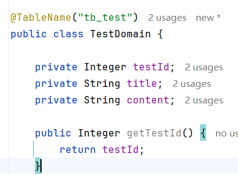

Mapper不仅要extends BaseMapper，还要指定要操作的泛型是我们对应的实体
```java
public interface TestMapper extends BaseMapper<TestDomain> {  
}
```

 记得在启动类上加上扫描注解
 ```java
@SpringBootApplication  
@MapperScan("com.bite.**.mapper")  
public class OjSystemApplication {  
    public static void main(String[] args) {  
        SpringApplication.run(OjSystemApplication.class, args);  
    }  
}
 ```
最后在bootstrap.yml下配置数据库连接，注意端口!!
```yml
server:  
  port: 9201  
# Spring  
spring:  
  application:  
    # 应⽤名称  
    name: oj-system  
  datasource:  
   url: jdbc:mysql://localhost:3307/bitoj_dev?useUnicode=true&characterEncoding=utf8&useSSL=true&serverTimezone=GMT%2B8  
   username: ojtest  
   password: 123456  
   hikari:  
    minimum-idle: 5 # 最⼩空闲连接数  
    maximum-pool-size: 20 # 最⼤连接数  
    idle-timeout: 30000 # 空闲连接存活时间（毫秒）  
    connection-timeout: 30000 # 连接超时时间（毫秒
```

### 表结构设计：满足需求，避免冗余设计、考虑今后发展

管理员表结构设计：
通过账号从数据库中查出实际密码，根据用户输入对比。

账号 密码这两个字段，还需要有索引提高查询速度，可以直接建立一个唯一性索引，既然有肯定不能为空，必须要有主键id

从安全来看，责任追踪，数据回溯：创建人、创建时间、更新人、更新时间

我们这里不需要将主键设置成自增，不太好，不安全，为什么后面会说为什么

管理员实体类设置：
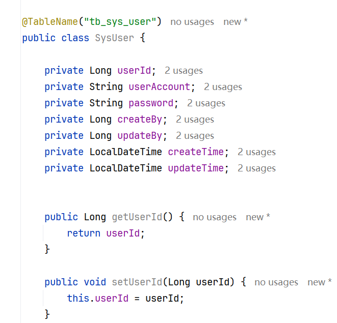

### 主键
为什么主键 不再使用aotu_increment？
+ 数据迁移和备份，当你把数据从数据库迁移到另一个库，新数据库如果已经存在就数据库中相同的字段id的情况下，插入就会失败，这种重复概率会大
+ 插入删除操作，如果表中存在大量删除和插入操作，自增的主键可能会导致ID值不连续，可能会浪费存储空间
+ 性能问题，高并发下，可能会导致性能瓶颈，每一次插入时，都要找下一个自增id，这个操作就增加了插入数据操作的延时
+ 可预测性，自增是可与测试的，有安全风险，如果让黑客预测到id可能会遭到篡改
+ 分布式环境问题，哥哥节点都会生成自增id，会有一些挑战

### 生成主键的方法
+ uuid，具有唯一性、全局性、不变性的特点，占的空间比较大，高并发会有性能瓶颈，索引性能也会下降，因为是主键，整体性能也会下降，是字符不太易于记忆
+ 雪花算法，是一种分布式唯一ID生成算法，趋势定增行，将64个比特位
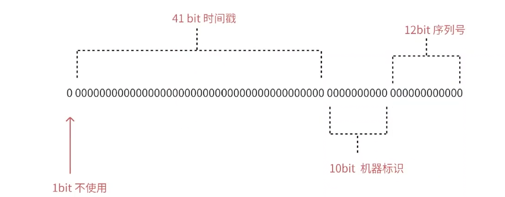

**默认是雪花算法**

这样配置就能确保主键生成用的是雪花算法
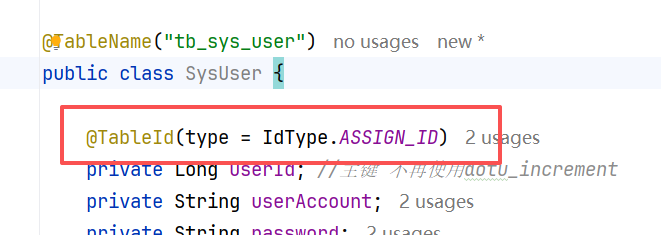

### 使用Lombok实体类的get、set方法太多了，不太优雅

1. 安装插件
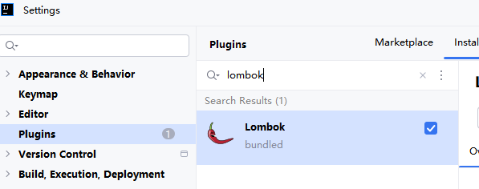

2. 导入Lombok依赖
```pom
<dependency>
 <groupId>org.projectlombok</groupId>
 <artifactId>lombok</artifactId>
</dependency>
```

那么这个依赖放在哪个pom里面呢？----------> 可以直接放在最外层pom文件里
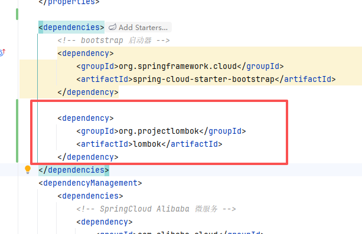

这时候之前写的get、set方法都可以去掉了，直接用注解
@Getter  
@Setter  
@ToString

我们发现这几个字段会有很大的复用，可以提取出来，放在一个公共的类里面，然后让这个继承那个公共类 BaseEntity 就行
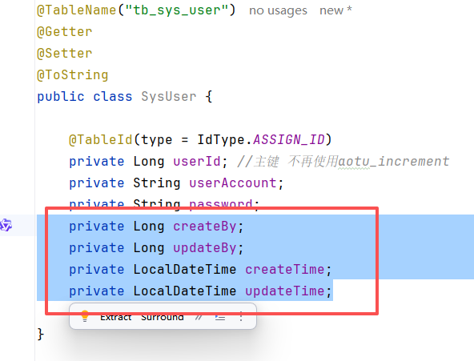

但是现在有个问题，这个公共类之后能在oj-system包底下用，其他包用不了怎么办
这时候可以new一个公共的模块common就行了，common存放一些公共的东西

关于依赖 oj-system下的pom
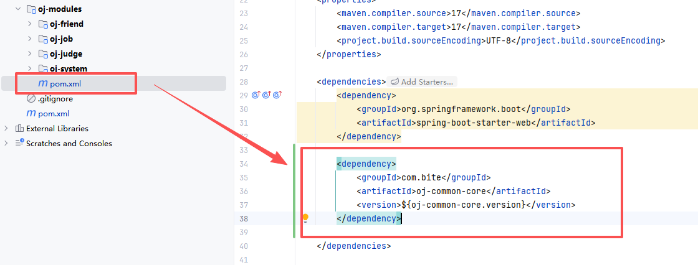

最外层的pom
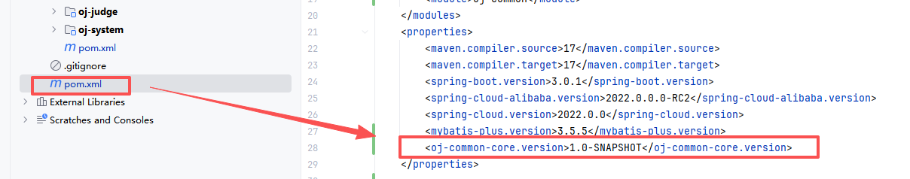

### 后端

请求先由controller处理，完了之后给service处理具体的业务逻辑
我相信以我的记忆能力以及实操能力，看图就能回忆起当初那个意气风发的自己是怎么操作的
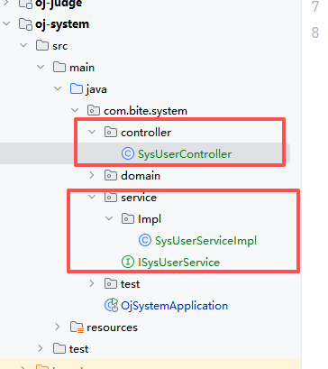
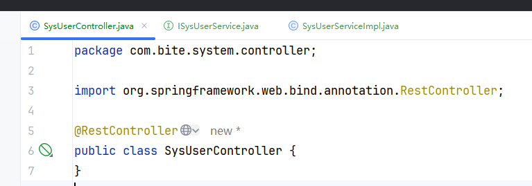
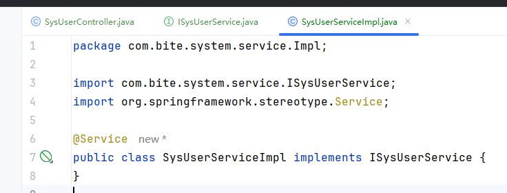

这里的返回值应该是什么呢？至少要返回一个Message提示登录成功/失败把，失败原因
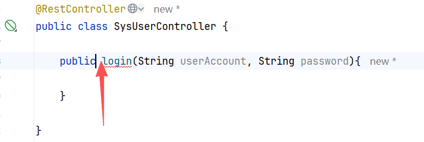

//至少要返回一个Message提示登录成功/失败把， bool true false || int code 1 成功 0 失败  
// 失败原因     String msg//因为返回两个字段，是不是一个对象啊，所以要定义一个对象
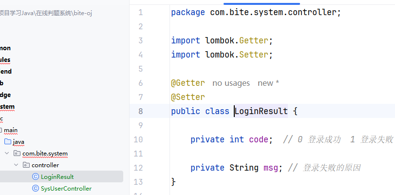

MyBatisPlus的语法是这样的：
```java
        LambdaQueryWrapper<SysUser> queryWrapper = new LambdaQueryWrapper<>();
        // select password from tb_sys_user where user_account = #{userAccount}
        SysUser sysUser = sysUserMapper.selectOne(queryWrapper.select(SysUser::getPassword).eq(SysUser::getUserAccount, userAccount));
```


## 有了接口文档才能更好的进行开发

一般是由后端写的，和前端讨论才最终决定，包含了接口地址、参数以及输出内容的说明
### 作用
+ 简化前后端开发
+ 已于错误处理
+ 代码可维护性
+ 文档化

### 内容

概述，接口名称、功能、类别
地址，接口唯一访问地址
请求方法，GET、POST、DELETE、PUT（增删改查）
请求参数，路径参数、查询参数、请求头、请求体
响应数据，接口返回的数据格式，状态码、消息、数据体
请求和响应示例

### 响应数据定义

响应数据格式：往common里面定义一个R类
```java
@Getter  
@Setter  
public class R<T> {  
  
    private int code; //定义一些固定（常量集合维护用枚举）的code，前后端商量好的 0 成功 1 失败 2 权限不足 3 参数错误 4 账号不存在 5 账号已存在 6 密码错误 等等  
  
    private String msg; // 通常是code的辅助说明 一个code对应一个msg  
  
    private T data; //请求某个接口返回的数据，类型可能是不同一的，所以用泛型  
  
}
```
然后有一个枚举,为了不暴露我们的一个状态，使用自定义状态码和msg
```java
@Getter  
@AllArgsConstructor  
public enum ResultCode {  
  
    //操作唱功  
    SUCCESS (1000, "操作成功"),  
    //服务器内部错误，友好提⽰  
    ERROR (2000, "服务繁忙请稍后重试"),  
    //操作失败，但是服务器不存在异常  
    FAILED (3000, "操作失败"),  
    FAILED_UNAUTHORIZED (3001, "未授权"),  
    FAILED_PARAMS_VALIDATE (3002, "参数校验失败"),  
    FAILED_NOT_EXISTS (3003, "资源不存在"),  
    FAILED_ALREADY_EXISTS (3004, "资源已存在"),  
    AILED_USER_EXISTS (3101, "⽤⼾已存在"),  
    FAILED_USER_NOT_EXISTS (3102, "⽤⼾不存在"),  
    FAILED_LOGIN (3103, "⽤⼾名或密码错误"),  
    FAILED_USER_BANNED (3104, "您已被列⼊⿊名单, 请联系管理员.");  
  
    private int code;  
  
    private String msg;  
  
}
```

### 请求路径和参数(body、pathparameters、query pathparameters、headers)

这里参数用body，请求方式用post
```java
@PostMapping("/login") //登录安全考虑，使用Post  
public R<Void> login(@RequestBody LoginDTO loginDTO){  
    return sysUserService.login(loginDTO.getUserAccount(), loginDTO.getUserAccount());  
}
```
创建一个LoginDTP存放用户名和密码
```java
@Getter  
@Setter  
public class LoginDTO {  
    private String userAccount;  
    private String password;  
}
```

注意，上面返回值已经是一个R<T>，记得把原始代码改一下。

但是这样写接口文档太low了，**可以用swagger 生成接口文档**