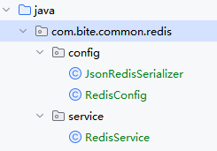
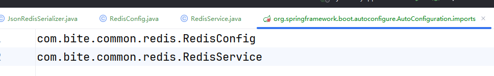
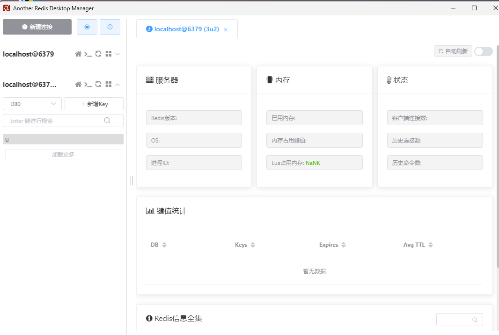
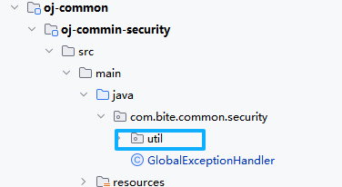

**我们在线oj项目用的就是jwt认证方式**

## 身份认证机制

### JWT组成
+ 头部，令牌类型和使用的算法，使用base64编码
+ 载荷，用户的信息（昵称、id，并不是明文直接存）和其他元数据，使用base64编码
+ 签名，验证令牌完整、真实性

通过 . 分割三个部分

**为什么使用jwt**
在gateway微服务进行jwt验证，因为jwt是自包含（减轻服务器负担）、安全（签名）、无状态（不存储），每个服务身份认证这块就能独立操作，扩展起来就很方便；支持跨域

**有没有什么坑，仅仅使用jwt就可以吗？**
+ jwt采用base64编码，不能存敏感信息，完全暴露出来的，能解码得到原始的数据，token泄露就完了
+ 因为无状态，想要修改里面的内容就必须重新签发（用户修改个人信息需重新登录）
+ 无法演唱jwt过期时间，用户正在操作时突然身份认证失败

**怎么既要又要呢**
+ payload中不能存放敏感信息
仅仅存储用户唯一标识信息，第三方集中存储敏感信息，根据唯一标识，从第三方中查出响应的敏感信息，第三方存储查询性能一定要高，没必要长期存储，用**Redis**
+ 用户修改个人信息，jwt不变
+ 控制jwt提供的过期时间
不能再使用jwt提供的过期时间的参数/方法，借助第三方维护过期时间，还是**Redis**

所以综上所述，记录jwt过期时间，并且支持过期时间的修改，最好还能有存储功能，那必然用的是**Redis**+JWT 实现身份认证机制

## 引入Redis

1. 拉取镜像
```powershell
docker pull redis
```
2. 启动redis容器
```powershell
docker run --name oj-redis -d -p 6379:6379 redis --requirepass "123456"
```
3. 在oj-common创建相应的redis工程，引入依赖
```xml
<!-- SpringBoot Boot Redis -->
 <dependency>
 <groupId>org.springframework.boot</groupId>
 <artifactId>spring-boot-starter-data-redis</artifactId>
 </dependency>
 <!-- Alibaba Fastjson -->
 <dependency>
 <groupId>com.alibaba.fastjson2</groupId>
 <artifactId>fastjson2</artifactId>
 <version>2.0.43</version>
 </dependency>
```
也要进行版本的管理
4. 对redis进行相应的配置
+ 写一个关于json序列化工具
自定义序列化器 JsonRedisSerializer类，序列化和反序列化
```java
public class JsonRedisSerializer<T> implements RedisSerializer<T> {  
    public static final Charset DEFAULT_CHARSET = Charset.forName("UTF-8");  
    private Class<T> clazz;  
    public JsonRedisSerializer(Class<T> clazz) {  
        super();  
        this.clazz = clazz;  
    }  
    @Override  
    public byte[] serialize(T t) throws SerializationException {  
        if (t == null) {  
            return new byte[0];  
        }  
        return JSON.toJSONString(t).getBytes(DEFAULT_CHARSET);  
    }  
    @Override  
    public T deserialize(byte[] bytes) throws SerializationException {  
        if (bytes == null || bytes.length <= 0) {  
            return null;  
        }  
        String str = new String(bytes, DEFAULT_CHARSET);  
        return JSON.parseObject(str, clazz);  
    }  
}
```

加redis配置RedisConfig
```java
/**  
* redis配置  
 */  
@Configuration  
public class RedisConfig extends CachingConfigurerSupport {  
    @Bean  
    public RedisTemplate<Object, Object> redisTemplate(RedisConnectionFactory  
                                                               connectionFactory) {  
        RedisTemplate<Object, Object> template = new RedisTemplate<>();  
        template.setConnectionFactory(connectionFactory);  
        JsonRedisSerializer serializer = new JsonRedisSerializer(Object.class);  
        // 使⽤StringRedisSerializer来序列化和反序列化redis的key值  
        template.setKeySerializer(new StringRedisSerializer());  
        template.setValueSerializer(serializer);  
        // Hash的key也采⽤StringRedisSerializer的序列化⽅式  
        template.setHashKeySerializer(new StringRedisSerializer());  
        template.setHashValueSerializer(serializer);  
        template.afterPropertiesSet();  
        return template;  
    }  
}
```

封装RedisService
```java
@Component  
public class RedisService {  
    @Autowired  
    public RedisTemplate redisTemplate;  
    //************************ 操作key ***************************  
    /**     * 判断 key是否存在  
     *  
     * @param key 键  
     * @return true 存在 false不存在  
     */  
    public Boolean hasKey(String key) {  
        return redisTemplate.hasKey(key);  
    }  
    /**  
     * 设置有效时间  
     *  
     * @param key Redis键  
     * @param timeout 超时时间  
     * @return true=设置成功；false=设置失败  
     */  
    public boolean expire(final String key, final long timeout) {  
        return expire(key, timeout, TimeUnit.SECONDS);  
    }/**  
     * 设置有效时间  
     *  
     * @param key Redis键  
     * @param timeout 超时时间  
     * @param unit 时间单位  
     * @return true=设置成功；false=设置失败  
     */  
    public boolean expire(final String key, final long timeout, final TimeUnit  
            unit) {  
        return redisTemplate.expire(key, timeout, unit);  
    }  
  
    /**  
     * 删除单个对象  
     *  
     * @param key  
     */  
    public boolean deleteObject(final String key) {  
        return redisTemplate.delete(key);  
    }  
    //************************ 操作String类型 ***************************    /**     * 缓存基本的对象，Integer、String、实体类等  
     *  
     * @param key 缓存的键值  
     * @param value 缓存的值  
     */  
    public <T> void setCacheObject(final String key, final T value) {  
        redisTemplate.opsForValue().set(key, value);  
    }  
    /**  
     * 缓存基本的对象，Integer、String、实体类等  
     *  
     * @param key 缓存的键值  
     * @param value 缓存的值  
     * @param timeout 时间  
     * @param timeUnit 时间颗粒度  
     */  
    public <T> void setCacheObject(final String key, final T value, final Long  
            timeout, final TimeUnit timeUnit) {  
        redisTemplate.opsForValue().set(key, value, timeout, timeUnit);  
    }/**  
     * 获得缓存的基本对象。  
     *  
     * @param key 缓存键值  
     * @return 缓存键值对应的数据  
     */  
    public <T> T getCacheObject(final String key, Class<T> clazz) {  
        ValueOperations<String, T> operation = redisTemplate.opsForValue();  
        T t = operation.get(key);  
        if (t instanceof String) {  
            return t;  
        }  
        return JSON.parseObject(String.valueOf(t), clazz);  
    }  
    //*************** 操作list结构 ****************    /**     * 获取list中存储数据数量  
     *  
     * @param key  
     * @return  
     */    public Long getListSize(final String key) {  
        return redisTemplate.opsForList().size(key);  
    }  
    /**  
     * 获取list中指定范围数据  
     *  
     * @param key  
     * @param start  
     * @param end  
     * @param clazz  
     * @param <T>  
     * @return  
     */    public <T> List<T> getCacheListByRange(final String key, long start, long  
            end, Class<T> clazz) {  
        List range = redisTemplate.opsForList().range(key, start, end);  
        if (CollectionUtils.isEmpty(range)) {  
            return null;  
        }  
        return JSON.parseArray(JSON.toJSONString(range), clazz);  
    }  
/*** 底层使⽤list结构存储数据(尾插 批量插⼊)  
 */public <T> Long rightPushAll(final String key, Collection<T> list) {  
    return redisTemplate.opsForList().rightPushAll(key, list);  
}  
    /**  
     * 底层使⽤list结构存储数据(头插)  
     */    public <T> Long leftPushForList(final String key, T value) {  
        return redisTemplate.opsForList().leftPush(key, value);  
    }  
    /**  
     * 底层使⽤list结构,删除指定数据  
     */  
    public <T> Long removeForList(final String key, T value) {  
        return redisTemplate.opsForList().remove(key, 1L, value);  
    }  
    //************************ 操作Hash类型 ***************************    public <T> T getCacheMapValue(final String key, final String hKey,  
                                  Class<T> clazz) {  
        Object cacheMapValue = redisTemplate.opsForHash().get(key, hKey);  
        if (cacheMapValue != null) {  
            return JSON.parseObject(String.valueOf(cacheMapValue), clazz);  
        }  
        return null;  
    }  
    /**  
     * 获取多个Hash中的数据  
     *  
     * @param key Redis键  
     * @param hKeys Hash键集合  
     * @param clazz 待转换对象类型  
     * @param <T> 泛型  
     * @return Hash对象集合  
     */  
    public <T> List<T> getMultiCacheMapValue(final String key, final  
    Collection<String> hKeys, Class<T> clazz) {  
        List list = redisTemplate.opsForHash().multiGet(key, hKeys);  
        List<T> result = new ArrayList<>();  
        for (Object item : list) {  
            result.add(JSON.parseObject(JSON.toJSONString(item), clazz));}  
        return result;  
    }  
    /**  
     * 往Hash中存⼊数据  
     *  
     * @param key Redis键  
     * @param hKey Hash键  
     * @param value 值  
     */  
    public <T> void setCacheMapValue(final String key, final String hKey, final  
    T value) {  
        redisTemplate.opsForHash().put(key, hKey, value);  
    }  
    /**  
     * 缓存Map  
     *     * @param key  
     * @param dataMap  
     */  
    public <K, T> void setCacheMap(final String key, final Map<K, T> dataMap) {  
        if (dataMap != null) {  
            redisTemplate.opsForHash().putAll(key, dataMap);  
        }  
    }  
    public Long deleteCacheMapValue(final String key, final String hKey) {  
        return redisTemplate.opsForHash().delete(key, hKey);  
    }  
}
```
存放文件如图

为了让其他微服务能扫描到要完成下图操作在resource下创建


别忘了配置redis的连接配置，密码地址等
```yaml
server:
  port: 9201
# Spring
spring:
  data:
    redis:
      host: localhost
      password: 123456

  datasource:
   url: jdbc:mysql://localhost:3307/bitoj_dev?useUnicode=true&characterEncoding=utf8&useSSL=true&serverTimezone=GMT%2B8
   username: ojtest
   password: 123456
   hikari:
    minimum-idle: 5 # 最⼩空闲连接数
    maximum-pool-size: 20 # 最⼤连接数
    idle-timeout: 30000 # 空闲连接存活时间（毫秒）
    connection-timeout: 30000 # 连接超时时间（毫秒
 
```

重启项目就可以了


## 身份认证机制-功能实现

### 引入jwt
```xml
<dependency>
 <groupId>io.jsonwebtoken</groupId>
 <artifactId>jjwt</artifactId>
 <version>0.9.1</version>
</dependency>
<dependency>
 <groupId>javax.xml.bind</groupId>
 <artifactId>jaxb-api</artifactId>
 <version>2.4.0-b180830.0359</version>
</dependency>
<dependency>
 <groupId>cn.hutool</groupId>
 <artifactId>hutool-all</artifactId>
 <version>5.8.22</version>
</dependency>

```
### 创建jwt工具类

在common的security的util包下创建

```java
public class JwtUtils {  
    /**  
     * ⽣成令牌  
     *  
     * @param claims 数据  
     * @param secret 密钥  
     * @return 令牌  
     */  
    public static String createToken(Map<String, Object> claims, String secret)  
    {  
        String token =  
                Jwts.builder().setClaims(claims).signWith(SignatureAlgorithm.HS512,  
                        secret).compact();  
        return token;  
    }  
    /**  
     * 从令牌中获取数据  
     *  
     * @param token 令牌  
     * @param secret 密钥  
     * @return 数据  
     */  
    public static Claims parseToken(String token, String secret) {  
        return  
                Jwts.parser().setSigningKey(secret).parseClaimsJws(token).getBody();  
    }  
}
```

### 捋一下逻辑，完成用户身份认证的三大步骤

1. 用户登录成功后，调用createToken 生成令牌 并 发送给客户端
**放在nacos上就能满足secret的保密、随机、不硬编码、定期更换**
+ 在实现类里面声明注解@Value("${jwt.secret}")，并在实现类上面声明@RefreshScope，实现动态刷新，当更新配置文件时，会自动更新无需重启
```yaml
# 在oj-system-local.yaml下
jwt:
  secret: sdfghuijasxdjkawskuigy
```

1. 后续的所有请求，在调用具体接口前，都要先通过token进行身份认证


2. 用户使用系统的过程中进行适当的延长jwt过期时间（防止用户在编码过程中过期）

