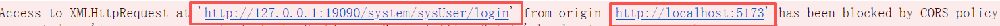
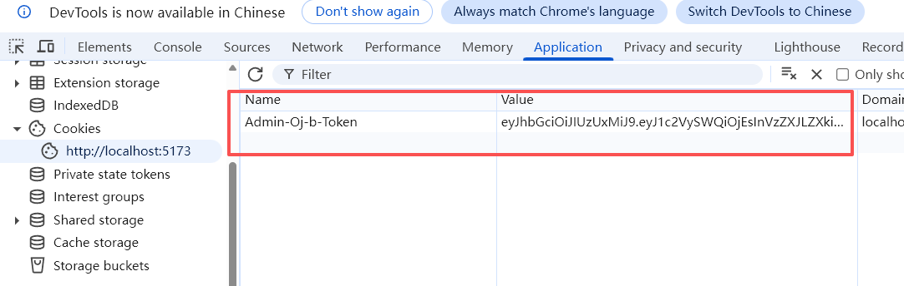
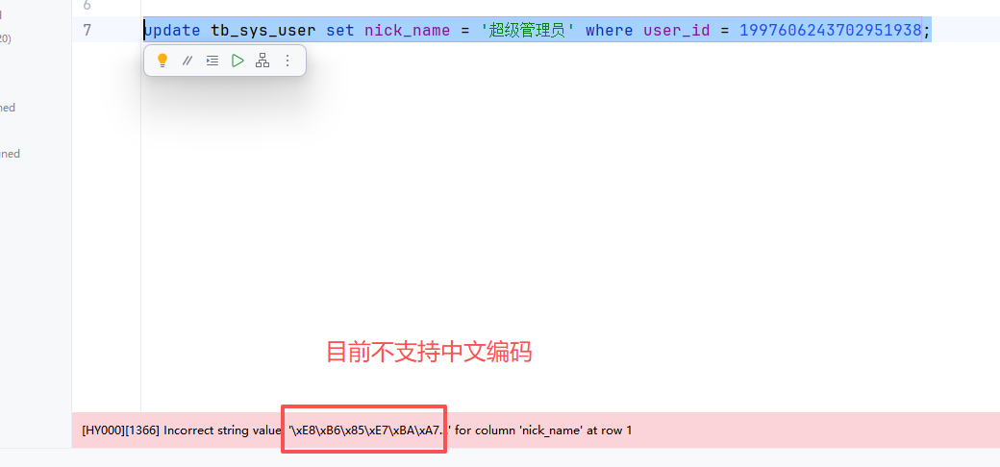
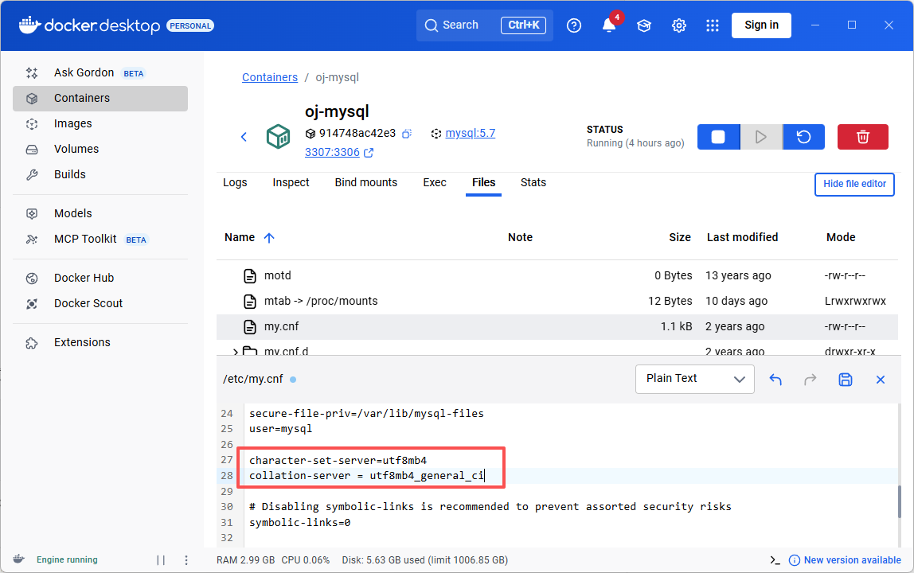
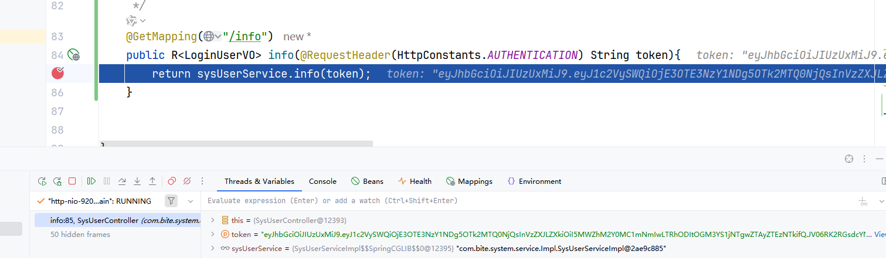
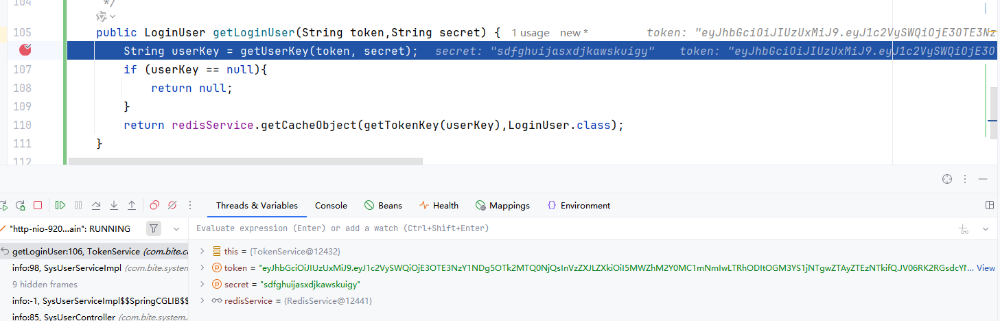
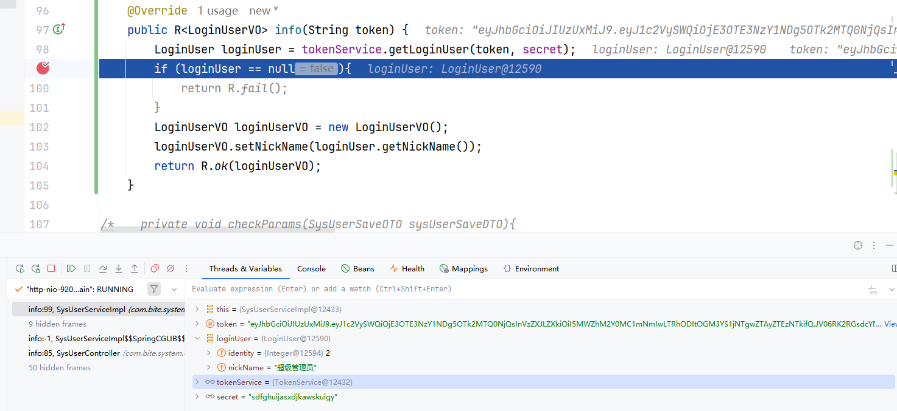
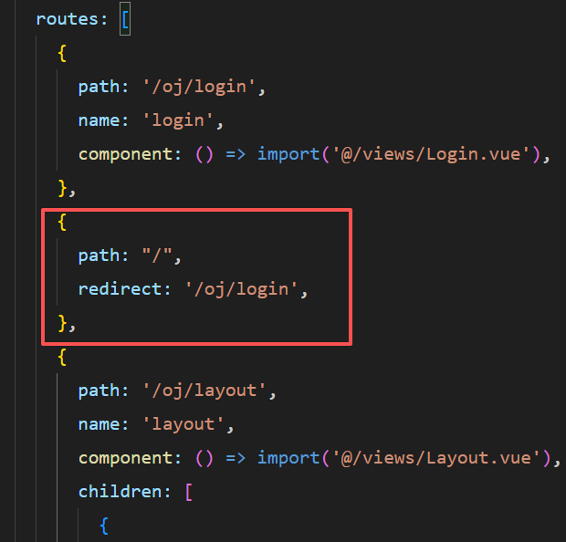

## Entity、DTO、VO

Entity：实体类
DTO：后端接收前端请求参数，通常只包含需要返回的数据
VO：后端返回给前端的数据

解耦，修改每一层的时候对其他层的影响降低
合理利用网络资源，在互相传输数据过程中，尽可能用到哪些封装哪些

如果划分太细可能未来维护困难

## 对参数的校验

引入依赖validation
```xml
<dependency>
 <groupId>org.springframework.boot</groupId>
 <artifactId>spring-boot-starter-validation</artifactId>
</dependency>
```

这几个注解
```java
@Getter  
@Setter  
public class ValidationDTO {  
    @NotNull(message = "昵称不能为null")  
    private String nickName;  
  
    @NotBlank(message = "用户账号不能为空")  
    private String userAccount;  
  
    @NotEmpty(message = "用户密码不能为空，并且不能只包含空格")  
    @Size(min = 5, max = 10, message = "密码长度不能少于5位，不能大于10位")  
    private String password;  
  
    @Min(value = 0, message = "年龄不能小于0岁")  
    @Max(value = 60, message = "年龄不能大于60岁")  
    private int age;  
  
    @Email(message = "必须符合邮箱格式")  
    private String email;  
  
    @Pattern(regexp = "^(13[0-9]|14[01456879]|15[0-35-9]|16[2567]|17[0-8]|18[0-9]|19[0-35-9])\\d{8}$",message = "手机号码格式不正确")  
    private String phone;  
  
    @Past(message = "开始日期必须是过去的日期")  
    private LocalDate startDate;  
  
    @Future(message = "结束日期必须是未来的日期")  
    private LocalDate endDate;  
}
```

注意加上这个配置才会对规则进行合法性判断
```java
@GetMapping("/validation")  
public String validation(@Validated ValidationDTO validationDTO){  
    return "参数测试";  
}
```

在全局异常处理加上具体参数失败处理方法，让其DTO配置的信息显示出来
```java
@ExceptionHandler(BindException.class)  
public R<Void> handleBindException(BindException e) {  
    log.error(e.getMessage());  
    String message = join(e.getAllErrors(),  
            DefaultMessageSourceResolvable::getDefaultMessage, ", ");  
    return R.fail(ResultCode.FAILED_PARAMS_VALIDATE.getCode(), message);  
}  
private <E> String join(Collection<E> collection, Function<E, String>  
        function, CharSequence delimiter) {  
    if (CollUtil.isEmpty(collection)) {  
        return StrUtil.EMPTY;  
    }  
    return collection.stream().map(function).filter(Objects::nonNull).collect(Collectors.joining(delimiter));  
}
```


## 前端项目创建oj-fe-b

安装element-plus
```powershell
npm install element-plus --save
```

按需导入element-plus，减小项目体积
```powershell
npm install -D unplugin-vue-components unplugin-auto-import
```

```js
import { fileURLToPath, URL } from 'node:url'

  

import vue from '@vitejs/plugin-vue'

import vueDevTools from 'vite-plugin-vue-devtools'

import { defineConfig } from 'vite'

import AutoImport from 'unplugin-auto-import/vite'

import Components from 'unplugin-vue-components/vite'

import { ElementPlusResolver } from 'unplugin-vue-components/resolvers'

  

// https://vite.dev/config/

export default defineConfig({

  plugins: [

    vue(),

    vueDevTools(),

        AutoImport({

      resolvers: [ElementPlusResolver()],

    }),

    Components({

      resolvers: [ElementPlusResolver()],

    }),

  ],

  resolve: {

    alias: {

      '@': fileURLToPath(new URL('./src', import.meta.url))

    },

  },

})
```

**登录成功**
携带用户信息向后端发请求-->后端接收前端请求，执行登录相关业务逻辑-->后端将结果返回给前端
如果登录成功，跳转到后台管理页面，并且前端将返回的token存储起来

**登陆失败**
提示一下失败信息

双向数据绑定v-model="username"

```vue
<el-input v-model="username" placeholder="请输⼊账号" />
```

```vue
<script setup>
import { ref } from 'vue'
const username = ref('')
const password = ref('')
</script>
```

## Axios
异步操作，我们vue项目发出的是Ajax请求
安装axios
```powershell
npm install axios
```
创建axios实例
```js
import axios from 'axios'

//不同的功能，通过axios请求不同的接口
const service = axios.create({
  baseURL:"http://127.0.0.1:19090/system", //解决跨域问题用：baseURL:"/dev-api",
  timeout: 5000,

})

export default service
```

同一apis方法
```js
import service from '@/utils/request';

export function loginService(userAccount, password) {

  return service({

    url: 'sysUser/login',

    method: 'post',

    data:{userAccount,password}

  })

}
```

跨域策略阻塞CORS（同源策略）
浏览器只允许来自同源请求访问资源（协议+域名+端口相同）


**代理服务器    解决跨域问题**
前端请求 --> 代理服务器 --> 后端
因为代理服务器不受浏览器影响
vite.config
```JS
  // 设置代理服务器，解决跨域问题
  server: {
    proxy: {
      '/dev-api': {
        target: 'http://127.0.0.1:19090/system',
        rewrite: (p) => p.replace(/^\/dev-api/, ""),
      },
    },
  },
```

安装js-cookie
```powershell
npm install js-cookie
```
将token存到浏览器cookie中
```js
import Cookies from "js-cookie";
const TokenKey = "Admin-Oj-b-Token";

export function getToken() {
 return Cookies.get(TokenKey);
}

export function setToken(token) {
 return Cookies.set(TokenKey, token);
}

export function removeToken() {
 return Cookies.remove(TokenKey);
}
```

```vue
async function loginFun(){
  const loginResult = await loginService(userAccount.value, password.value)
  console.log("登录结果: ", loginResult);
  if(loginResult.data.code == 1000){
    console.log("登录成功")
    router.push('/oj/system')
    setToken(loginResult.data.data)
  }else{
    console.log("登录失败")
  }
}
```


勤看[Element-Plus官网]([Input 输入框 | Element Plus (element-plus.org)](https://element-plus.org/zh-CN/component/input#input-%E8%BE%93%E5%85%A5%E6%A1%86))

设置相应拦截器
```js
service.interceptors.response.use(
  (res) => {
    // 未设置状态码则默认成功状态
    const code = res.data.code;
    const msg = res.data.msg;
    if (code !== 1000) {
      ElMessage.error(msg);
      return Promise.reject(new Error(msg));
    } else {
      return Promise.resolve(res.data);
    }
  },
  (error) => {
    return Promise.reject(error);
  }
);
```

通过相应拦截器优化
```vue
async function loginFun(){
  try{
    const loginResult = await loginService(userAccount.value, password.value)
    console.log("登录结果: ", loginResult);
    router.push('/oj/system')
    setToken(loginResult.data)
  }catch(error) {
    console.log("登录结果: ", error);
  }

/*   if(loginResult.data.code == 1000){
    console.log("登录成功")
    router.push('/oj/system')
    setToken(loginResult.data.data)
    ElMessage({
    message: '登录成功',
    type: 'success',
  })
  }else{
    console.log("登录失败")
    ElMessage.error(loginResult.data.msg)
  } */
}
```

## 页面布局

[Container布局容器]([Container 布局容器 | Element Plus (element-plus.org)](https://element-plus.org/zh-CN/component/container#container-%E5%B8%83%E5%B1%80%E5%AE%B9%E5%99%A8))

## 后端提供动态获取管理员昵称接口

添加nick_name 这个新列
```sql
alter table tb_sys_user add nick_name varchar(20) null after user_account;
```
然后解决mysql编码问题




好的接下来就是这几个围绕着获取当前用户信息info这个接口的步骤
1. 首先获得前端传过来的token

2. 然后调用解析token根据用户唯一标识userkey调用redis查看用户信息

3. 最后获得nickName返回给前端


## 退出登录

用户点击退出登录，并且确认退出，将退出的请求(携带token)，发送给后端
后端先验证用户是否处于登录状态，并且验证是否是管理员 

处理退出登录逻辑（将token失效即可）：后端接收到请求后将redis中用户数据删除掉

返回结果：
如果失败，继续保持登录状态，停留在当前页面
如果成功，前端清除存储的token，返回登录页面

--- 

## 前端路由优化

现在启动前端项目之后打开的是 http://localhost:5173/ 是一个空页面，每次想看到页面都得手动添加路径，麻烦

可以用**重定向**
加这个配置


提高用户体验：
虽然现在进到 layout 这个页面，但是我们没登陆或者退出了，理论上应该不能让其登录了
我现在已经登录过了，上完厕所之后打开登录页路径后应该跳转到layout

可以概括为以下两点
1. 非登录状态下，访问除登录页以外的页面，自动跳转回登录页
2. 已登录，并且token未过期，此时访问登录页应该自动跳转到layout后台管理页面
**全局前置守卫**
```js
router.beforeEach((to, from, next) => {
    if (getToken()) {
        /* has token*/
        if (to.path === '/oj/login') {
            next({ path: '/oj/layout/cuser' })
        } else {
            next()
        }
    } else {
        if (to.path !== '/oj/login') {
            next({
                path:'/oj/login'
            })
        } else {
            next()
        }
    }
})
```
