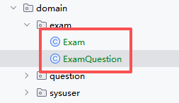
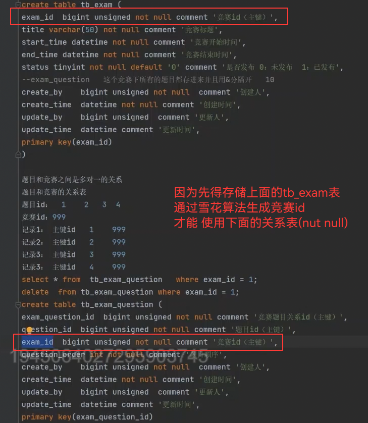
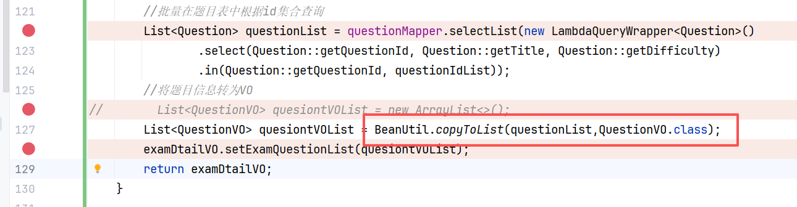

## 题目前端增删改

引入两个库

富文本编译器
还有代码编译器
```powershell
npm install @vueup/vue-quill@1.2.0

npm install ace-builds@1.4.13
```

还有抽屉
前端携带数据向后端发起请求
子组件要向父组件传递数据就要用到事件，代码里有，比如添加题目成功后就会立刻发起查询题目列表的请求就用到了子组件向父组件发消息

### 编辑题目
获取题目详情数据我们是在 Question.vue 这个组件下写的
但是展示题目详情数据的是在抽屉 QuestionDrawer.vue 这个子组件下

这就是获取数据在父组件，展示在子组件
**想办法将父组件获取到的数据放到子组件中去展示**

但是太麻烦了，直接让子组件发出请求自己显示就好了，得想办法将父组件获取的题目id传给子组件.

### 编辑题目
关于 async/await 的使用规则：
需要 async/await：当函数内部有异步操作（如 API 调用）且需要等待结果时

## 竞赛管理

**和竞赛相关的功能：**
B端：列表、新增、编辑、删除、发布、撤销发布
C端：列表（未开始、历史）、报名参赛、参加竞赛（竞赛倒计时、完成竞赛、竞赛内题目切换）、竞赛练习、查看排名、我的消息

建表
```sql
create table tb_exam (  
    exam_id bigint unsigned not null comment '竞赛id（主键）',  
    title varchar(50) not null comment '竞赛标题',  
    start_time datetime not null comment '竞赛开始时间',  
    end_time datetime not null comment '竞赛结束时间',  
    status tinyint not null default '0' comment '是否发布 0：未发布 1：已发布',  
    create_by bigint unsigned not null  comment '创建人',  
    create_time datetime not null comment '创建时间',  
    update_by bigint unsigned comment '更新人',  
    update_time datetime comment '更新时间',  
  
    primary key(exam_id)  
);  
  
-- 题目和竞赛关系表  
create table tb_exam_question (  
    exam_question_id bigint unsigned not null comment '竞赛题目关系id（主键）',  
    question_id bigint unsigned not null comment '题目id（主键）',  
    exam_id bigint unsigned not null comment '竞赛id（主键）',  
    question_order int not null comment '题目顺序',  
    create_by bigint unsigned not null  comment '创建人',  
    create_time datetime not null comment '创建时间',  
    update_by bigint unsigned comment '更新人',  
    update_time datetime comment '更新时间',  
  
    primary key(exam_question_id)  
);
```

**把这两个表对应的实体类创建出来**


### 列表功能
1. 用户切换到竞赛管理
2. 前端发起获取竞赛列表请求(前端携带相关参数)
3. 后端接收到请求后，根据请求参数从数据库查询符合条件的竞赛，将查询结果返回前端(成功/失败)
4. 前端接收到后端相应后(成功/失败)
   如果成功：将查询到的数据展示到页面中
   如果失败：提示用户失败信息

接口代码
```java
/*  
* 查询竞赛列表接口  
 */@Override  
public List<ExamVO> list(ExamQueryDTO examQueryDTO) {  
    PageHelper.startPage(examQueryDTO.getPageNum(),examQueryDTO.getPageSize());  
    return examMapper.selectExamList(examQueryDTO);  
}
```

### 竞赛新增

第一种：不包含题目的竞赛新增（**不能允许它发布**，因为可能没有添加题目等完善竞赛）
可以理解成一种暂存的竞赛

1. 前端携带用户输入的竞赛基本信息，像后端发起添加竞赛请求
2. 后端接收到请求后，对相关参数进行处理，将竞赛信息存入数据库，并将添加结果返回前端（成功/失败）
3. 前端接收到后端响应后
   如果成功：提示用户添加成功，竞赛列表中看到新增竞赛
   如果失败：提示失败原因
```java
/*  
* 添加竞赛 - 不包含题目的新增  
 */@Override  
public int add(ExamAddDTO examAddDTO) {  
  
    //竞赛名称的重复性校验  
    List<Exam> examList = examMapper  
            .selectList(new LambdaQueryWrapper<Exam>().eq(Exam::getTitle, examAddDTO.getTitle()));  
    if (CollectionUtil.isNotEmpty(examList)) {  
        throw new ServiceException(ResultCode.FAILED_ALREADY_EXISTS);  
    }  
    //进行时间的校验  
    if (examAddDTO.getStartTime().isBefore(LocalDateTime.now())) {  
        throw new ServiceException(ResultCode.EXAM_START_TIME_BEFORE_CURRENT_TIME);  
    }  
    if (examAddDTO.getStartTime().isAfter(examAddDTO.getEndTime())) {  
        throw new ServiceException(ResultCode.EXAM_START_TIME_AFTER_END_TIME);  
    }  
  
    //处理传过来的参数，将DTO转为实体  
    Exam exam = new Exam();  
    BeanUtil.copyProperties(examAddDTO,exam);  
    return examMapper.insert(exam);  
}
```

第二种：包含题目的竞赛的新增 **等于 = 新增不包含题目竞赛  + 为这个竞赛新增题目**

为什么分成两步呢？

防止题目丢失，也是为了用户体验
 所以要先保存竞赛基本信息，再加题目
 减少了一个接口的工作压力，对于用户响应变快，单一，维护更好容易排查

流程
1. 新增一个不包含题目的竞赛
2. 点击添加题目按钮，发起获取题目列表的请求（请求之前实现的题目列表接口即可）
3. 从题目列表中选择题目，点击提交按钮，携带着 竞赛id和题目id 向后端发起为竞赛添加题目的请求,把获取到的题目列表数据展示到弹出框内
4. 后端接收到请求后，处理相关参数将竞赛题目信息存储到数据库中，并将添加结果返回前端
5. 前端接收到后端响应后
   如果成功：在竞赛的题目列表中要能看到新增的题目
   如果失败：提示用户失败信息

MyBatis-Plus给我们提供了批量添加的方法
可以优化下面单个添加的方式，因为这个循环里面调用了两次数据库，性能堪忧
```java
for (Long questionId : questionIdSet){  
    //判断question是否为空  
    Question question = questionMapper.selectById(questionId);  
    if (question == null){  
        throw new ServiceException(ResultCode.EXAM_QUESTION_NOT_EXISTS);  
    }  
    //到这里就可以进行添加了  
    ExamQuestion examQuestion = new ExamQuestion();  
    examQuestion.setExamId(examQuestionAddDTO.getExamId());  
    examQuestion.setQuestionId(questionId);  
    examQuestion.setQuestionOrder(number++);  
    examQuestionMapper.insert(examQuestion);  
}
```

优化把两处对于数据库的操作都去掉了，取而代之的是批量操作方式selectBatchIds、saveBatch
```java
//批量查询  
List<Question> questionList = questionMapper.selectBatchIds(questionIdSet);  
if (CollectionUtil.isEmpty(questionList) || questionList.size() != questionIdSet.size()){  
    throw new ServiceException(ResultCode.EXAM_QUESTION_NOT_EXISTS);  
}


        int number = 1;  
        List<ExamQuestion> examQuestionList = new ArrayList<>();  
        for (Long questionId : questionIdSet){  
            //判断question是否为空  
/*            Question question = questionMapper.selectById(questionId);  
            if (question == null){                throw new ServiceException(ResultCode.EXAM_QUESTION_NOT_EXISTS);            }*/            //到这里就可以进行添加了  
            ExamQuestion examQuestion = new ExamQuestion();  
            examQuestion.setExamId(examQuestionAddDTO.getExamId());  
            examQuestion.setQuestionId(questionId);  
            examQuestion.setQuestionOrder(number++);  
            examQuestionList.add(examQuestion);  
//            examQuestionMapper.insert(examQuestion);  
        }  
        saveBatch(examQuestionList);
```


### 竞赛编辑

竞赛编辑编辑 = 竞赛详情功能 + 

需要**竞赛详情功能：**
1. 查询回显，携带竞赛 id 向后端发起获取竞赛详情请求
2. 后端接收到请求后，根据竞赛 id 从数据库中查询竞赛详情信息。并将查询结果返回前端
3. 前对岸接收后端响应之后
   如果成功，在页面中展示详情信息
   如果失败：提示失败原因

注意集合的数据拷贝用这个方法


这是竞赛详情功能接口
```java
    /*  
    * 根据id查询竞赛详情  
     */    @Override  
    public ExamDtailVO detail(Long examId) {  
        ExamDtailVO examDtailVO = new ExamDtailVO();  
        //获取竞赛基本信息  
        Exam exam = getExam(examId);  
        BeanUtil.copyProperties(exam,examDtailVO);  
        //获取题目id集合  
        List<ExamQuestion> examQuestionList = examQuestionMapper.selectList(new LambdaQueryWrapper<ExamQuestion>()  
                .select(ExamQuestion::getQuestionId)  
                .eq(ExamQuestion::getExamId, examId)  
                .orderByAsc(ExamQuestion::getQuestionOrder));  
        if (CollectionUtil.isEmpty(examQuestionList)){ //有可能是没有题目的竞赛  
            //只包含竞赛基本信息  
            return examDtailVO;  
        }  
        //先拿到题目id的集合到新的List 集合中  
        List<Long> questionIdList = examQuestionList.stream().map(ExamQuestion::getQuestionId).toList();  
        //批量在题目表中根据id集合查询  
        List<Question> questionList = questionMapper.selectList(new LambdaQueryWrapper<Question>()  
                .select(Question::getQuestionId, Question::getTitle, Question::getDifficulty)  
                .in(Question::getQuestionId, questionIdList));  
        //将题目信息转为VO  
//        List<QuestionVO> quesiontVOList = new ArrayList<>();  
        List<QuestionVO> quesiontVOList = BeanUtil.copyToList(questionList,QuestionVO.class);  
        examDtailVO.setExamQuestionList(quesiontVOList);  
        return examDtailVO;  
    }
```

