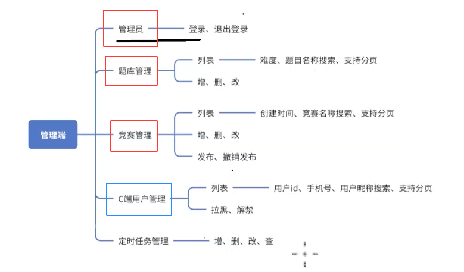

## 竞赛删除

竞赛删除 = 删除竞赛基本信息（tb_exam） + 删除竞赛题目信息（tb_exam_question）
1. 找到要删除的竞赛，点击删除按钮。前端携带竞赛 id 向后端发起删除竞赛请求
2. 后端接收请求后，根据竞赛 id （先判断竞赛是否存在，竞赛是否开赛）删除竞赛基本信息 和 竞赛题目信息。并且返回删除结果
3. 前端接收到响应，如果成功/失败

```java
/*  
删除竞赛  
 */@Override  
public int delete(Long examId) {  
    //判断竞赛是否存在  
    Exam exam = getExam(examId);  
    //判断竞赛是否开始  
    checkExam(exam);  
    //删除竞赛中的题目  
    examQuestionMapper.delete(new LambdaQueryWrapper<ExamQuestion>()  
            .eq(ExamQuestion::getExamId, examId));  
    //删除竞赛  
    return examMapper.deleteById(exam);  
}
```

## 竞赛发布

竞赛发布的前提：竞赛存在、竞赛中有题目

有三个地方可以进行竞赛发布操作
A添加竞赛
1. 在满足发布竞赛前提后，点击发布竞赛。前端携带竞赛 id 向后端发起请求
2. 后端接收到请求后，根据竞赛 id 判断前提是否成立。
   如果不成立：将原因发给前端
   如果成立：将竞赛状态字段从0改为1，并且同步到数据库，将修改结果发给前端
3. 前端接收到后端响应之后
   如果失败，展示失败原因
   如果成功，跳转回列表页，当前状态变回已发布
   C端竞赛列表中要能找到已发布竞赛（可以将状态字段为0的竞赛过滤掉，后面可能会传参数给接口）

B 编辑竞赛
C竞赛列表当中

```java
/*  
发布竞赛  
 */@Override  
public int publish(Long examId) {  
    //判断竞赛是否存在  
    Exam exam = getExam(examId);  
    //判断竞赛中是否有题目 select count(*) from tb_exam_question where exam_id = #{examId}    Long count = examQuestionMapper.selectCount(new LambdaQueryWrapper<ExamQuestion>()  
            .eq(ExamQuestion::getExamId, examId));  
    if (count == null || count <= 0){  
        throw new ServiceException(ResultCode.EXAM_NOT_HAS_QUESTION);  
    }  
    //改变状态并同步到数据库  
    exam.setStatus(Constants.TRUE);  
    return examMapper.updateById(exam);  
}
```

## 竞赛撤销

竞赛撤销发布的前提：竞赛存在、竞赛还未开始

1. 找到要发布的竞赛，点击撤销发布按钮。前端携带竞赛 id 向后端发起请求
2. 后端接收到请求后，根据竞赛 id 判断前提条件是否成立
   如果不成立：返回前端不成立原因
   如果成立： 撤销发布对应的竞赛（将竞赛状态从1 设置 为 0，并同步数据库 ），将结果返回前端
3. 前端接收到响应后
   如果成功：展示失败原因
   如果失败：B端竞赛列表中当前竞赛状态变为未发布
		   当前竞赛C端竞赛列表中消失
		   
```java
/*  
撤销发布  
 */@Override  
public int cancelpublish(Long examId) {  
    //判断竞赛是否存在  
    Exam exam = getExam(examId);  
    //判断竞赛是否开始  
    checkExam(exam);  
    exam.setStatus(Constants.FALSE);  
    return examMapper.updateById(exam);  
}
```


B端功能全部功能如图此前的这几个已经开发完毕，现在继续开发
是哪个用户提交的

### 用户管理

