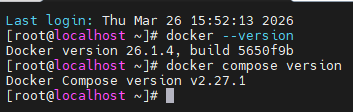
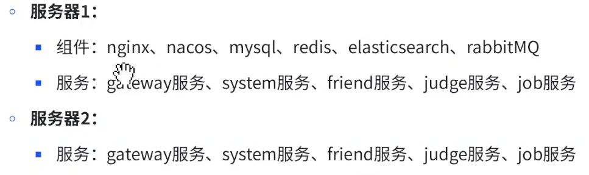
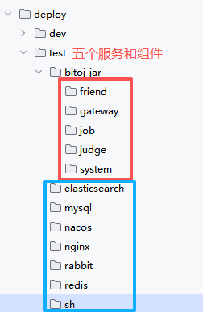
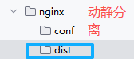
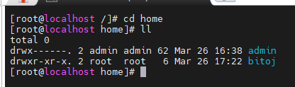
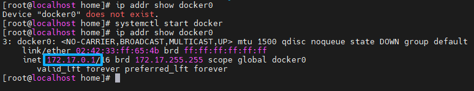
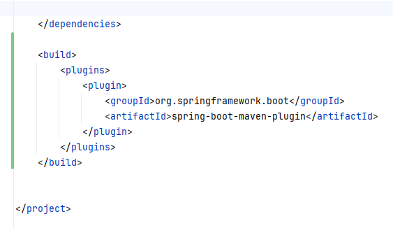

# 先检查是否安装好了docker和docker compose
1.安装docker
```powershell
# 先清理旧缓存 \
yum clean all 
# 重新添加阿里云Docker源 
yum-config-manager --add-repo https://mirrors.aliyun.com/docker-ce/linux/centos/docker-ce.repo 
# 生成新缓存 
yum makecache fast
# 安装docker
yum install -y docker-ce docker-ce-cli containerd.io
# 验证docker
docker --version
```



# 准备两台服务器（或者一台2h4g）


创建test目录和响应文件夹




sh是项目部署用的脚本(脚本内容如下):
```powershell
rm ../bitoj-jar/gateway/oj-gateway.jar
rm ../bitoj-jar/friend/oj-friend.jar
rm ../bitoj-jar/job/oj-job.jar
rm ../bitoj-jar/judge/oj-judge.jar
rm ../bitoj-jar/system/oj-system.jar
copy ../../../oj-gateway/target/oj-gateway-1.0.jar ../bitojjar/gateway/oj-gateway.jar
copy ../../../oj-modules/oj-judge/target/oj-judge-1.0-SNAPSHOT.jar 
../bitoj-jar/judge/oj-judge.jar
copy ../../../oj-modules/oj-friend/target/oj-friend-1.0-SNAPSHOT.jar 
../bitoj-jar/friend/oj-friend.jar
copy ../../../oj-modules/oj-job/target/oj-job-1.0-SNAPSHOT.jar ../bitojjar/job/oj-job.jar
copy ../../../oj-modules/oj-system/target/oj-system-1.0-SNAPSHOT.jar 
../bitoj-jar/system/oj-system.jar
pause
```
以上是在本地准备的目录

在服务器也要准备工作目录


# 开启docker远程访问
由于使用docker0桥进行调用，先开启docker的远程配置
```powershell
ip addr show docker0
```


修改配置打开远程访问docker，因为judge服务需要用到docker的代码沙箱
```powershell
vi /lib/systemd/system/docker.service 
找到ExecStart 开头的配置，注释原配置 进⾏备份 插⼊以下内容 
[Service] 
Type=notify 
# the default is not to use systemd for cgroups because the delegate issues still # exists and systemd currently does not support the cgroup feature set required 
# for containers run by docker 
ExecStart=/usr/bin/dockerd -H tcp://0.0.0.0:2375 -H fd:// --containerd=/run/containerd/containerd.sock
ExecReload=/bin/kill -s HUP $MAINPID 
TimeoutStartSec=0 
RestartSec=2 
Restart=always
```
到这里我们的项目部署的准备工作就已经完成了

# 开始项目部署过程

1. 项目打包
后端项目打包
项目打包前，需要在gateway服务和oj-modules的pom.xml文件中添加依赖。解决打包后启动JAR包是报找不到主类的错误
```xml
<build>
    <plugins>
        <plugin>
            <groupId>org.springframework.boot</groupId>
            <artifactId>spring-boot-maven-plugin</artifactId>
        </plugin>
    </plugins>
</build>
```
包括modules也是加这个依赖


还要对bootstrap.yml文件进行修改：(这些修改得再nacos的namespace和开启鉴权后再弄)
现在先打包oj-fe-b和oj-fe-c**分别得到两个dist目录**
```powershell
npm run build
```

编写**dockerfile文件**
Gateway
```powershell
# 指定了基础镜像为openjdk:17.0.2，即使⽤OpenJDK 17.0.2版本的Java环境作为构建的基础。
FROM openjdk:17.0.2
# 拷⻉jar包到容器中
ADD ./oj-gateway.jar ./oj-gateway.jar
# 运⾏jar包 ⽤ Java 运⾏容器内的 oj-gateway.jar 应⽤程序
CMD ["java", "-jar", "oj-gateway.jar"]
```
System
```powershell
FROM openjdk:17.0.2

ADD ./oj-system.jar ./oj-system.jar

CMD ["java", "-jar", "oj-system.jar"]
```
Friend
```powershell
FROM openjdk:17.0.2

ADD ./oj-friend.jar ./oj-friend.jar

CMD ["java", "-jar", "oj-friend.jar"]
```
Judge
```powershell
FROM openjdk:17.0.2

ADD ./oj-judge.jar ./oj-judge.jar

CMD ["java", "-jar", "oj-judge.jar"]
```
Job
```powershell
FROM openjdk:17.0.2

ADD ./oj-job.jar ./oj-job.jar

CMD ["java", "-jar", "oj-job.jar"]
```

接下来编写**docker compose文件**
项目不是初始状态，但是这些组件是初始状态，又相互依赖的关系
第一版
```yaml
# 指定 Docker Compose ⽂件的版本
version: '3.8'

# services：定义了服务列表
services:
  oj-mysql-server:
    image: mysql:5.7
    container_name: oj-mysql-server
    environment:
      # 时区上海
      TZ: Asia/Shanghai
      # root 密码
      MYSQL_ROOT_PASSWORD: 123456
    ports:
      - "3306:3306"
    volumes:
      # 数据挂载
      - ./mysql/mysqldata/:/var/lib/mysql/
    # 配置MySQL 服务器的字符集与排序规则
    command:
      --character-set-server=utf8mb4
      --collation-server=utf8mb4_general_ci
    # 通过执⾏特定的 MySQL 命令来检查服务的健康状态 ⽤于测试连接到 MySQL 服务器
    healthcheck:
      test: ["CMD", "mysqladmin", "ping", "-u", "root", "-p123456"]
      interval: 10s
      timeout: 5s
      retries: 10
```
然后将docker-compose.yml上传到服务器上，执行
```powershell
docker compose up -d
```
如果超时换这个镜像
```powershell
cat > /etc/docker/daemon.json <<'EOF'
{
  "registry-mirrors": ["https://docker.1ms.run"]
}
EOF
```
然后执行命令
```powershell
systemctl daemon-reload 
systemctl restart docker
```
最后再执行
```powershell
docker compose up -d
```