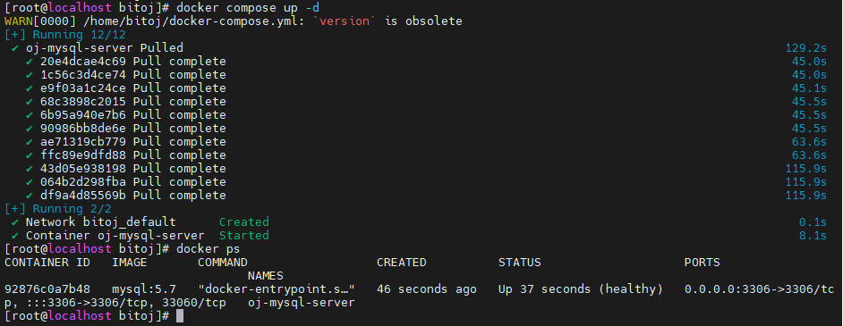

# 先检查是否安装好了docker和docker compose
1.安装docker
```powershell
# 先清理旧缓存 \
yum clean all 
# 重新添加阿里云Docker源 
yum-config-manager --add-repo https://mirrors.aliyun.com/docker-ce/linux/centos/docker-ce.repo 
# 生成新缓存 
yum makecache fast
# 安装docker
yum install -y docker-ce docker-ce-cli containerd.io
# 验证docker
docker --version
```


# 准备两台服务器（或者一台2h4g）


创建test目录和响应文件夹


sh是项目部署用的脚本(脚本内容如下):
```powershell
rm ../bitoj-jar/gateway/oj-gateway.jar
rm ../bitoj-jar/friend/oj-friend.jar
rm ../bitoj-jar/job/oj-job.jar
rm ../bitoj-jar/judge/oj-judge.jar
rm ../bitoj-jar/system/oj-system.jar
copy ../../../oj-gateway/target/oj-gateway-1.0.jar ../bitojjar/gateway/oj-gateway.jar
copy ../../../oj-modules/oj-judge/target/oj-judge-1.0-SNAPSHOT.jar 
../bitoj-jar/judge/oj-judge.jar
copy ../../../oj-modules/oj-friend/target/oj-friend-1.0-SNAPSHOT.jar 
../bitoj-jar/friend/oj-friend.jar
copy ../../../oj-modules/oj-job/target/oj-job-1.0-SNAPSHOT.jar ../bitojjar/job/oj-job.jar
copy ../../../oj-modules/oj-system/target/oj-system-1.0-SNAPSHOT.jar 
../bitoj-jar/system/oj-system.jar
pause
```
以上是在本地准备的目录

在服务器也要准备工作目录


# 开启docker远程访问
由于使用docker0桥进行调用，先开启docker的远程配置
```powershell
ip addr show docker0
```


修改配置打开远程访问docker，因为judge服务需要用到docker的代码沙箱
```powershell
vi /lib/systemd/system/docker.service 
找到ExecStart 开头的配置，注释原配置 进⾏备份 插⼊以下内容 
[Service] 
Type=notify 
# the default is not to use systemd for cgroups because the delegate issues still # exists and systemd currently does not support the cgroup feature set required 
# for containers run by docker 
ExecStart=/usr/bin/dockerd -H tcp://0.0.0.0:2375 -H fd:// --containerd=/run/containerd/containerd.sock
ExecReload=/bin/kill -s HUP $MAINPID 
TimeoutStartSec=0 
RestartSec=2 
Restart=always
```
到这里我们的项目部署的准备工作就已经完成了

# 开始项目部署过程

1. 项目打包
后端项目打包
项目打包前，需要在gateway服务和oj-modules的pom.xml文件中添加依赖。解决打包后启动JAR包是报找不到主类的错误
```xml
<build>
    <plugins>
        <plugin>
            <groupId>org.springframework.boot</groupId>
            <artifactId>spring-boot-maven-plugin</artifactId>
        </plugin>
    </plugins>
</build>
```
包括modules也是加这个依赖


还要对bootstrap.yml文件进行修改：(这些修改得再nacos的namespace和开启鉴权后再弄)
现在先打包oj-fe-b和oj-fe-c**分别得到两个dist目录**
```powershell
npm run build
```

编写**dockerfile文件**
Gateway
```powershell
# 指定了基础镜像为openjdk:17.0.2，即使⽤OpenJDK 17.0.2版本的Java环境作为构建的基础。
FROM openjdk:17.0.2
# 拷⻉jar包到容器中
ADD ./oj-gateway.jar ./oj-gateway.jar
# 运⾏jar包 ⽤ Java 运⾏容器内的 oj-gateway.jar 应⽤程序
CMD ["java", "-jar", "oj-gateway.jar"]
```
System
```powershell
FROM openjdk:17.0.2

ADD ./oj-system.jar ./oj-system.jar

CMD ["java", "-jar", "oj-system.jar"]
```
Friend
```powershell
FROM openjdk:17.0.2

ADD ./oj-friend.jar ./oj-friend.jar

CMD ["java", "-jar", "oj-friend.jar"]
```
Judge
```powershell
FROM openjdk:17.0.2

ADD ./oj-judge.jar ./oj-judge.jar

CMD ["java", "-jar", "oj-judge.jar"]
```
Job
```powershell
FROM openjdk:17.0.2

ADD ./oj-job.jar ./oj-job.jar

CMD ["java", "-jar", "oj-job.jar"]
```

接下来编写**docker compose文件**
项目不是初始状态，但是这些组件是初始状态，又相互依赖的关系
第一版
```yaml
# 指定 Docker Compose ⽂件的版本
version: '3.8'

# services：定义了服务列表
services:
  oj-mysql-server:
    image: mysql:5.7
    container_name: oj-mysql-server
    environment:
      # 时区上海
      TZ: Asia/Shanghai
      # root 密码
      MYSQL_ROOT_PASSWORD: 123456
    ports:
      - "3306:3306"
    volumes:
      # 数据挂载
      - ./mysql/mysqldata/:/var/lib/mysql/
    # 配置MySQL 服务器的字符集与排序规则
    command:
      --character-set-server=utf8mb4
      --collation-server=utf8mb4_general_ci
    # 通过执⾏特定的 MySQL 命令来检查服务的健康状态 ⽤于测试连接到 MySQL 服务器
    healthcheck:
      test: ["CMD", "mysqladmin", "ping", "-u", "root", "-p123456"]
      interval: 10s
      timeout: 5s
      retries: 10
```
然后将docker-compose.yml上传到服务器上，执行
```powershell
docker compose up -d
```
如果超时换这个镜像
```powershell
cat > /etc/docker/daemon.json <<'EOF'
{
  "registry-mirrors": ["https://docker.1ms.run"]
}
EOF
```
然后执行命令
```powershell
systemctl daemon-reload 
systemctl restart docker
```
最后再执行
```powershell
docker compose up -d
```
这样就成功了

完成mysql的启动好以后，还有对mysql中的数据进行初始化（nacos和项目的数据都会依赖）

还得把nacos、项目、xxl-job的库创建出来、一些表、数据、用户啥的
# MYSQL初始化
创建用户并设置权限
```sql
CREATE USER 'ojtest'@'%' IDENTIFIED BY '123456';
CREATE database if NOT EXISTS `bitoj_dev`;
CREATE database if NOT EXISTS `bitoj_nacos_local`;
CREATE database if NOT EXISTS `xxl_job` default character set utf8mb4 collate
utf8mb4_unicode_ci;
GRANT CREATE,DROP,SELECT, INSERT, UPDATE, DELETE,ALTER ON bitoj_dev.* TO
'ojtest'@'%';
GRANT CREATE,DROP,SELECT, INSERT, UPDATE, DELETE,ALTER ON bitoj_nacos_local.* 
TO 'ojtest'@'%';
GRANT CREATE,DROP,SELECT, INSERT, UPDATE, DELETE,ALTER ON xxl_job.* TO
'ojtest'@'%';
```

## nacos外接数据库配置
```sql
use bitoj_nacos_local;

CREATE TABLE `config_info` (
 `id` bigint(20) NOT NULL AUTO_INCREMENT COMMENT 'id',
 `data_id` varchar(255) NOT NULL COMMENT 'data_id',
 `group_id` varchar(128) DEFAULT NULL COMMENT 'group_id',
 `content` longtext NOT NULL COMMENT 'content',
 `md5` varchar(32) DEFAULT NULL COMMENT 'md5',
 `gmt_create` datetime NOT NULL DEFAULT CURRENT_TIMESTAMP COMMENT '创建时间',
 `gmt_modified` datetime NOT NULL DEFAULT CURRENT_TIMESTAMP COMMENT '修改时间',
 `src_user` text COMMENT 'source user',
 `src_ip` varchar(50) DEFAULT NULL COMMENT 'source ip',
 `app_name` varchar(128) DEFAULT NULL COMMENT 'app_name',
 `tenant_id` varchar(128) DEFAULT '' COMMENT '租户字段',
 `c_desc` varchar(256) DEFAULT NULL COMMENT 'configuration description',
 `c_use` varchar(64) DEFAULT NULL COMMENT 'configuration usage',
 `effect` varchar(64) DEFAULT NULL COMMENT '配置生效的描述',
 `type` varchar(64) DEFAULT NULL COMMENT '配置的类型',
 `c_schema` text COMMENT '配置的模式',
 `encrypted_data_key` text NOT NULL COMMENT '密钥',
 PRIMARY KEY (`id`),
 UNIQUE KEY `uk_configinfo_datagrouptenant` (`data_id`,`group_id`,`tenant_id`)
) ENGINE=InnoDB DEFAULT CHARSET=utf8 COLLATE=utf8_bin COMMENT='config_info';

CREATE TABLE `config_info_aggr` (
 `id` bigint(20) NOT NULL AUTO_INCREMENT COMMENT 'id',
 `data_id` varchar(255) NOT NULL COMMENT 'data_id',
 `group_id` varchar(128) NOT NULL COMMENT 'group_id',
 `datum_id` varchar(255) NOT NULL COMMENT 'datum_id',
 `content` longtext NOT NULL COMMENT '内容',
 `gmt_modified` datetime NOT NULL COMMENT '修改时间',
 `app_name` varchar(128) DEFAULT NULL COMMENT 'app_name',
 `tenant_id` varchar(128) DEFAULT '' COMMENT '租户字段',
 PRIMARY KEY (`id`),
 UNIQUE KEY `uk_configinfoaggr_datagrouptenantdatum` (`data_id`,`group_id`,`tenant_id`,`datum_id`)
) ENGINE=InnoDB DEFAULT CHARSET=utf8 COLLATE=utf8_bin COMMENT='增加租户字段';

CREATE TABLE `config_info_beta` (
 `id` bigint(20) NOT NULL AUTO_INCREMENT COMMENT 'id',
 `data_id` varchar(255) NOT NULL COMMENT 'data_id',
 `group_id` varchar(128) NOT NULL COMMENT 'group_id',
 `app_name` varchar(128) DEFAULT NULL COMMENT 'app_name',
 `content` longtext NOT NULL COMMENT 'content',
 `beta_ips` varchar(1024) DEFAULT NULL COMMENT 'betaIps',
 `md5` varchar(32) DEFAULT NULL COMMENT 'md5',
 `gmt_create` datetime NOT NULL DEFAULT CURRENT_TIMESTAMP COMMENT '创建时间',
 `gmt_modified` datetime NOT NULL DEFAULT CURRENT_TIMESTAMP COMMENT '修改时间',
 `src_user` text COMMENT 'source user',
 `src_ip` varchar(50) DEFAULT NULL COMMENT 'source ip',
 `tenant_id` varchar(128) DEFAULT '' COMMENT '租户字段',
 `encrypted_data_key` text NOT NULL COMMENT '密钥',
 PRIMARY KEY (`id`),
 UNIQUE KEY `uk_configinfobeta_datagrouptenant` (`data_id`,`group_id`,`tenant_id`)
) ENGINE=InnoDB DEFAULT CHARSET=utf8 COLLATE=utf8_bin COMMENT='config_info_beta';

CREATE TABLE `config_info_tag` (
 `id` bigint(20) NOT NULL AUTO_INCREMENT COMMENT 'id',
 `data_id` varchar(255) NOT NULL COMMENT 'data_id',
 `group_id` varchar(128) NOT NULL COMMENT 'group_id',
 `tenant_id` varchar(128) DEFAULT '' COMMENT 'tenant_id',
 `tag_id` varchar(128) NOT NULL COMMENT 'tag_id',
 `app_name` varchar(128) DEFAULT NULL COMMENT 'app_name',
 `content` longtext NOT NULL COMMENT 'content',
 `md5` varchar(32) DEFAULT NULL COMMENT 'md5',
 `gmt_create` datetime NOT NULL DEFAULT CURRENT_TIMESTAMP COMMENT '创建时间',
 `gmt_modified` datetime NOT NULL DEFAULT CURRENT_TIMESTAMP COMMENT '修改时间',
 `src_user` text COMMENT 'source user',
 `src_ip` varchar(50) DEFAULT NULL COMMENT 'source ip',
 PRIMARY KEY (`id`),
 UNIQUE KEY `uk_configinfotag_datagrouptenanttag` (`data_id`,`group_id`,`tenant_id`,`tag_id`)
) ENGINE=InnoDB DEFAULT CHARSET=utf8 COLLATE=utf8_bin COMMENT='config_info_tag';

CREATE TABLE `config_tags_relation` (
 `id` bigint(20) NOT NULL COMMENT 'id',
 `tag_name` varchar(128) NOT NULL COMMENT 'tag_name',
 `tag_type` varchar(64) DEFAULT NULL COMMENT 'tag_type',
 `data_id` varchar(255) NOT NULL COMMENT 'data_id',
 `group_id` varchar(128) NOT NULL COMMENT 'group_id',
 `tenant_id` varchar(128) DEFAULT '' COMMENT 'tenant_id',
 `nid` bigint(20) NOT NULL AUTO_INCREMENT COMMENT 'nid, 自增长标识',
 PRIMARY KEY (`nid`),
 UNIQUE KEY `uk_configtagrelation_configidtag` (`id`,`tag_name`,`tag_type`),
 KEY `idx_tenant_id` (`tenant_id`)
) ENGINE=InnoDB DEFAULT CHARSET=utf8 COLLATE=utf8_bin COMMENT='config_tag_relation';

CREATE TABLE `group_capacity` (
 `id` bigint(20) unsigned NOT NULL AUTO_INCREMENT COMMENT '主键ID',
 `group_id` varchar(128) NOT NULL DEFAULT '' COMMENT 'Group ID，空字符表示整个集群',
 `quota` int(10) unsigned NOT NULL DEFAULT '0' COMMENT '配额，0表示使用默认值',
 `usage` int(10) unsigned NOT NULL DEFAULT '0' COMMENT '使用量',
 `max_size` int(10) unsigned NOT NULL DEFAULT '0' COMMENT '单个配置大小上限，单位为字节，0表示使用默认值',
 `max_aggr_count` int(10) unsigned NOT NULL DEFAULT '0' COMMENT '聚合子配置最大个数，0表示使用默认值',
 `max_aggr_size` int(10) unsigned NOT NULL DEFAULT '0' COMMENT '单个聚合数据的子配置大小上限，单位为字节，0表示使用默认值',
 `max_history_count` int(10) unsigned NOT NULL DEFAULT '0' COMMENT '最大变更历史数量',
 `gmt_create` datetime NOT NULL DEFAULT CURRENT_TIMESTAMP COMMENT '创建时间',
 `gmt_modified` datetime NOT NULL DEFAULT CURRENT_TIMESTAMP COMMENT '修改时间',
 PRIMARY KEY (`id`),
 UNIQUE KEY `uk_group_id` (`group_id`)
) ENGINE=InnoDB DEFAULT CHARSET=utf8 COLLATE=utf8_bin COMMENT='集群、各Group容量信息表';

CREATE TABLE `his_config_info` (
 `id` bigint(20) unsigned NOT NULL COMMENT 'id',
 `nid` bigint(20) unsigned NOT NULL AUTO_INCREMENT COMMENT 'nid, 自增标识',
 `data_id` varchar(255) NOT NULL COMMENT 'data_id',
 `group_id` varchar(128) NOT NULL COMMENT 'group_id',
 `app_name` varchar(128) DEFAULT NULL COMMENT 'app_name',
 `content` longtext NOT NULL COMMENT 'content',
 `md5` varchar(32) DEFAULT NULL COMMENT 'md5',
 `gmt_create` datetime NOT NULL DEFAULT CURRENT_TIMESTAMP COMMENT '创建时间',
 `gmt_modified` datetime NOT NULL DEFAULT CURRENT_TIMESTAMP COMMENT '修改时间',
 `src_user` text COMMENT 'source user',
 `src_ip` varchar(50) DEFAULT NULL COMMENT 'source ip',
 `op_type` char(10) DEFAULT NULL COMMENT 'operation type',
 `tenant_id` varchar(128) DEFAULT '' COMMENT '租户字段',
 `encrypted_data_key` text NOT NULL COMMENT '密钥',
 PRIMARY KEY (`nid`),
 KEY `idx_gmt_create` (`gmt_create`),
 KEY `idx_gmt_modified` (`gmt_modified`),
 KEY `idx_did` (`data_id`)
) ENGINE=InnoDB DEFAULT CHARSET=utf8 COLLATE=utf8_bin COMMENT='多租户改造';

CREATE TABLE `tenant_capacity` (
 `id` bigint(20) unsigned NOT NULL AUTO_INCREMENT COMMENT '主键ID',
 `tenant_id` varchar(128) NOT NULL DEFAULT '' COMMENT 'Tenant ID',
 `quota` int(10) unsigned NOT NULL DEFAULT '0' COMMENT '配额，0表示使用默认值',
 `usage` int(10) unsigned NOT NULL DEFAULT '0' COMMENT '使用量',
 `max_size` int(10) unsigned NOT NULL DEFAULT '0' COMMENT '单个配置大小上限，单位为字节，0表示使用默认值',
 `max_aggr_count` int(10) unsigned NOT NULL DEFAULT '0' COMMENT '聚合子配置最大个数',
 `max_aggr_size` int(10) unsigned NOT NULL DEFAULT '0' COMMENT '单个聚合数据的子配置大小上限，单位为字节，0表示使用默认值',
 `max_history_count` int(10) unsigned NOT NULL DEFAULT '0' COMMENT '最大变更历史数量',
 `gmt_create` datetime NOT NULL DEFAULT CURRENT_TIMESTAMP COMMENT '创建时间',
 `gmt_modified` datetime NOT NULL DEFAULT CURRENT_TIMESTAMP COMMENT '修改时间',
 PRIMARY KEY (`id`),
 UNIQUE KEY `uk_tenant_id` (`tenant_id`)
) ENGINE=InnoDB DEFAULT CHARSET=utf8 COLLATE=utf8_bin COMMENT='租户容量信息表';

CREATE TABLE `tenant_info` (
 `id` bigint(20) NOT NULL AUTO_INCREMENT COMMENT 'id',
 `kp` varchar(128) NOT NULL COMMENT 'kp',
 `tenant_id` varchar(128) default '' COMMENT 'tenant_id',
 `tenant_name` varchar(128) default '' COMMENT 'tenant_name',
 `tenant_desc` varchar(256) DEFAULT NULL COMMENT 'tenant_desc',
 `create_source` varchar(32) DEFAULT NULL COMMENT 'create_source',
 `gmt_create` bigint(20) NOT NULL COMMENT '创建时间',
 `gmt_modified` bigint(20) NOT NULL COMMENT '修改时间',
 PRIMARY KEY (`id`),
 UNIQUE KEY `uk_tenant_info_kptenantid` (`kp`,`tenant_id`),
 KEY `idx_tenant_id` (`tenant_id`)
) ENGINE=InnoDB DEFAULT CHARSET=utf8 COLLATE=utf8_bin COMMENT='tenant_info';

CREATE TABLE `users` (
 `username` varchar(50) NOT NULL PRIMARY KEY COMMENT 'username',
 `password` varchar(500) NOT NULL COMMENT 'password',
 `enabled` boolean NOT NULL COMMENT 'enabled'
);

CREATE TABLE `roles` (
 `username` varchar(50) NOT NULL COMMENT 'username',
 `role` varchar(50) NOT NULL COMMENT 'role',
 UNIQUE INDEX `idx_user_role` (`username` ASC, `role` ASC) USING BTREE
);

CREATE TABLE `permissions` (
 `role` varchar(50) NOT NULL COMMENT 'role',
 `resource` varchar(128) NOT NULL COMMENT 'resource',
 `action` varchar(8) NOT NULL COMMENT 'action',
 UNIQUE INDEX `uk_role_permission` (`role`,`resource`,`action`) USING BTREE
);

INSERT INTO users (username, password, enabled) VALUES ('nacos', '$2a$10$EuWPZHzz32dJN7jexM34MOeYirDdFAZm2kuWj7VEOJhhZkDrxfvUu', TRUE);
INSERT INTO roles (username, role) VALUES ('nacos', 'ROLE_ADMIN');
```

## xxl-job数据库初始化
```sql

```