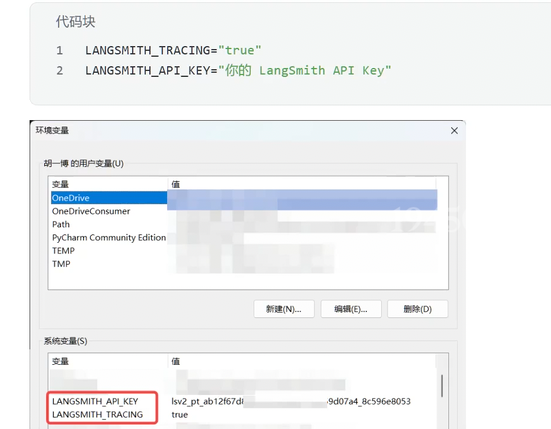
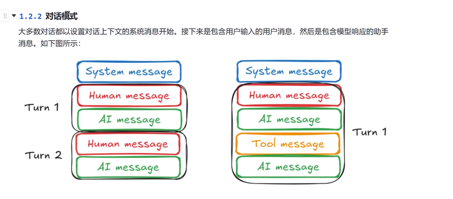
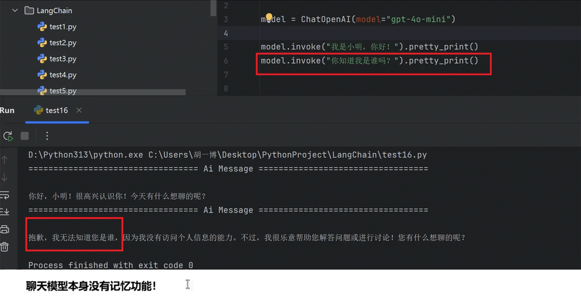
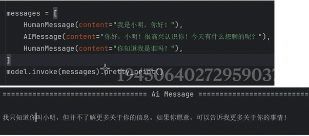

调试监控的平台，配置好环境变量和key就可以追踪了。零代码侵入

以上就是我们聊天模型核心能力

# 其他核心组件

并不是所有组件都实现了Runable接口

## 消息（Message）
 不管是什么消息，langchain都是继承了**BaseMessage**
 
## 消息--多轮对话
之前都是和大模型进行单次对话，怎么和大模型进行多轮对话

对于原本的大模型来说，发现大模型没有记忆功能

没有记忆功能怎么办，可以用**消息列表**
实际上这一步可以做到**多轮对话**
