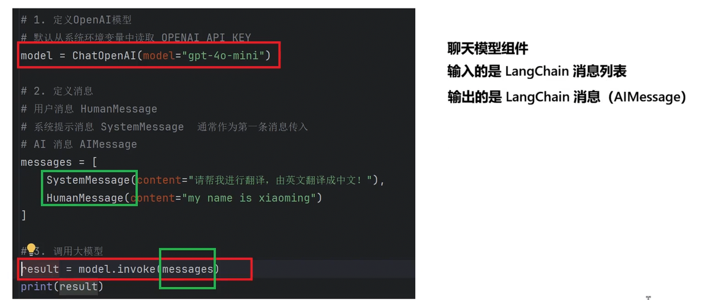
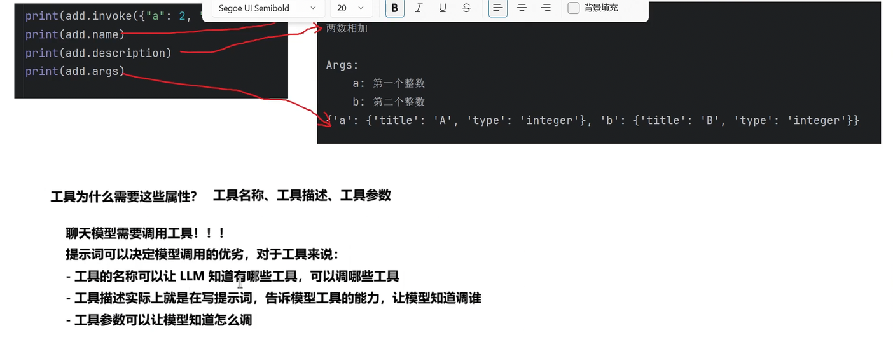
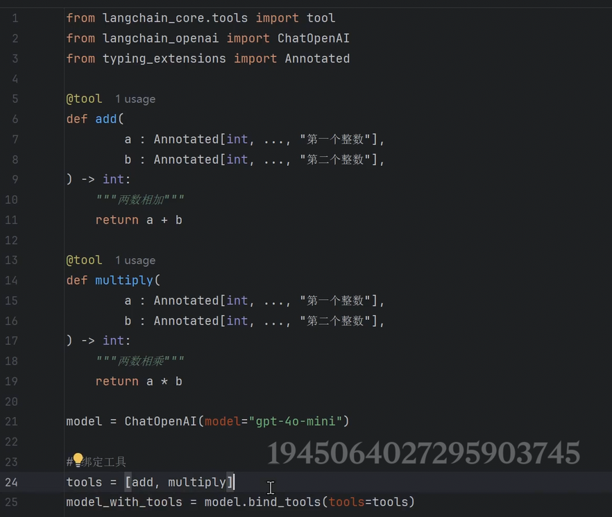
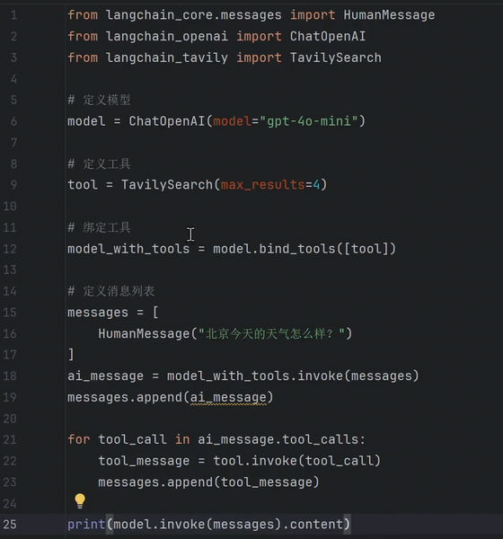
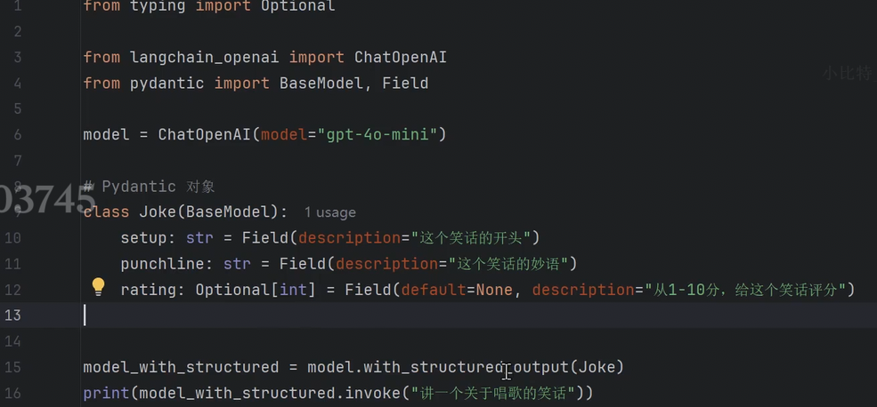
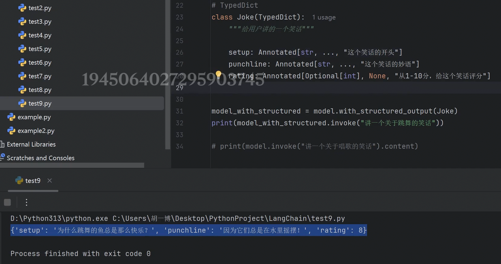
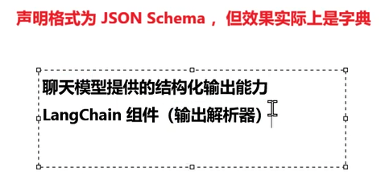
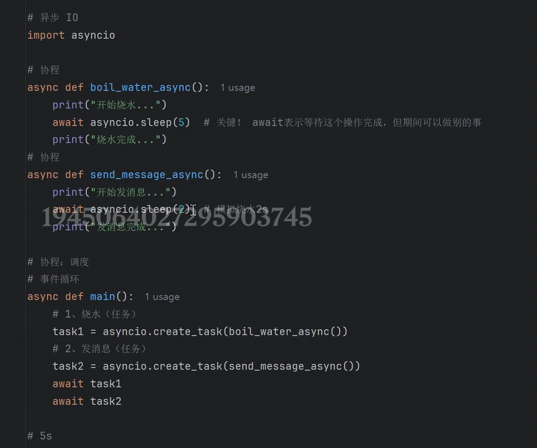
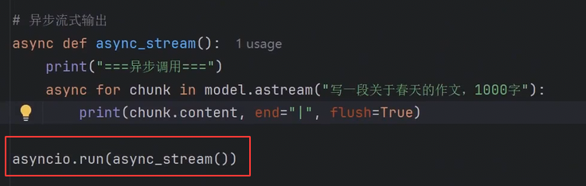

和原生模型调用的输入输出不一样，我们都是用的LangChain封装好的

# 工具
解决大模型无法获取最新资讯的问题

## 定义
@tool + python函数

工具Schema不能缺

保留过程可以分析问题（天气工具）

# 绑定

# 搜索工具
tavily(天气搜索)
其实langchain不用自己构造工具，有很多三方工具已经集成，直接调用就行的
搜索天气的demo

# langchain聊天模型结构化数据返回（结构化输出）

以下就是定义结构化对象返回结构化数据的方式

## 结构化输出的是pydantic对象

## 返回TypedDict
类似定义一个类，可以辅助键名拼写错误与类型错误
返回的是字典的写法

## 返回JSON

以上只是模型的，后面还会有lanchain的结构化输出能力

# 流式传输stream
一个字一个字（一个token一个token）往出蹦

## 异步IO全流程

## 异步流式输出

这是一个协程

