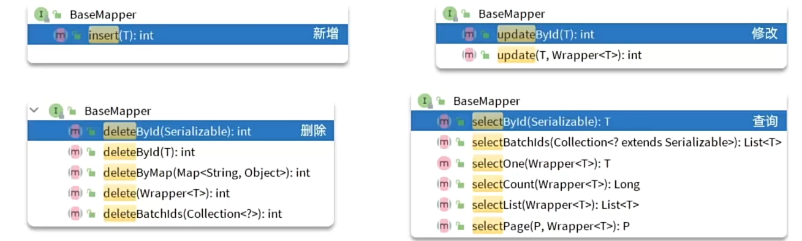

# 为什么使用MP

**MP即==MyBatisPlus==**，可以对Mybatis进行改造
```java
public interface UserMapper {

    void saveUser(User user);
    
    void deleteUser(Long id);
    
    void updateUser(User user);
    
    User queryUserById(@Param("id") Long id);
    
    List<User> queryUserByIds(@Param("ids") List<Long> ids);
}
```
+ 这些SQL语句对应的xml文件虽然不难，但是**繁琐**

# 怎么使用MP呢

1. 引入MP**依赖**
MP官方提供了starter，其中集成了Mybatis和MP的所有功能，并且实现了自动装配的效果。
因此我们可以用MybatisPlus代替Mybatis的starter:
```xml
<!--MybatisPlus--> 
<dependency> 
	<groupId>com.baomidou</groupId> 
	<artifactId>mybatis-plus-boot-starter</artifactId> 
	<version>3.5.3.1</version> 
</dependency>
```
2. 定义Mapper
自定义的Mapper继承MybatisPlus提供的BeanMapper接口：
**注意：在继承的时候要注意实体类为你的实体类的类型，只有这样才知道你的增删改查操作的是哪个实体**
```java
public interface UserMapper extends BaseMapper<User> {

}
```
继承之后这些方法就都可以直接用了


