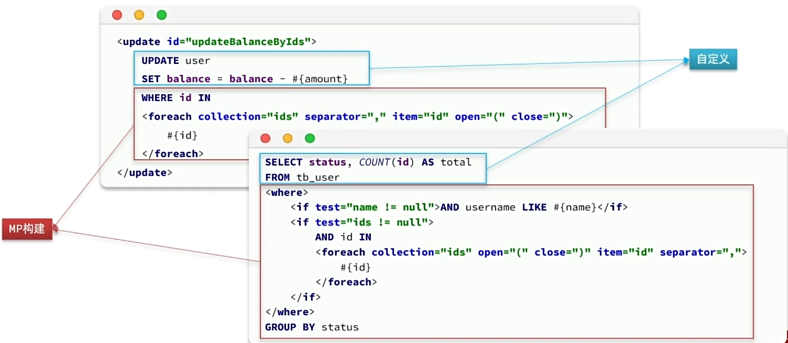
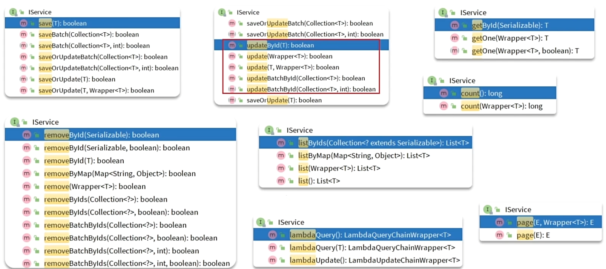
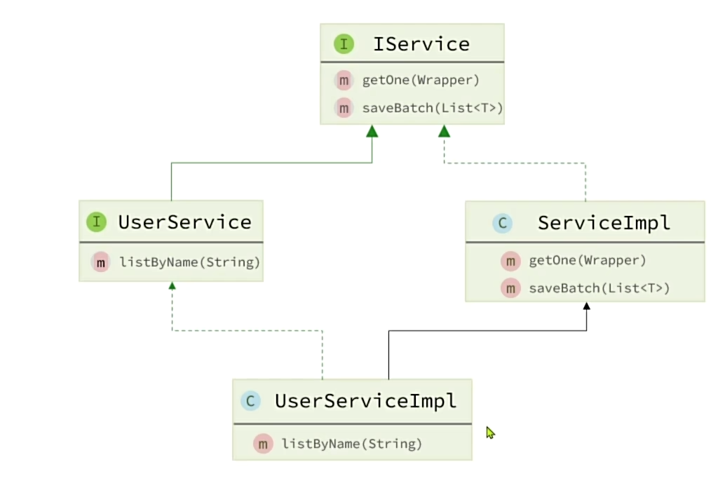

## 1.条件构造器
MP支持各种负责的where条件，可以满足日常开发的所有需求

==Wapper==就是条件构造器

**使用例子**
需求：更新id为1，2，4的用户的余额，扣200
```sql
UPDATE user 
	SET balance = balance - 200 
	WHERE id in (1, 2, 4)
```

```java
@Test
void testUpdateWrapper() {
    List<Long> ids = List.of(1L, 2L, 4L);
    UpdateWrapper<User> wrapper = new UpdateWrapper<User>()
            .setSql("balance = balance - 200")
            .in("id", ids);
    userMapper.update(null, wrapper);
}
```
**使用Lambda的形式，用对应的get函数避免字符串硬编码**
```java
@Test
void testLambdaQueryWrapper() {
    // 1.构建查询条件
    LambdaQueryWrapper<User> wrapper = new LambdaQueryWrapper<User>()
            .select(User::getId, User::getUsername, User::getInfo, User::getBalance)
            .like(User::getUsername, "o")
            .ge(User::getBalance, 1000);
    // 2.查询
    List<User> users = userMapper.selectList(wrapper);
    users.forEach(System.out::println);
}
```
**条件构造器的用法小结**
 - QueryWrapper和LambdaQueryWrapper通常用来构建select、delete、update的where条件部分 
 - UpdateWrapper和LambdaUpdateWrapper通常只有在set语句比较特殊才使用
 - 尽量使用LambdaQueryWrapper和LambdaUpdateWrapper，避免硬编码

## 2.自定义SQL

**我们可以利用MyBatisPlus的Wrapper来构建复杂的Where条件，然后自己定义SQL语句中剩下的部分。**

下面我们通过这个需求展开：将id在指定范围的用户（例如1、2、4）的余额扣减指定值

这是完全手写这个需求的SQL语句
```sql
<update id="updateBalanceByIds">
    UPDATE user
    SET balance = balance - #{amount}
    WHERE id IN
    <foreach collection="ids" separator="," item="id" open="(" close=")">
        #{id}
    </foreach>
</update>
```
我们可以利用MyBatisPlus的Wrapper来构建复杂的Where条件，然后自己定义SQL语句中剩下的部分。

 ① 基于Wrapper构建where条件
 ```java
 List<Long> ids = List.of(1L, 2L, 4L);
int amount = 200;
// 1.构建条件
LambdaQueryWrapper<User> wrapper = new LambdaQueryWrapper<User>().in(User::getId, ids);
// 2.自定义SQL方法调用
userMapper.updateBalanceByIds(wrapper, amount);
 ```
 ② 在 mapper 方法参数中用 Param 注解声明 wrapper 变量名称，必须是 ew
 ```java
 void updateBalanceByIds(@Param("ew") LambdaQueryWrapper<User> wrapper, @Param("amount") int amount);
 ```
③ 自定义 SQL，并使用 Wrapper 条件
```xml
<update id="updateBalanceByIds">
    UPDATE tb_user SET balance = balance - #{amount} ${ew.customSqlSegment}
</update>
```

## 3.Service接口

**Service提供的增删改查**


①我们Service接口需要去继承他的Service接口
②我们的实现类需要去继承他的实现类

**实际上对于一些简单的增删改查，我们都可以直接在Controller当中调MP里面提供的方法，无需写任何的自定义Service或者Mapper，非常的方便；
只有在我们的业务逻辑相对复杂，需要自己写一些业务，MP只有增删改查没有业务，因此在这种情境下我们就需要去自定义Service方法，并且在里边编写我们的业务逻辑，当我们的BaseMapper不足以满足，就要自定义Mapper

## 4.IService的Lambda查询

**未使用Lambda之前写的SQL**
```xml
<select id="queryUsers" resultType="com.itheima.mp.domain.po.User">
    SELECT *
    FROM tb_user
    <where>
        <if test="name != null">
            AND username LIKE #{name}
        </if>
        <if test="status != null">
            AND `status` = #{status}
        </if>
        <if test="minBalance != null and maxBalance != null">
            AND balance BETWEEN #{minBalance} AND #{maxBalance}
        </if>
    </where>
</select>
```
**用了之后**
```java
@Override  
public List<User> queryUsers(String name, Integer status, Integer minBalance, Integer maxBalance) {  
    return lambdaQuery()  
            .like(name != null, User::getUsername, name)  
            .eq(status != null, User::getStatus, status)  
            .ge(minBalance != null, User::getBalance, minBalance)  
            .le(maxBalance != null, User::getBalance, maxBalance)  
            .list();  
}
```
对比对比是不是==超级方便==