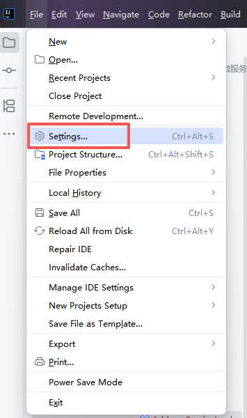
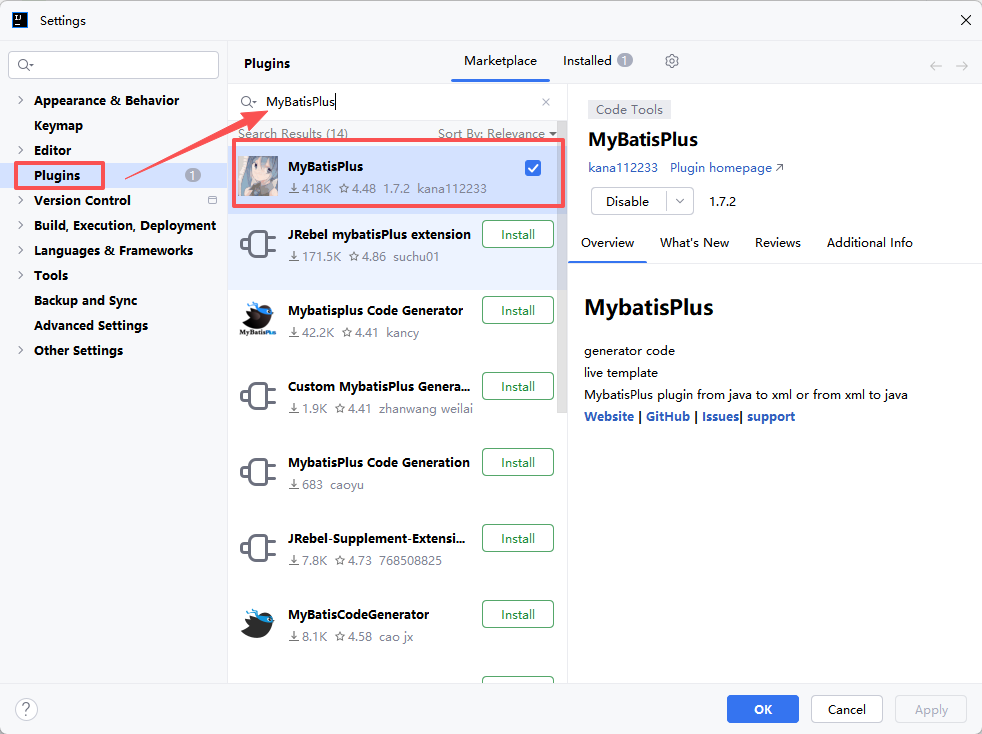
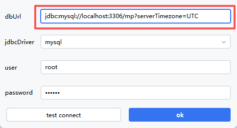
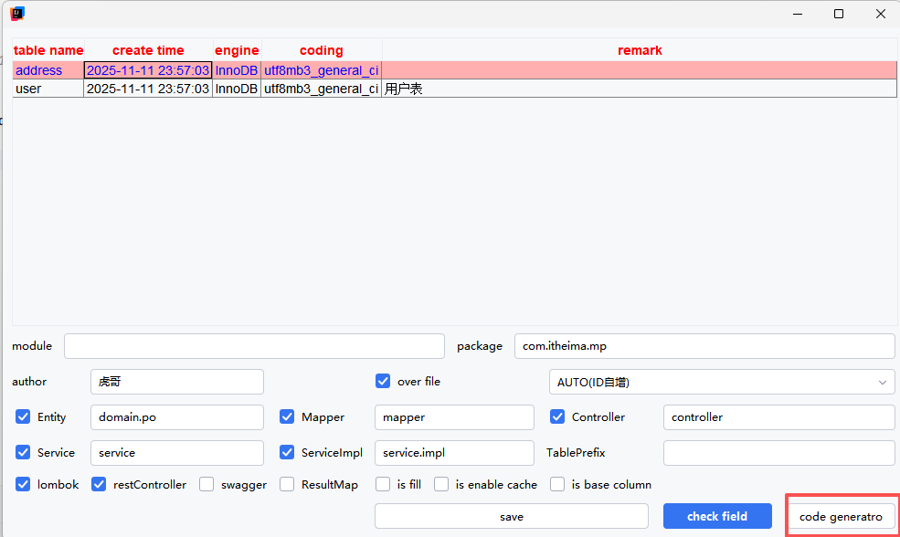
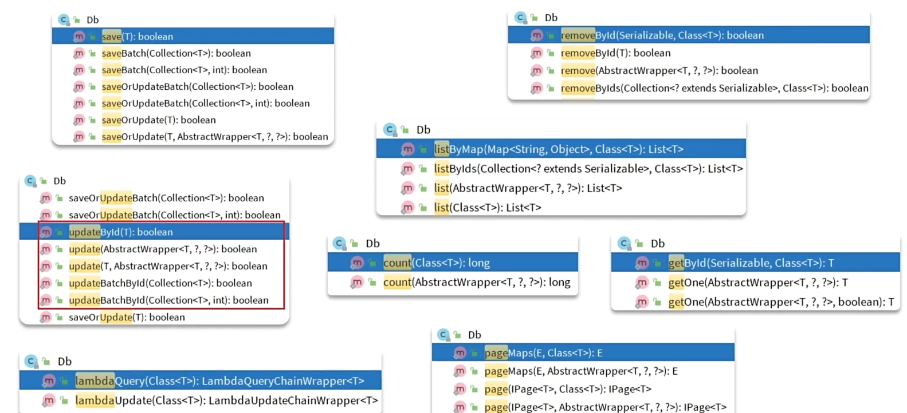

## 1.代码生成
### 在IDEA上安装MyBatisPlus插件

1. 打开Settings（Ctr+Alt+S）

2. 搜索并安装插件：MyBatisPlus

3. 双击Shift搜索ConfigDatabase进行配置

4. 双击Shift搜索CodeGenerator生成相关表的代码


## 2.静态工具

**当出现两个Service出现相互调用可以使用静态的工具Db进行调用，避免循环依赖**
比如开发以下业务
```java
//UserController

@GetMapping  
@ApiOperation("根据id批量查询用户接口")  
public List<UserVO> queryUserById(@ApiParam("用户id集合") @RequestParam("ids") List<Long> ids) {  
    return userService.queryUserAndAddressByIds(ids);  
}
```

```java
//IUserService

List<UserVO> queryUserAndAddressByIds(List<Long> ids);
```

```java
//UserServiceImpl

@Override  
public List<UserVO> queryUserAndAddressByIds(List<Long> ids) {  
    //1.查询用户  
    List<User> users = listByIds(ids);  
    if (CollUtil.isEmpty(users)){  
        return Collections.emptyList();  
    }  
    //2.查询用户地址  
    //2.1 获取用户id集合  
    List<Long> userIds = users.stream().map(User::getId).collect(Collectors.toList());  
    //2.2根据用户id查询用户地址  
    List<Address> addresses = Db.lambdaQuery(Address.class).in(Address::getUserId, userIds).list();  
    //2.3转换地址VO  
    List<AddressVO> addressVOList = BeanUtil.copyToList(addresses, AddressVO.class);  
    //2.4用户地址集合分组处理，相同用户的放入一个集合（组）中  
    Map<Long, List<AddressVO>> addressVOMap = new HashMap<>(0);  
    if (CollUtil.isNotEmpty(addressVOList)){  
        addressVOMap = addressVOList.stream().collect(Collectors.groupingBy(AddressVO::getUserId));  
    }  
    //3.转换VO返回  
    List<UserVO> list = new ArrayList<>(users.size());  
    for (User user : users) {  
        //3.1转化User的PO为VO  
        UserVO userVO = BeanUtil.copyProperties(user, UserVO.class);  
        list.add(userVO);  
        //3.2设置地址VO  
        userVO.setAddresses(addressVOMap.get(user.getId()));  
    }  
    return list;  
}
```

## 3.逻辑删除

逻辑删除就是基于代码逻辑模拟删除效果，但并不会真正删除数据。思路如下：
- 在表中添加一个字段标记数据是否被删除 
- 当删除数据时把标记置为1 
- 查询时只查询标记为0的数据

**MybatisPlus提供了逻辑删除功能，无需改变方法调用的方式，而是在底层帮我们自动修改CRUD的语句。我们要做的就是在application.yaml文件中配置逻辑删除的字段名称和值即可:**
```yaml
mybatis-plus:
  global-config:
    db-config:
      logic-delete-field: flag # 全局逻辑删除的实体字段名，字段类型可以是boolean、integer
      logic-delete-value: 1 # 逻辑已删除值(默认为 1)
      logic-not-delete-value: 0 # 逻辑未删除值(默认为 0)
```
==逻辑删除本身也有自己的问题==，
比如:会导致数据库表垃圾数据越来越多，==影响查询效率==SQL中全都需要对逻辑删除字段做判断，影响查询效率因此，我不太推荐采用逻辑删除功能，如果数据不能删除，可以采用把数据迁移到其它表的办法。

## 4.枚举处理器

分两步走
1. 给枚举的属性加上对应注解
```java
@Getter  
public enum UserStatus {  
    NORMAL(1, "正常"),  
    FROZEN(2, "冻结");  
  
    @EnumValue  
    private final int value;  
    private final String desc;  
  
    UserStatus(int value, String desc) {  
        this.value = value;  
        this.desc = desc;  
    }  
}
```
1. 在yml中配置全局枚举处理器
```yml
mybatis-plus:
  configuration:
    default-enum-type-handler: com.baomidou.mybatisplus.core.handlers.MybatisEnumTypeHandler
```
