缓存穿透

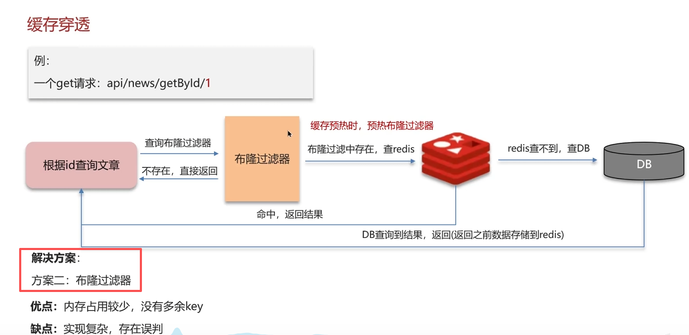
总结
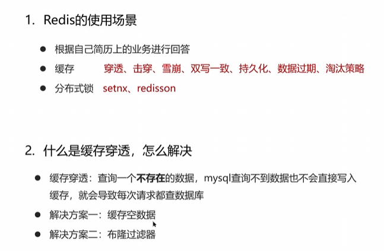
缓存击穿
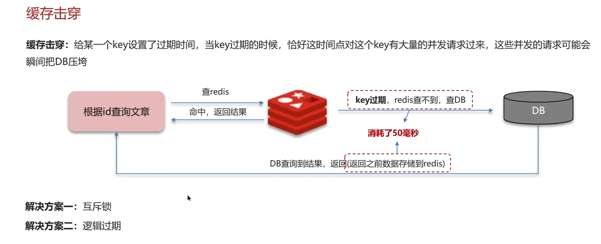
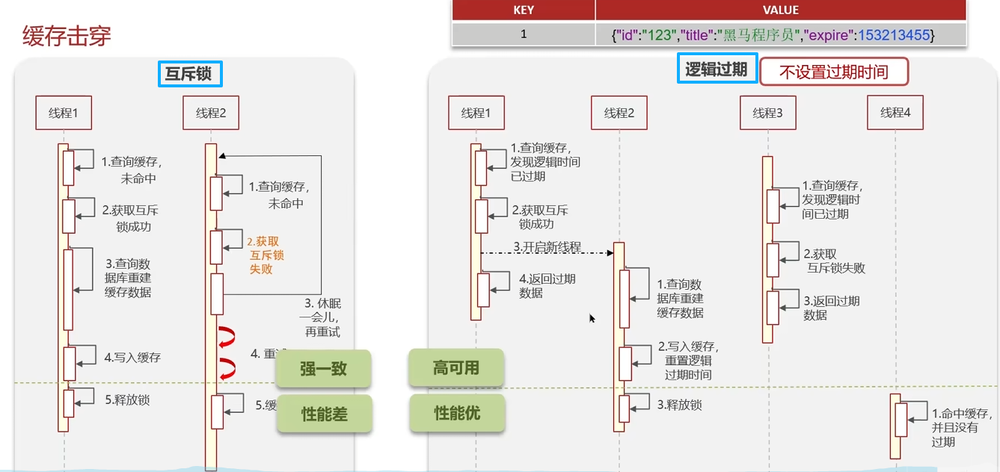
总结
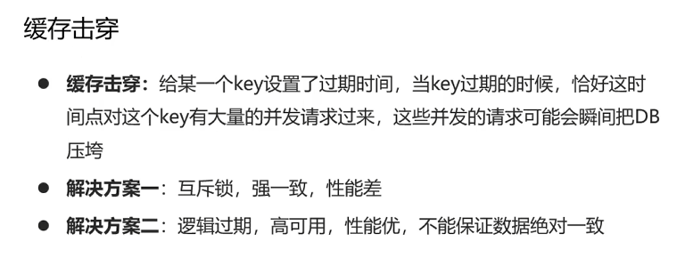
缓存雪崩
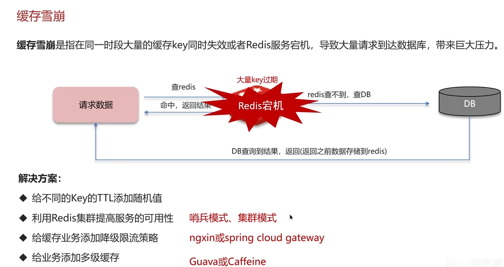
总结
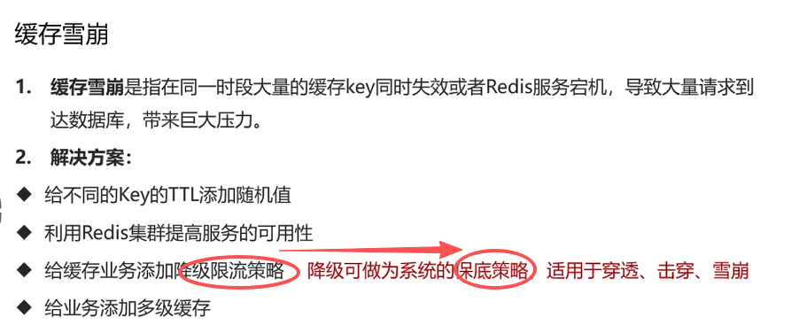
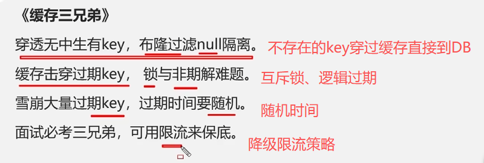

Redis作为缓存，MySQL的数据如何与Redis进行同步呢（双写一致性）
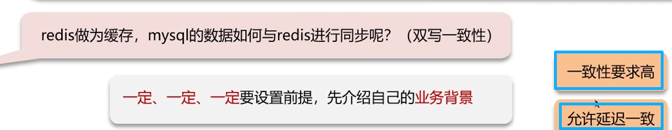
双写一致：当修改了MySQL的数据也要同时更新Redis的数据，缓存和数据库的数据**保持一致**
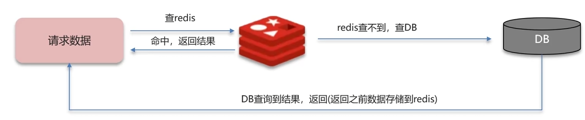
读操作：缓存命中，直接返回；缓存未命中查询数据库，写入缓存，设定超时时间
写操作：延时双删

1.先删除缓存。还是先修改数据库
答案是，这两种都有可能出现脏数据
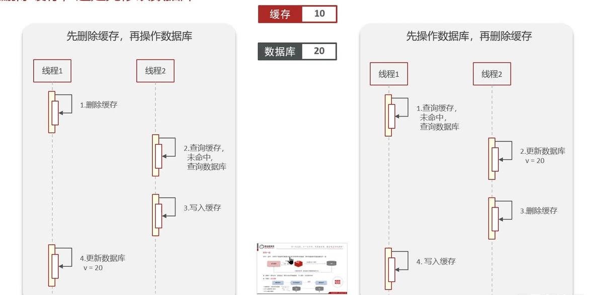
为什么要删除啊两次缓存
为什么要延时双删：就是为了**降低脏数据**的出现；因为数据库是主从模式（读写分离），要等主节点同步到从节点（所以需要延时一会），所以延时双删极大控制了**有脏数据的风险**，因为这个延时的时间不好控制，所以还是**做不到绝对的强一致**。

强一致性的解决方案：
1. 那怎么才能做到**双写一致（强一致）**：可以用**分布式锁**
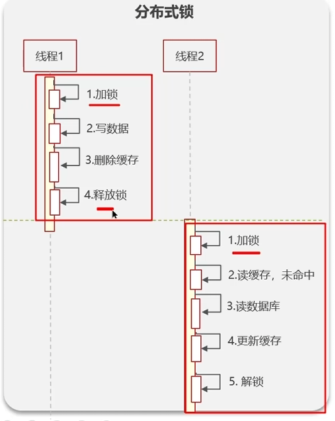

但是性能低
可以优化：
一般放入缓存中的数据都是**读多写少**的 ，写多读少的直接操作数据库多省事啊
可以用**读写锁（读锁、排他锁）**
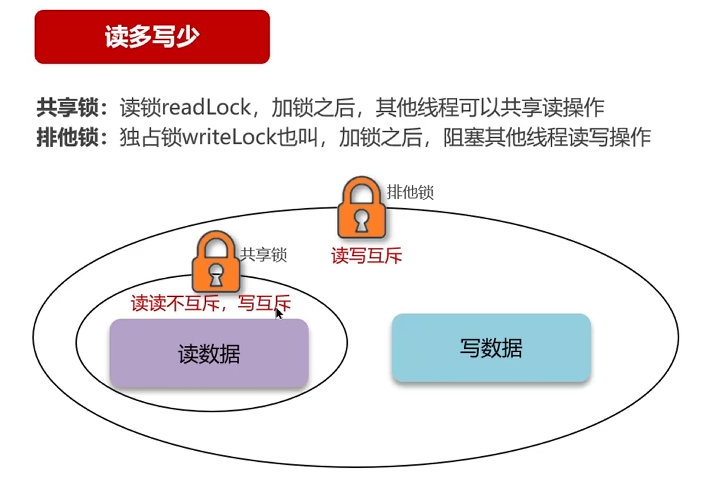

2. 异步通知保证数据的最终一致性
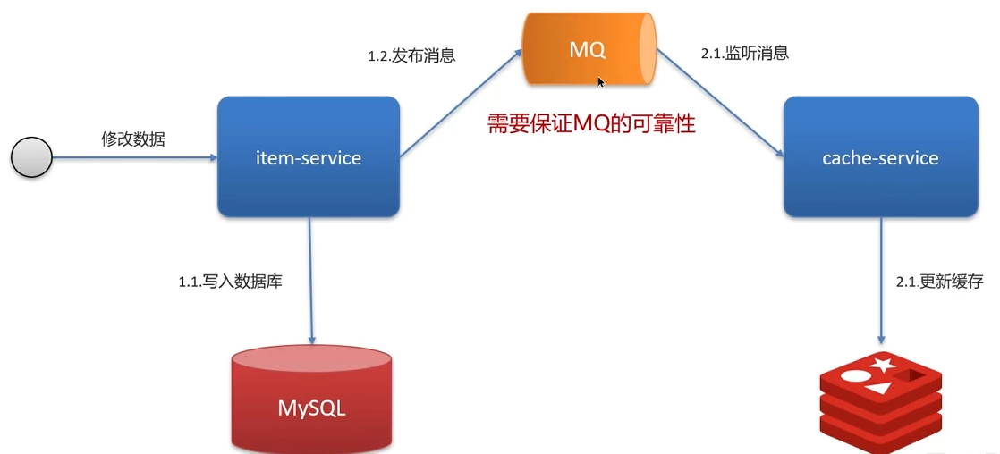
基于Canal的异步通知（接受短暂延时可接受）
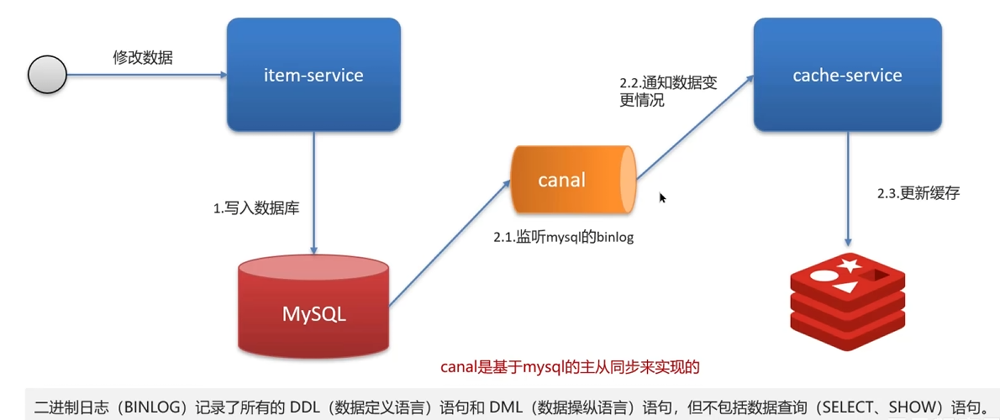

总结
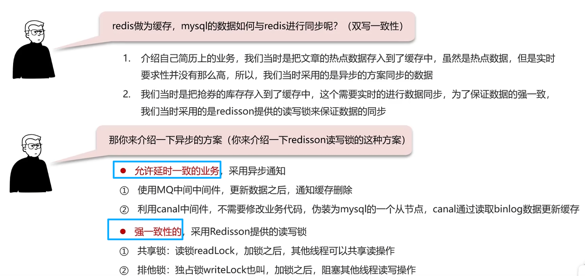

Redis持久化
1. RDB（数据备份文件）
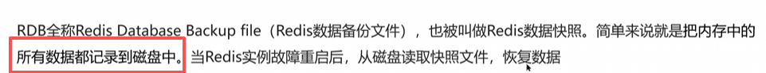
RDB执行原理
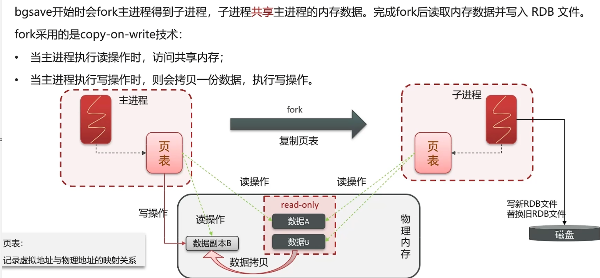

2. AOF（追加文件）

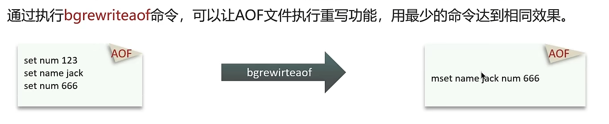
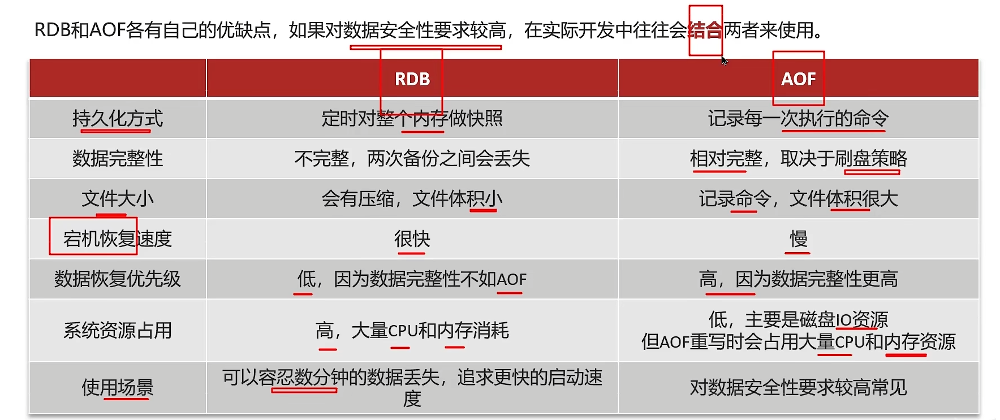

Redis数据过期策略
+ 惰性删除
当key过期后，不管它，需要用该key时，再检查是否过期。
如果过期，就删掉它，反之返回该key
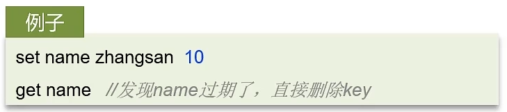
**优点**：对CPU友好，不浪费时间进行过期检查
**缺点**：对内存不好，如果一直没用，该key会一直存在内存中，用不释放

+ 定期删除
