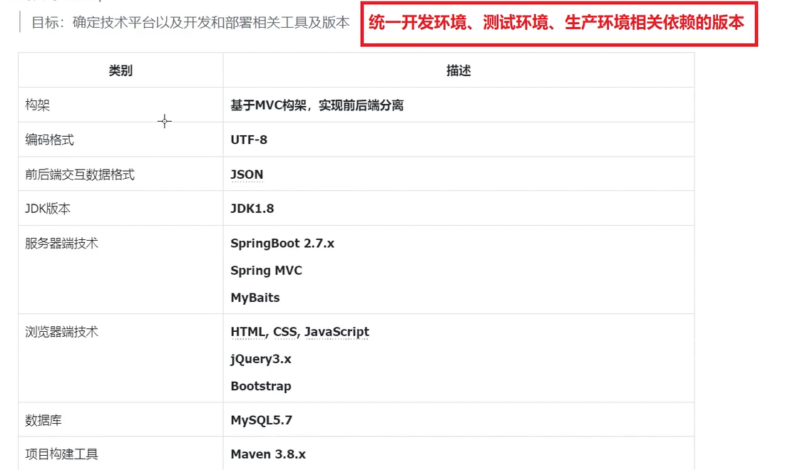

# 技术选型


# 数据库设计
```sql
# 创建数据库
create database forum_db character set utf8mb4 collate utf8mb4_general_ci;

# 创建表
# 用户表
create table t_user (  
    id bigint primary key auto_increment comment '编号，主键自增',  
    username varchar(20) not null unique comment '用户名，唯一',  
    password varchar(32) not null comment '加密后的密码',  
    nickname varchar(50) not null comment '昵称',  
    phoneNum varchar(20) comment '手机号',  
    email varchar(50) comment '电子邮箱',  
    gender tinyint not null default 2 comment '性别 0女，1男，2保密',  
    salt varchar(32) not null comment '为密码加盐',  
    avatarUrl varchar(255) comment '用户头像路径',  
    articleCount int not null default 0 comment '发帖数量',  
    isAdmin tinyint not null default 0 comment '是否管理员 0否，1是',  
    remark varchar(1000) comment '备注，自我介绍',  
    state tinyint not null default 0 comment '状态 0正常，1禁言',  
    deleteState tinyint not null default 0 comment '是否删除，0否，1是',  
    createTime datetime not null comment '创建时间，精确到秒',  
    updateTime datetime not null comment '更新时间，精确到秒'  
);

# 板块表

```