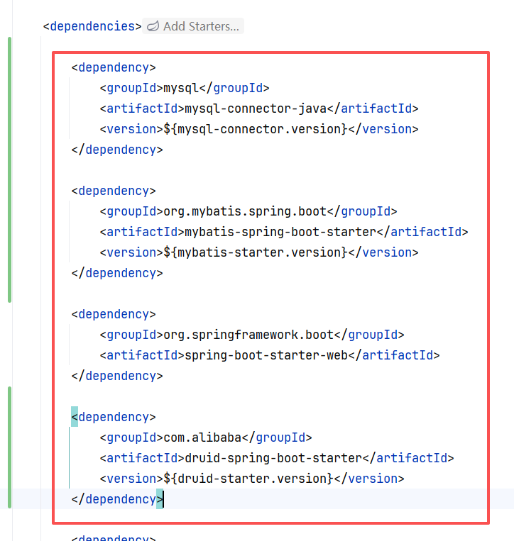

# 公共组件
## 添加依赖
```xml
<!-- 构建项目指定编码集 -->
<project.build.sourceEncoding>UTF-8</project.build.sourceEncoding>
<!-- 数据库驱动 -->
<mysql-connector.version>5.1.49</mysql-connector.version>
<!-- mybatis依赖 -->
<mybatis-starter.version>2.3.0</mybatis-starter.version>
<!-- 数据源 -->
<druid-starter.version>1.2.15</druid-starter.version>
```

```xml
<dependency>  
    <groupId>mysql</groupId>  
    <artifactId>mysql-connector-java</artifactId>  
    <version>${mysql-connector.version}</version>  
</dependency>  
  
<dependency>  
    <groupId>org.mybatis.spring.boot</groupId>  
    <artifactId>mybatis-spring-boot-starter</artifactId>  
    <version>${mybatis-starter.version}</version>  
</dependency>  
  
<dependency>  
    <groupId>org.springframework.boot</groupId>  
    <artifactId>spring-boot-starter-web</artifactId>  
</dependency>  
  
<dependency>  
    <groupId>com.alibaba</groupId>  
    <artifactId>druid-spring-boot-starter</artifactId>  
    <version>${druid-starter.version}</version>  
</dependency>
```

## 关于数据库的配置 在application.yml配置
```yml
datasource:  
  url: jdbc:mysql://127.0.0.1:3306/forum_db?useUnicode=true&characterEncoding=utf8&useSSL=false&serverTimezone=Asia/Shanghai&allowPublicKeyRetrieval=true  
  username: root  
  password: 123456  
  driver-class-name: com.mysql.jdbc.Driver
```

## 数据库表与实体类的映射
```xml

<!-- mybatis-generator -->  
<mybatis-generator-plugin-version>1.4.1</mybatis-generator-plugin-version>

<!-- mybatis 生成器插件 -->
<plugin>
    <groupId>org.mybatis.generator</groupId>
    <artifactId>mybatis-generator-maven-plugin</artifactId>
    <version>${mybatis-generator-plugin-version}</version>
    <executions>
        <execution>
            <id>Generate MyBatis Artifacts</id>
            <phase>deploy</phase>
            <goals>
                <goal>generate</goal>
            </goals>
        </execution>
    </executions>
    <!-- 相关配置 -->
    <configuration>
        <!-- 打开日志 -->
        <verbose>true</verbose>
        <!-- 允许覆盖 -->
        <overwrite>true</overwrite>
        <!-- 配置文件路径 -->
        <configurationFile>
            src/main/resources/mybatis/generatorConfig.xml
        </configurationFile>
    </configuration>
</plugin>
```

**需要修改的地方**
```xml
<!-- 驱动包路径，location中路径替换成自己本地路径 -->  
<classPathEntry location="D:\develop\apache-maven-3.9.11\mvn_repo\com\mysql\mysql-connector-j\8.0.33\mysql-connector-j-8.0.33.jar"/>

<!-- 实体类生成位置 -->  
<javaModelGenerator targetPackage="com.bite.forum.model"  
                    targetProject="src/main/java">
```
**在生成好的mapper文件中在insert后添加
```xml
<insert id="insert" parameterType="com.bitejiuyeke.forum.model.User" useGeneratedKeys="true" keyProperty="id">

-- 主要是加下面这个
useGeneratedKeys="true" keyProperty="id"
```

# 公共代码

状态码，返回值


全局异常处理


# 集成API自动生成
```xml
<!-- spring fox-->  
<springfox-boot-starter.version>3.0.0</springfox-boot-starter.version>

<!-- API⽂档⽣成，基于swagger2 -->  
<dependency>  
    <groupId>io.springfox</groupId>  
    <artifactId>springfox-boot-starter</artifactId>  
    <version>${springfox-boot-starter.version}</version>  
</dependency>  
<!-- SpringBoot健康监控 -->  
<dependency>  
    <groupId>org.springframework.boot</groupId>  
    <artifactId>spring-boot-starter-actuator</artifactId>  
</dependency>
```

## 编写配置类

```powershell
启动程序，浏览器中输⼊地址：http://127.0.0.1:58080/swagger-ui/index.html ，可以正常并 显⽰接⼝信息，说明配置成功
```