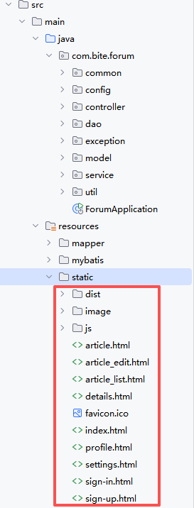

# 实现业务功能


## 注册DAO
### 顺序图

### 参数要求


## 注册Service


## 注册Controller
Controller层一般不处理异常，异常 处理在Servicce 层，直接返回**错误信息**就行
Controller还是推荐使用改成**标准 JSON + @RequestBody**
```java
@PostMapping("/register")
public AppResult register(@RequestBody User user) {
     ......
    // 下面逻辑不变
}
```

# 前端--注册
导入前端代码**放在static这个目录下**

前端主要是发**AJAX**请求就行
```html
/*
主要用了id选择器
*/

// 构造数据
    let postData = {
      username: $('#username').val(),
      nickname: $('#nickname').val(),
      password: $('#password').val(),
      passwordRepeat: $('#passwordRepeat').val(),
    };
    // 发送AJAX请求 
    // contentType = application/x-www-form-urlencoded
    // 成功后跳转到 sign-in.html
    $.ajax ({
      url: 'user/register',
      type: 'POST',
      contentType: 'application/x-www-form-urlencoded',
      data: postData,
      // 回调方法
      success: function (respData) {
        if (respData.code == 0) {
          //提示信息
          $.toast({
            heading: '成功',
            text: '注册成功，正在自动跳转到登录页面...',
            icon: 'success',
            hideAfter: 2000,
            loader: true, 
            showHideTransition: 'fade', 
            afterHidden: function() {
              location.assign('./sign-in.html');
            }
          });
        } else {
          //提示信息
          $.toast({
            heading: '警告',
            text: respData.message,
            icon: 'warning'
          });
        }
      },
      error: function () {
          //提示信息
          $.toast({
            heading: '错误',
            text: '发生错误，请稍后再试',
            icon: 'error'
          });
      },
    });
  });
```
