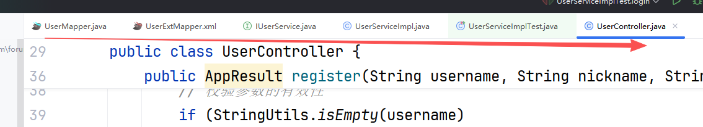
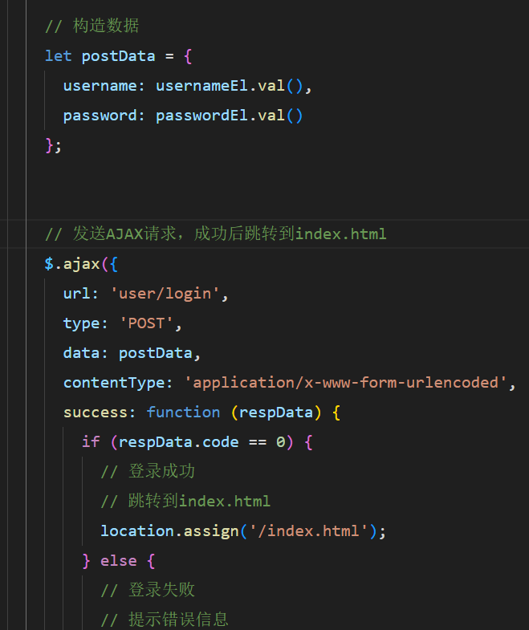
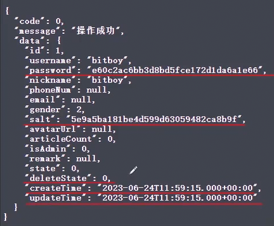
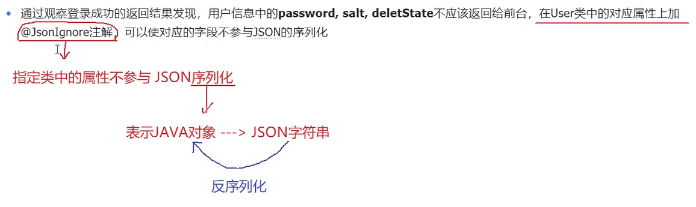
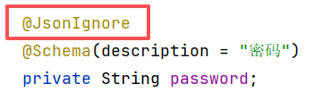
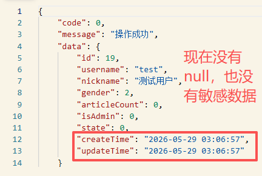
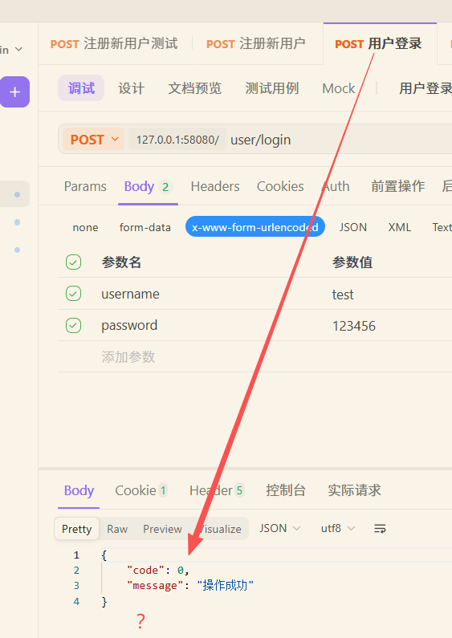
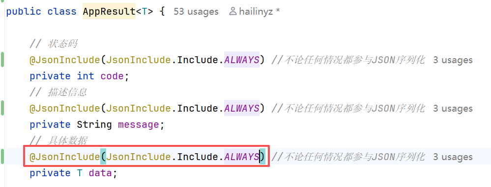
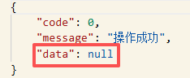

# 登录后端
## 实现流程




这些校验注解是为了减轻数据库的一些校验，能提升数据库性能


# 登录前端


# 获取用户信息后端
## 根据id的值判断User对象的获取方式

**如果id为空，则获取Session作用域中的User对象(当前登录用户)
如果id不为空，从数据库中按id查询出用户信息（查看别人的信息）**

## 修复响应结果中问题

**这些敏感信息不应该再网络中传输也不应该返回给前端**


**处理日期格式**
```yml
# 在spring下加⼊⼦节点
spring:
 # JSON序列化配置
 jackson:
 date-format: yyyy-MM-dd HH:mm:ss # ⽇期格式
 default-property-inclusion: NON_NULL # 不为null时序列化

```


**但是当我们在登录接口以及其他接口时，是没有data的，但是又想让他出现，可以这样配置**


**得到：**


# 获取用户信息前端
```html
$.ajax({
      // 请求的方法
      type : 'get',
      // 没有参数，表示获取当前登录用户的信息
      url : 'user/info',
      // 成功回调
      success : function(respData) {
        // 判断响应的状态码
        if (respData.code == 0) {
          // 设置页面上用户的信息
          let user = respData.data;
          // 判断用户头像是否有效
          if (!user.avatarUrl) {
            // 设置默认的头像地址
            user.avatarUrl = avatarUrl;
          }
          // 设置页面上的头像
          $('#index_nav_avatar').css('background-image', 'url(' + user.avatarUrl + ')');
          // 用户昵称
          $('#index_nav_nickname').html(user.nickname);
          // 设置用户组
          let subName = user.isAdmin == 1 ? '管理员' : '普通用户';
          $('#index_nav_name_sub').html(subName);
          currentUserId = user.id;

        } else {
          // 提示信息
          $.toast({
              heading: '警告',
              text: respData.message,
              icon: 'warning'
          });
        }
      },
      // 失败回调
      error : function () {
        // 提示信息
        $.toast({
            heading: '错误',
            text: '访问出现问题，请与管理员联系.',
            icon: 'error'
        });
      }
```

