# 退出登录后端
**只需要在Controller中加一个退出登陆的接口几口即可
```java
/*  
* 退出登录  
 */@Operation(summary = "退出登录")  
@GetMapping("/logout")  
public AppResult logout(HttpServletRequest request) {  
    //1. 获取Session对象  
    HttpSession session = request.getSession(false);  
    //2. 判断Session对象是否存在  
    if (session == null) {  
        //Session对象不存在，返回错误信息  
        return AppResult.failed(ResultCode.FAILED_FORBIDDEN);  
    }  
    //3. 删除Session对象  
    session.invalidate();  
    log.info("用户退出登录成功");  
    //4. 返回结果  
    return AppResult.success();  
}
```

# 退出登陆前端

**不用像之前的请求一样分success还是error，只需要complete
complete：当请求完成时，不论成功还是失败，都跳转到登录页面
**
```html
    // ============================ 处理退出登录点击事件 ===========================
    // 成功后，跳转到sign-in.html
    $('#index_user_logout').click(function () {
      $.ajax({
        type: 'GET',
        url: 'user/logout',
        complete: function () {
          //当请求完成时，不论成功还是失败，都跳转到登录页面
          location.assign('/sign-in.html');
        }
      });
    });
```

# 登录拦截器

**所有对外提供的接口，如果不使用拦截器，那么所有的接口都要去写这么几行代码：**
**判断用户的登陆状态**
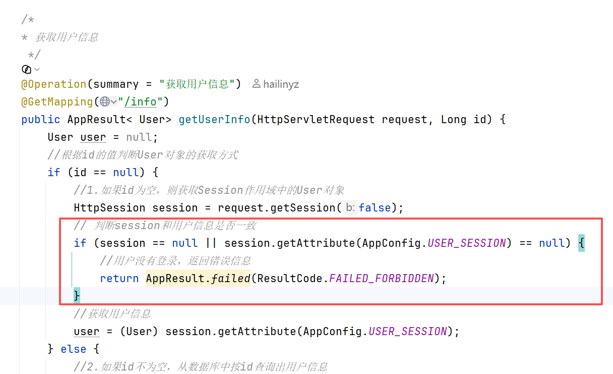
**所以我们要把这些统一的校验工作抽取出来
然后用SpringMVC提供的拦截器功能，对所有请求进行过滤
请求在过滤的时候发现用户没有登录，直接过滤掉，不让他再访问了
通过继续我们后面的流程**

**以上就是拦截器的功能**

拦截器（LoginInterceptor）定义好之后还要加到全局的注册器（addInterceptors）

现在就可以把这些代码干掉了
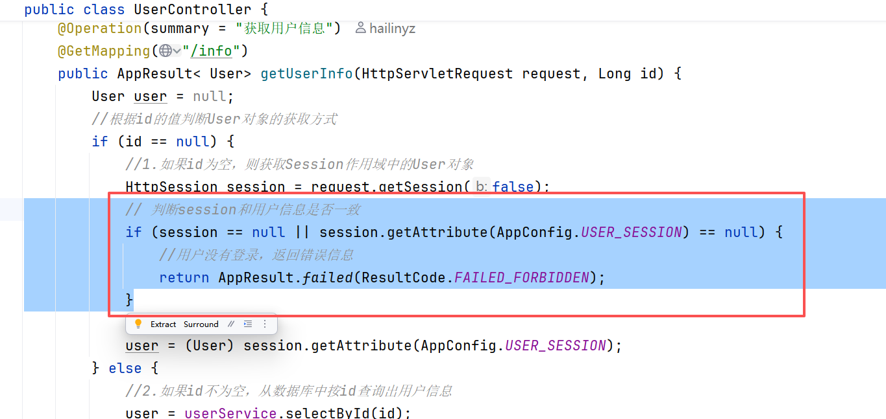

# 导航栏板块列表后端

```java
// 从配置⽂件中获取主⻚中显⽰的版块个数，默认为9  
@Value("${bit-forum.index.board-num:9}")  
private Integer indexBoardNum;  
  
@Resource  
private IBoradService boardService;  
  
/*  
获取首页板块列表  
 */@GetMapping("/topList")  
@Operation(summary = "获取首页板块列表")  
public AppResult<List<Board>> topList() {  
    //调用Service查询结果  
    List<Board> boards = boardService.selectByNum(indexBoardNum);  
    //判断是否为空  
    if (boards == null) {  
        boards = new ArrayList<>();  
    }  
    //返回结果  
    return AppResult.success(boards);  
}
```


# 导航栏板块列表前端
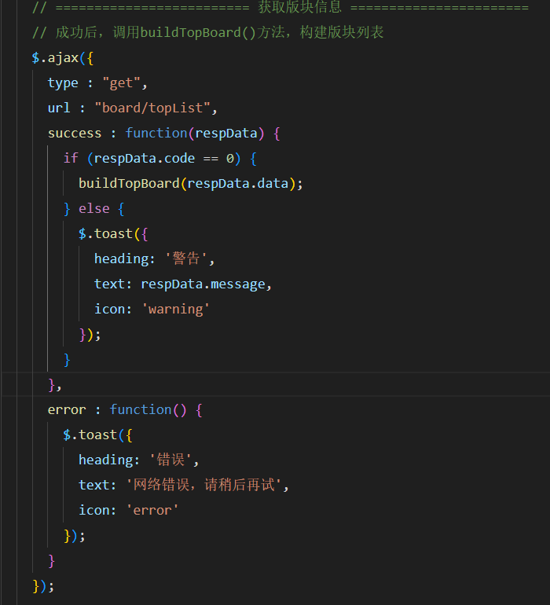

# 发布帖子后端
## 实现逻辑
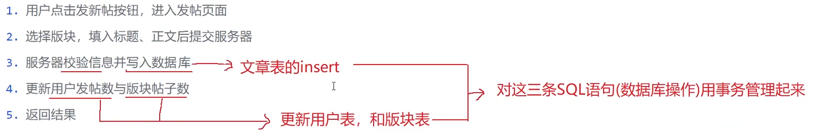
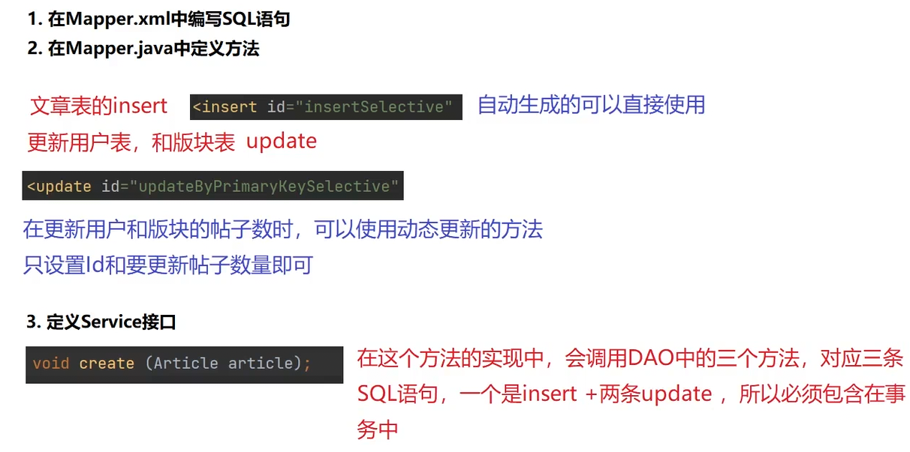
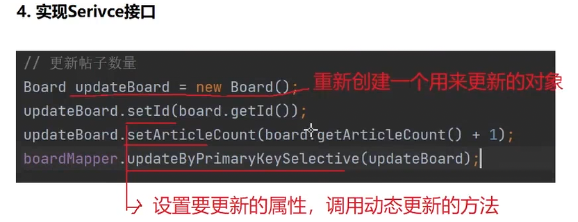
**避免循环引用（两个互相引用）
可以只引用mapper**

# 发布帖子前端
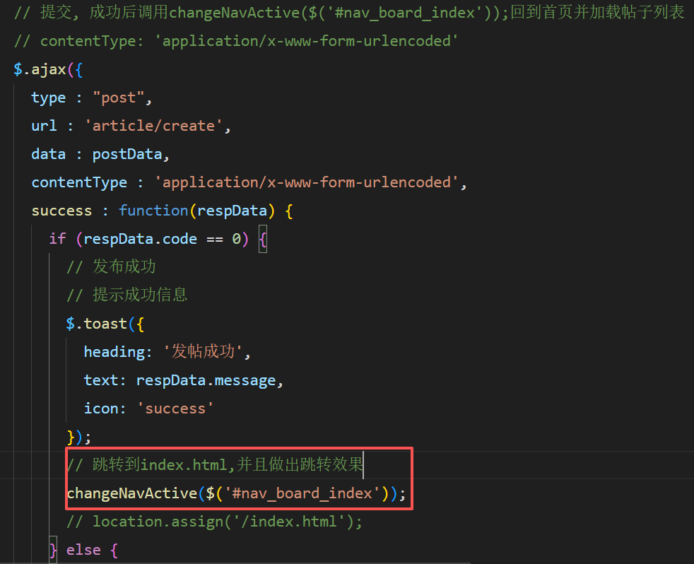

# 帖子列表
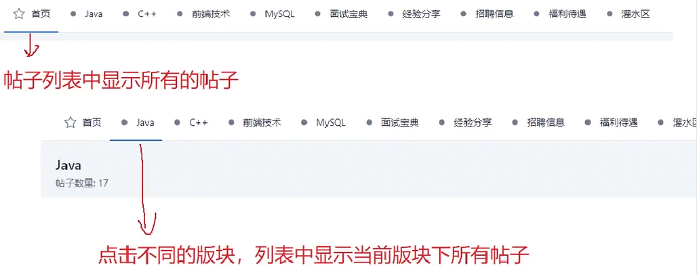
## 板块帖子列表

## 实现逻辑
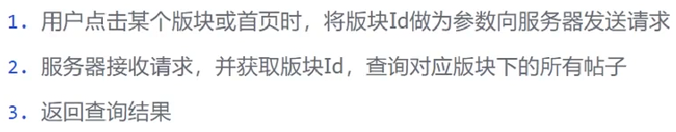
## 参数要求
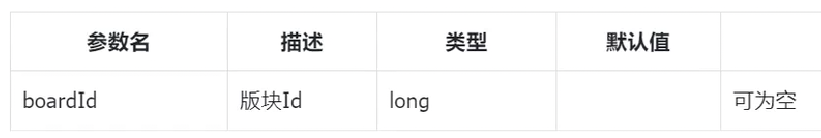
**根据传入的boardId来执行不同的查询
selectAll()
selectByBoardId(Long boardId)

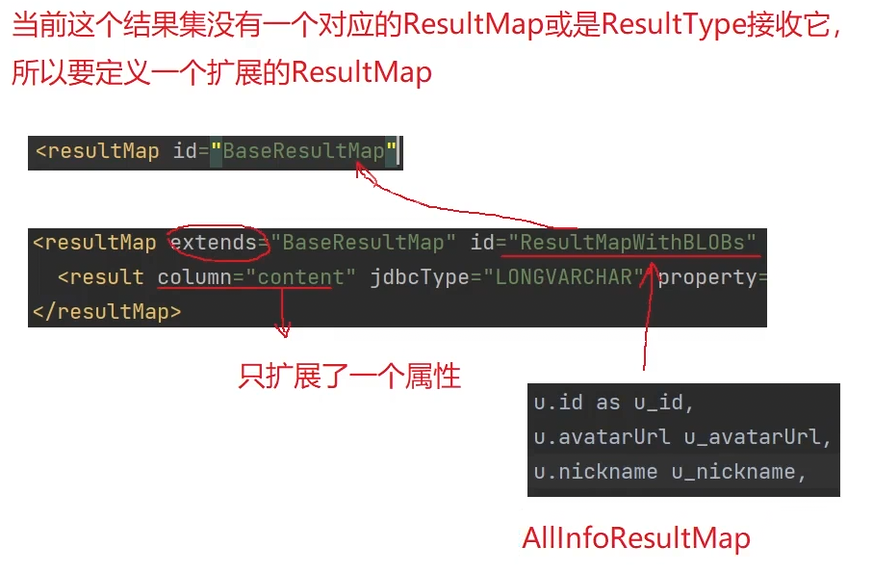
**这里是为了返回的时候是个标准的json**

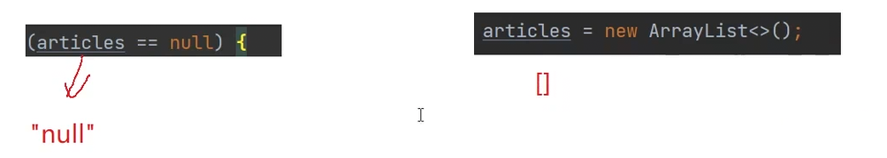