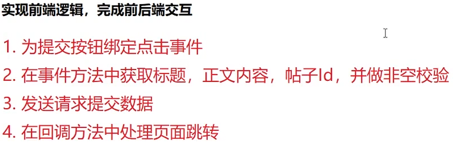

# 显示编辑与删除按钮


# 帖子编辑

## 实现逻辑

## 参数要求

  ```java
  /*  
* 修改帖子  
 */@Operation(summary = "修改帖子")  
@PostMapping("/modify")  
public AppResult modify(HttpServletRequest request,  
                        Long id,  
                        String title,  
                        String content) {  
    //校验用户是否禁言  
    HttpSession session = request.getSession(false);  
    User user = (User) session.getAttribute(AppConfig.USER_SESSION);  
    if (user.getState() == 1) { //表示用户已被禁言  
        return AppResult.failed(ResultCode.FAILED_USER_BANNED);  
    }  
    //判断帖子是否存在  
    Article article = articleService.selectById(id);  
    if (article == null) {  
        return AppResult.failed(ResultCode.FAILED_ARTICLE_NOT_EXISTS);  
    }  
    //判断当前用户是否是作者  
    if (user.getId() != article.getUserId()) {  
        return AppResult.failed(ResultCode.FAILED_FORBIDDEN);  
    }  
    //判断帖子是否还能修改(帖子的状态)  
    if (article.getState() == 1 || article.getDeleteState() == 1) {  
        return AppResult.failed(ResultCode.FAILED_ARTICLE_BANNED);  
    }  
    //调用Service完成更新修改  
    articleService.modify(id, title, content);  
    //打印日志  
    log.info("修改帖子成功，帖子id = " + id + "User id = " + user.getId());  
    return AppResult.success();  
}
  ```
## 前端


# 点赞和
# 帖子回复
# 根据帖子id查询帖子列表

