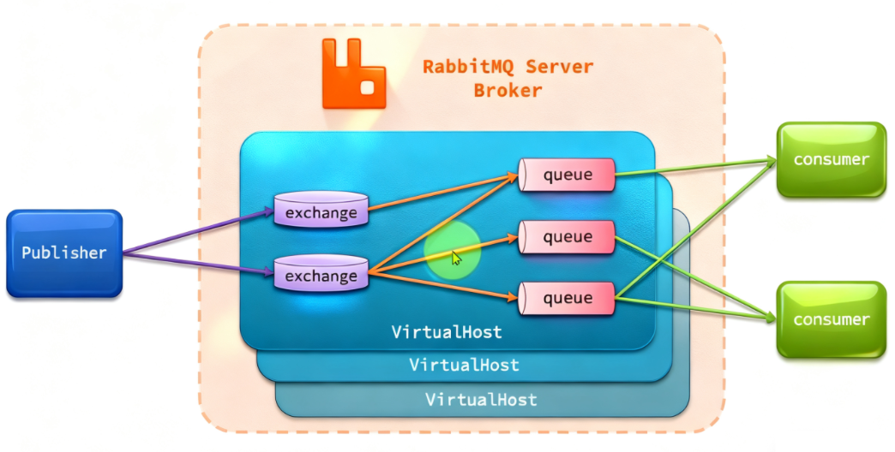
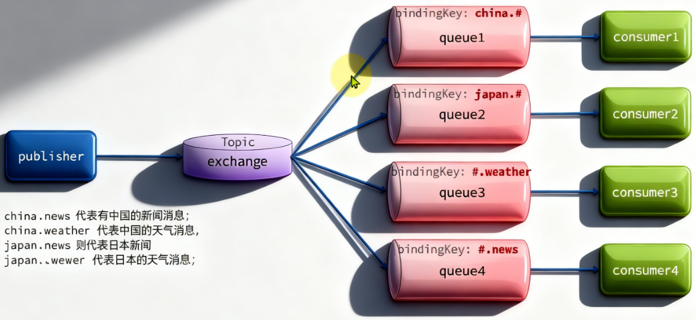

RabbitMQ的整体架构以及核心概念：
+ VirtualHost：虚拟主机，起到数据隔离的作用（类似于Mysql中的一个个的数据库）
+ publisher：消息发送者
+ consumer：消息的消费者
+ queue：队列，存储消息
+ exchange：交换机，负责路由消息


## Spring AMQP

AMQP是用于应用程序之间传递业务消息的开放标准。该协议与语言和平台无关，更符合微服务中独立性的要求。

而Spring AMQP 就是基于AMQP定义的一套API规范，提供了模板来发送和接收消息。包含两部分，其中**spring-amqp是基础抽象，spring-rabbit是底层的默认实现。** 废话太多，其实这个东西就是让我们收发消息更加简单的

## Work Queues

Work Queues ,**任务模型**，就是让**多个消费者绑定到一个队列，共同消费队列中的消息**
+ 向队列中发消息同一个消息只能被一个消费者能处理
+ 消费者轮询处理消息
+ 当有高并发的时候可以多加几个消费者，解决了消息堆积问题（多个消费者绑定到一个队列，可以加快消息处理速度）
+ 设置preFetch实现能者多劳

默认情况下MQ会将消息轮询投递给绑定在队列上的消费者。处理慢的消费者可能出现**消息堆积**

因此修改 消费者的application.yml，设置preFetch值为1，确保同一时刻最多投递哦给消费者1条消息：
能者多劳
```YAML
spring:
  rabbitmq:
    listener:
      simple:
        prefetch: 1 # 每次只能获取一条消息，处理完成才能获取下一个消息
```

这样配置以后处理慢的人就可以先处理完这一条消息才能获取最新消息，避免了消息堆积，实现了能者多劳的局面。

## Fanout交换机 -- 雨露均沾

主要作用是**接收**发送者发送的消息，并将消息**路由**到与其绑定的队列。
常见交换机有以下三种：
+ Fanout：广播，会将接收的消息路由到每一个跟其绑定的queue
+ Direct：定向
+ Topic：话题


## Direct交换机 -- 既可以定向也可以雨露均沾

Direct Exchange 会将接收到的消息根据规则路由到指定的Queue，因此称为**定向路由**
+ 每个Queue都与Exchange设置一个BindingKey
+ 发布者发送消息时，指定消息的RoutingKey
+ Exchange将消息路由到BindingKey与消息RoutingKey一致的队列

## Topic交换机 - 扩展性更强

因为涉及到通配符的匹配，所以性能可能没有Direct好，但应该可以忽略不计。
也是基于RoutingKey做消息路由，但是routingKey通常是多个单词的组合，并且以 . 分割。

Queue与Exchange指定BindingKey时可以使用通配符：
+  # 指代0个或多个单词
+ * 指代一个单词


## 通过配置类代码声明队列和交换机BindingKey

SpeingAMQP提供了几个类，用来声明队列、交换机及其绑定关系：
+ Queue：用于声明队列，可以用工厂类QueueBuilder构建
+ Exchange：用于声明交换机，可以用工厂类ExchangeBuilder构建
+ Binding：用于声明队列和交换机的绑定关系，可以用工厂类BindingBuilder构建

我们知道Exchange有好几个类，有上面提到的**Fanout、Direct、Topic等等**

例如，创建一个Fanout配置类
```java
@Configuration
public class FanoutConfig {
    /**
     * 声明交换机
     * @return Fanout类型交换机
     */
    @Bean
    public FanoutExchange fanoutExchange(){
        return new FanoutExchange("hmall.fanout");
    }

    /**
     * 第1个队列
     */
    @Bean
    public Queue fanoutQueue1(){
        return new Queue("fanout.queue1");
    }

    /**
     * 绑定队列和交换机
     */
    @Bean
    public Binding bindingQueue1(Queue fanoutQueue1, FanoutExchange fanoutExchange){
        return BindingBuilder.bind(fanoutQueue1).to(fanoutExchange);
    }

    /**
     * 第2个队列
     */
    @Bean
    public Queue fanoutQueue2(){
        return new Queue("fanout.queue2");
    }

    /**
     * 绑定队列和交换机
     */
    @Bean
    public Binding bindingQueue2(Queue fanoutQueue2, FanoutExchange fanoutExchange){
        return BindingBuilder.bind(fanoutQueue2).to(fanoutExchange);
    }
}
```

基于JavaBean的方式来实现绑定最大的问题就是代码太臃肿了

## 基于注解声明队列和交换机BindingKey

```Java
@RabbitListener(bindings = @QueueBinding(
    value = @Queue(name = "direct.queue1"),
    exchange = @Exchange(name = "hmall.direct", type = ExchangeTypes.DIRECT),
    key = {"red", "blue"}
))
public void listenDirectQueue1(String msg){
    System.out.println("消费者1接收到direct.queue1的消息：【" + msg + "】");
}

@RabbitListener(bindings = @QueueBinding(
    value = @Queue(name = "direct.queue2"),
    exchange = @Exchange(name = "hmall.direct", type = ExchangeTypes.DIRECT),
    key = {"red", "yellow"}
))
public void listenDirectQueue2(String msg){
    System.out.println("消费者2接收到direct.queue2的消息：【" + msg + "】");
}
```

## 消息转换器

