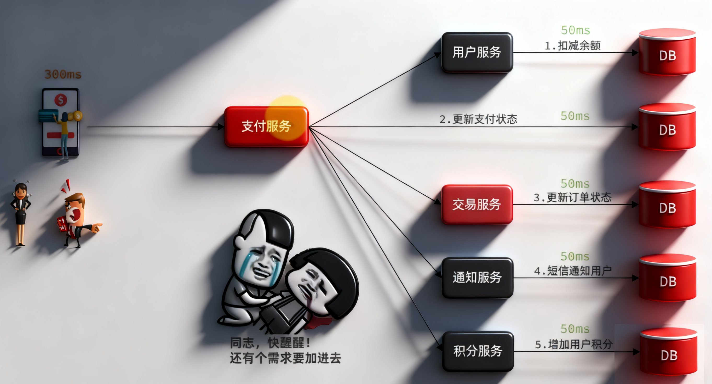
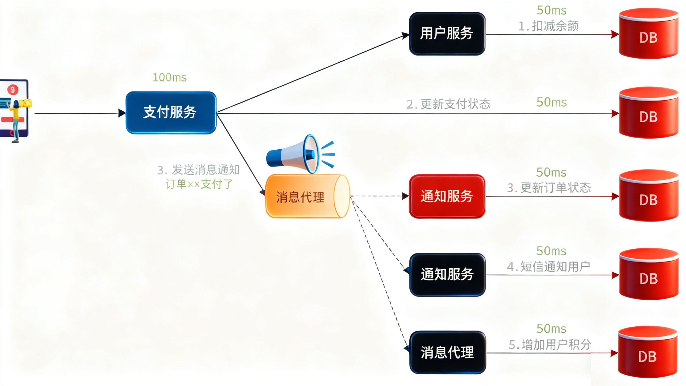

## 同步调用

优势：
+ 时效性强， 等待结果后才返回
问题：
+ 扩展性差
+ 性能下降
+ 级联失败（雪崩）

## 异步调用

优势：
+ 解除耦合，扩展性强
+ 无需等待，性能好
+ 故障隔离
+ 缓存消息，流量削峰填谷
问题：
+ 不能立即得到调用结果，可能都得不到结果，时效性差
+ 不能确定下游业务执行是否成功
+ 业务安全依赖于**Broker（消息代理）** 的可靠性

## MQ技术

RabbitMQ消息队列是用来做消息收发的

