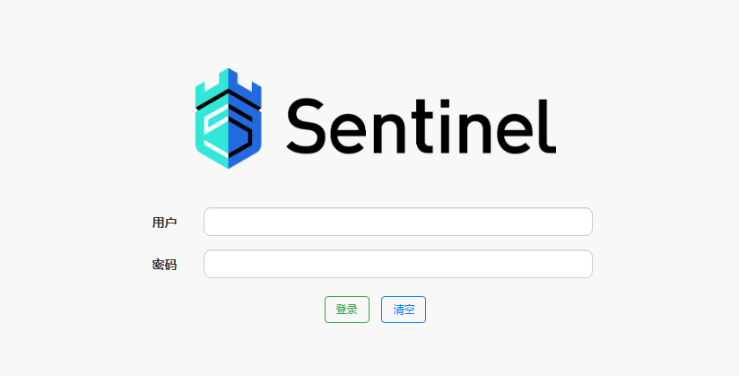
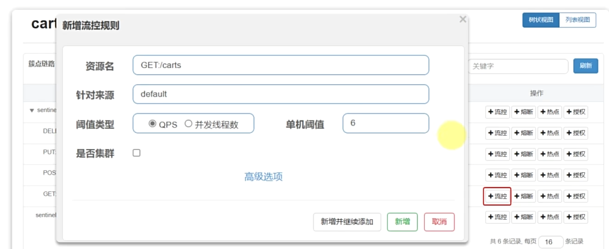
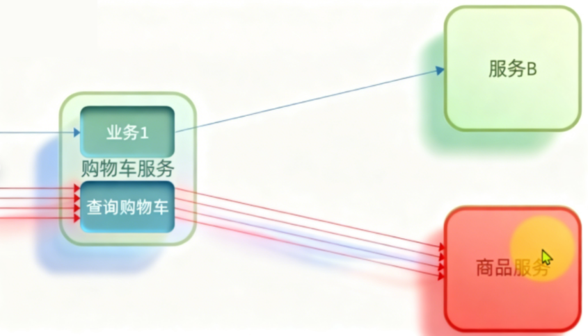
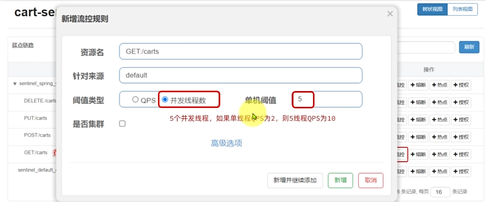

Sentinel 是阿里巴巴开源的一款微服务控制组件。官网地址：[[https://sentinelguard.io/zh-cn/index.html]]

启动准备好的sentinel jar包
```powershell
java -Dserver.port=8090 -Dcsp.sentinel.dashboard.server=localhost:8090 -Dproject.name=sentinel-dashboard -jar sentinel-dashboard.jar
```


用户密码默认是sentinel

## 整合到微服务

1. 引入依赖
```xml
<!--sentinel-->
<dependency>
    <groupId>com.alibaba.cloud</groupId> 
    <artifactId>spring-cloud-starter-alibaba-sentinel</artifactId>
</dependency>
```
1. 配置控制台
```yaml
spring:
  cloud: 
    sentinel:
      transport:
        dashboard: localhost:8090
```

### 簇点链路

簇点链路就是单机调用链路。是一次请求进入服务后经过的每一个被Sentinel监控的资源链。默认Sentinel会监控SpringMVC的每一个Endpoint（http接口）。限流、熔断等都是针对簇点链路中的**资源**设置的。而资源名默认就是接口的请求路径。

Restful风格的API请求路径一般都相同，这会导致簇点资源名称重复。因此我们要修改配置，把请求方式+请求路径作为簇点资源名称:
```yaml
spring:
  cloud:
    sentinel:
      transport:
        dashboard: localhost:8090
      http-method-specify: true # 开启请求方式前缀
```

## 请求限流

如图操作即可


## 线程隔离

当商品服务出现阻塞或故障时，调用商品服务的购物车服务可能因此而被拖慢，甚至资源耗尽。所以必须限制购物车服务中查询这个业务的可用线程数，实现线程隔离。

现在我们假设说这个商品服务出现了**故障**

它的故障我们不说是直接宕机这种啊，我们就说是他的业务不知道什么原因（可能是数据库问题或者网路原因）导致查询的特别慢，可能2~3秒才能处理一个请求，这时候查询购物车的这个业务就得等待商品服务返回的结果，

如果现在查询购物车的并发很高，就占用了Tomcat的资源，可能会导致整个购物车服务资源耗尽 别的业务1想查询别的业务就进不来了，然后购物车服务也发生类似慢的**故障**，那么调用购物车的服务的其他服务也有可能出现故障，这时候就会出现**雪崩**

**所以用到了线程隔离 -- 线程隔离也属于流量控制的一部分**

如图操作即可



