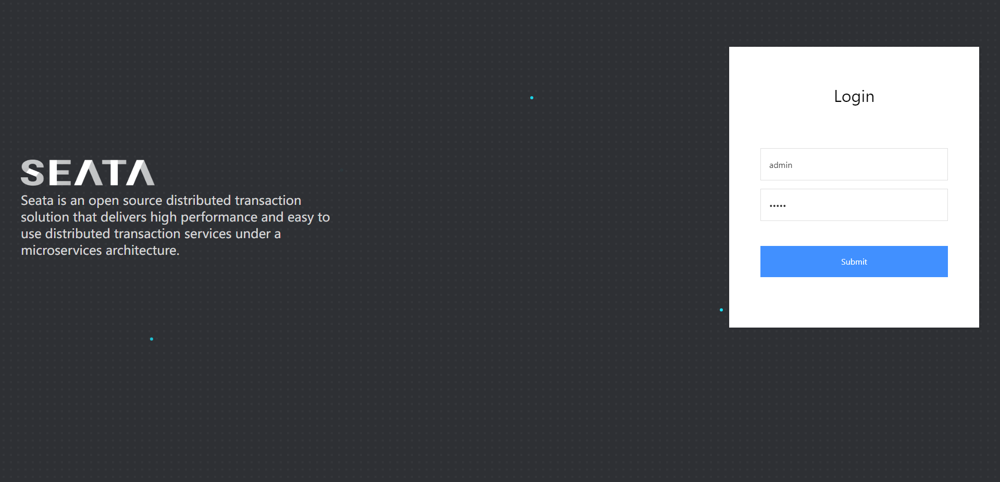

在分布式系统中，如果一个业务需要多个服务合作完成，而且每一个服务都有事务，多个事务必须同时成功或失败，这样的事务就是**分布式事务**。其中的每个服务的事务就是一个**分支事务**。整个业务称为**全局事务**。


应该是都成功或者都失败才对

分布式事务解决思路：Seata架构

相互之间不知道对方成没成功，想办法让事务分支之间感知到彼此的事务状态，才能保证状态一致。

## Seata架构

+ TC - 事务协调者
+ TM - 事务管理器
+ RM - 资源管理器


## Dcoker部署Seata

1. 注意：部署之前先看有哪些网桥
```powershell
docker network ls
```

2. 然后看自己的mysql容器是不是在这个网桥下：
```powershell
docker inspect mysql
```
我这里查出来的是在hmall下


3. 再查以下nacos容器，我这里查出来是不在hmall里的

如果不在就可以把已经存在的加进来：
```powershell
docker network connect hmall nacos
```

最后执行如下命令即可完成seata的容器化部署

```powershell
docker run --name seata \
-p 8099:8099 \
-p 7099:7099 \
-e SEATA_IP=192.168.100.0 \  # 改成你的虚拟机IP
-v ./seata:/seata-server/resources \
--privileged=true \
--network hmall \  # 改成你Nacos所在的默认网桥（原命令是hm-net，你没有这个自定义网络）
-d \
seataio/seata-server:1.5.2
```

部署完成后就可以访问：你的虚拟机地址:7099 访问，用户名密码默认为：admin


## 微服务集成Seata

1. 引依赖
```XML
<!--统一配置管理-->
  <dependency>
      <groupId>com.alibaba.cloud</groupId>
      <artifactId>spring-cloud-starter-alibaba-nacos-config</artifactId>
  </dependency>
  <!--读取bootstrap文件-->
  <dependency>
      <groupId>org.springframework.cloud</groupId>
      <artifactId>spring-cloud-starter-bootstrap</artifactId>
  </dependency>
  <!--seata-->
  <dependency>
      <groupId>com.alibaba.cloud</groupId>
      <artifactId>spring-cloud-starter-alibaba-seata</artifactId>
  </dependency>
```

2. 在application.yml中配置TC服务地址
```YAML
seata:
  registry: # TC服务注册中心的配置，微服务根据这些信息去注册中心获取tc服务地址
    type: nacos # 注册中心类型 nacos
    nacos:
      server-addr: 192.168.150.101:8848 # nacos地址
      namespace: "" # namespace，默认为空
      group: DEFAULT_GROUP # 分组，默认是DEFAULT_GROUP
      application: seata-server # seata服务名称
      username: nacos
      password: nacos
  tx-service-group: hmall # 事务组名称
  service:
    vgroup-mapping: # 事务组与tc集群的映射关系
      hmall: "default"
```
这些配置呢所有事务的参与者都要去配啊，所以我们抽取到一个nacos中的共享配置
这时候就有同学问了，这么多依赖直接放在common不就行了吗，**非也非也**
并不是每个微服务都会有分布式事务，所以哪个微服务用到就往哪个引入就行了

## Seata解决分布式事务提供了不同的模式

## XA模式


## AT模式