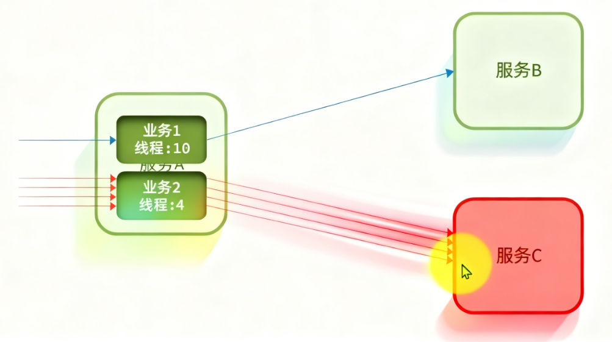
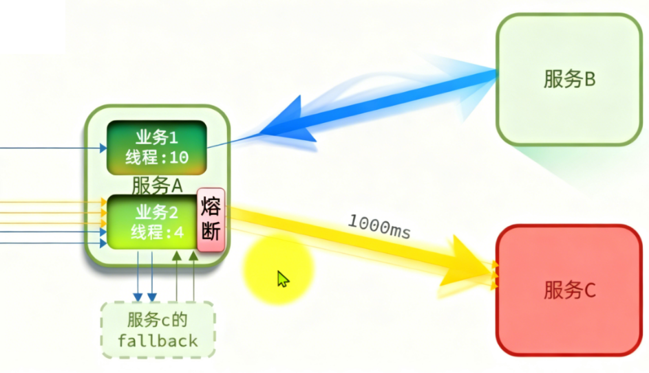

## 雪崩问题产生的原因是什么？
+ 微服务互相调用，服务提供者出现故障或阻塞
+ 服务调用者没有做好异常处理，导致自身故障
+ 调用链中的所有服务级联失败，导致整个集群故障
## 解决问题的思路有哪些
+ 尽量避免服务出现故障或阻塞
	·✔保证代码的健壮性
	·✔保证网络的畅通
	·✔能应对较高的并发请求
+ 服务调用者做好远程调用异常的后备方案，避免故障扩散

## 服务保护方案 -- 请求限流（保护服务提供者）

请求限流：限制访问微服务的并发量，避免服务因流量激增出现故障

## 服务保护方案 -- 线程隔离（服务调用的这一方）

线程隔离：也叫做舱壁模式，模拟船舱隔板的防水原理。通过限定每个业务能使用的线程数量将故障业务隔离，避免故障扩散

## 服务保护方案 -- 服务熔断

既然服务C挂了，那干嘛还要访问呢，为了避免资源浪费，直接拒绝访问挂掉的服务C

服务熔断：由**熔断器**统计请求的异常比例或慢调用比例，如果超出阈值则会**熔断**该业务，则拦截该接口的请求

失败处理：熔断器件，所有请求快速失败，全都走fallback逻辑
这样就提高了前端的响应速度

以上这些都让我一一实现吗，这显然是难，所以spring都给我们提供好了一些**服务保护技术**

**Sentinel、Hystrix**
+ 线程隔离：信号量隔离
+ 熔断策略：基于慢调用比例或异常比例
+ 限流：基于QPS，支持流量整形
+ Fallback：支持
+ 控制台：开箱即用，可配置规则、查看秒级监控、机器发现等
+ 配置方式：基于控制台，重启后失效

