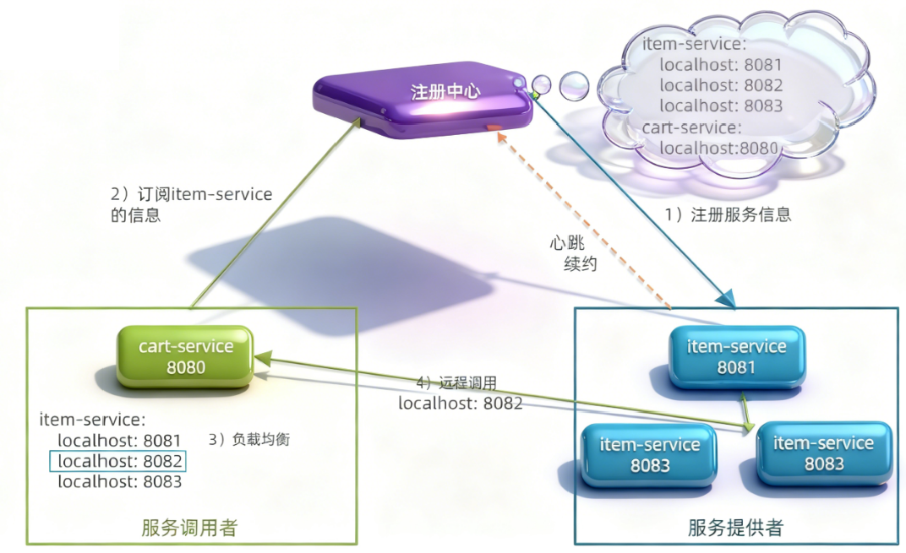
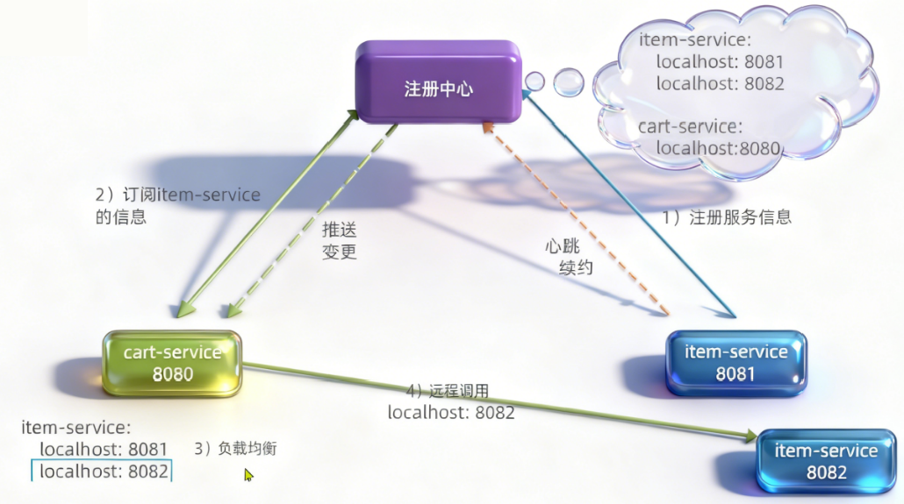

## 1.注册中心原理

服务治理中有**三个角色：**
+ 服务提供者：暴露服务接口，供其他服务调用
+ 服务调用者：调用其他服务提供的接口
+ 注册中心：记录并监控微服务各实例状态，推送服务变更信息

**解决了哪些问题**
+ 服务的调用者不知道该调用谁，只需要找到注册中心，他就会告诉你，额日期额还能告诉你一堆让你挑（==负载均衡==）

+ ==有的服务挂了呢==，服务（微服务）提供者不仅要注册到注册中心，还要与注册中心之间形成心跳续约（定期向注册中心发请求，证明我还活着），如果不跳了，注册中心也会把你从这个服务列表中去掉，注册中心会推送变更。

### 注册中心原理总结

消费者如何得知服务状态变更？
- 服务提供者通过心跳机制向注册中心报告自己的健康状态，当心跳异常时注册中心会将异常服务剔除，并通知订阅了该服务的消费者 
当提供者有多个实例时，消费者该选择哪一个？ 
- 消费者可以通过负载均衡算法，从多个实例中选择一个
**当然了，自己实现注册中心还是有难度的，我们不需要自己实现，因为有很多框架已经为我们实现了==Nacos注册中心==**

## 2.Nacos注册中心

### 2.1Nacos组件

他作为一个注册中心，肯定是一个独立的服务对不对，将来我们的微服务就会关联向他去注册自己。
**我们用Docker部署**
