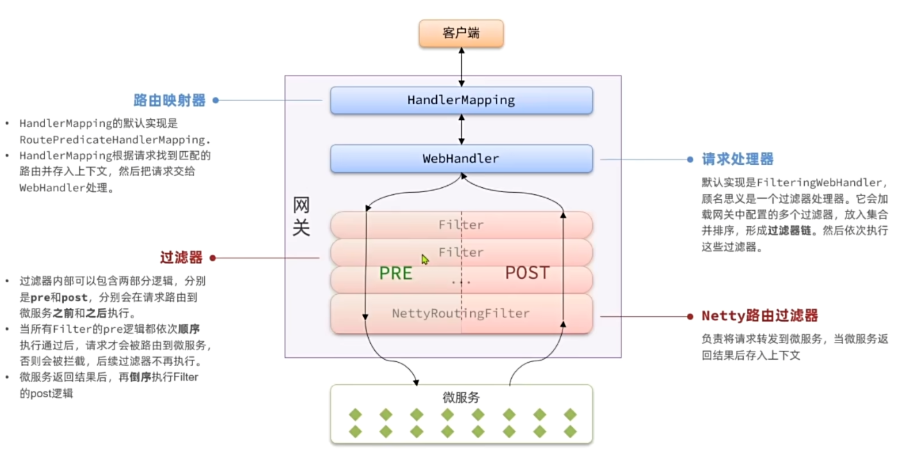

## 1.什么是网关
就是网络的关口，负责请求的**路由、转发、身份校验**
以前我们单体项目前端要向后端发起请求，很简单，直接发就行了

但是拆分成微服务之后就麻烦了：所以有了**网关**

就比如找人，你得有户口簿、打野才会给你开门，如果你不知道你要找的人在哪，大爷会带你去，这就叫做网关。

下面给你看更加专业的图

网关始终请求8080，这毋庸置疑，然后到了网关，他去判断前端请求的业务需要的是哪个微服务处理这个请求
+ 那么这个判断的过程就是请求的**路由**
+ 接下来网关就会将躯体的请求转发到具体的微服务了，这就是**路由转发**
+ 当然了，部署上线 后的服务里面可能有多个实例，形成**集群**，所以要在多个实例之间运用**负载均衡**
+ 所有的微服务信息就会**服务注册**到**注册中心**，它里面就会有多有的微服务信息
+ 当然网关也是一个微服务，启动之后也可以去注册中心**拉取**所有的服务地址
由于前端只知道网关地址，因此整个微服务对前端来讲，是隐藏起来的黑盒，这样在前端看来现在的后端跟原来的单体架构没什么区别，这时候微服务就不用向外界暴露自己的端口地址了，也是对后端的一种保护。


## 2. 配置路由规则
```yaml
spring:
  cloud:
    gateway:
      routes:
        - id: item  # 路由规则id，自定义，唯一
          uri: lb://item-service  # 路由目标微服务，lb代表负载均衡
          predicates:  # 路由断言，判断请求是否符合规则，符合则路由到目标
            - Path=/items/**  # 以请求路径判断，以/items开头则符合
        - id: xx
          uri: lb://xx-service
          predicates:
            - Path=/xx/**
```

## 3. 网关登录校验

### 执行顺序

网络请求JWT校验要在NettyRoutingFilter之前（PRE确保在路由转发之前进行校验）

### 自定义过滤器 GloablFilter

直接实现GloablFilter接口即可
```java
@Component  
public class MyGlobalFilter implements GlobalFilter, Ordered {  
  
    /*、  
    * 拦截所有请求  
    * exchange: 请求上下文, 里面有request和response等信息, 可以获取请求参数、响应结果等信息  
    * chain: 过滤器链，可以调用下一个过滤器  
    * 返回值: Mono<Void>: 表示异步处理，返回Mono.empty()表示处理完成  
    * 这里返回chain.filter(exchange)表示继续处理下一个过滤器,实现了共享请求参数和响应结果  
     */    @Override  
    public Mono<Void> filter(ServerWebExchange exchange, GatewayFilterChain chain) {  
        // TODO 模拟登录校验逻辑  
        HttpHeaders headers = exchange.getRequest().getHeaders();  
        System.out.println("headers = " + headers);  
        //放心  
        return chain.filter(exchange);  
    }  
  
    /*‘  
    * 优先级，数字越小越优先  
    * 实现了Ordered接口，表示优先级  
     */    @Override  
    public int getOrder() { //优先级，数字越小越优先，Ordered.HIGHEST_PRECEDENCE表示最高优先级  
        return Ordered.HIGHEST_PRECEDENCE;  
    }  
}
```


> [!NOTE] PS:从网关到微服务的用户传递
> Spring Boot自动装配它不仅仅是面试的时候能用到，在实际的开发中也有着重要作用，就好比如，想让每个微服务都获取到用户信息，可以在Common下定义一个SpringMVC拦截器，要想使拦截器生效，需要配置spring.factories的扫描包，然后，最重要的是在配置类里面加上@ConditionalOnClass(DispatcherServlet.class)注解，这样才能实现拦截器。


## 4. 在微服务之间传递用户信息

