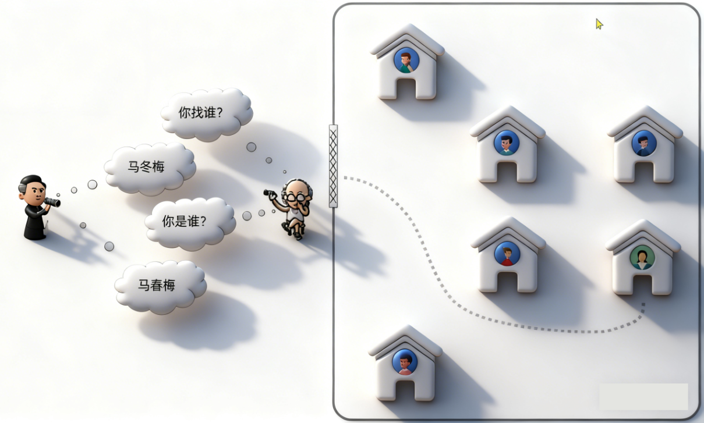

## 1.什么是网关
就是网络的关口，负责请求的**路由、转发、身份校验**
以前我们单体项目前端要向后端发起请求，很简单，直接发就行了

但是拆分成微服务之后就麻烦了：所以有了**网关**

就比如找人，你得有户口簿、打野才会给你开门，如果你不知道你要找的人在哪，大爷会带你去，这就叫做网关。

下面给你看更加专业的图

网关始终请求8080，这毋庸置疑，然后到了网关，他去判断前端请求的业务需要的是哪个微服务处理这个请求
+ 那么这个判断的过程就是请求的**路由**
+ 接下来网关就会将躯体的请求转发到具体的微服务了，这就是**路由转发**
+ 当然了，部署上线 后的服务里面可能有多个实例，形成**集群**，所以要在多个实例之间运用**负载均衡**
+ 所有的微服务信息就会**服务注册**到**注册中心**，它里面就会有多有的微服务信息
+ 当然网关也是一个微服务，启动之后也可以去注册中心**拉取**所有的服务地址
由于前端只知道网关地址，因此整个微服务对前端来讲，是隐藏起来的黑盒，这样在前端看来现在的后端跟原来的单体架构没什么区别，这时候微服务就不用向外界暴露自己的端口地址了，也是对后端的一种保护。

### 配置路由规则

