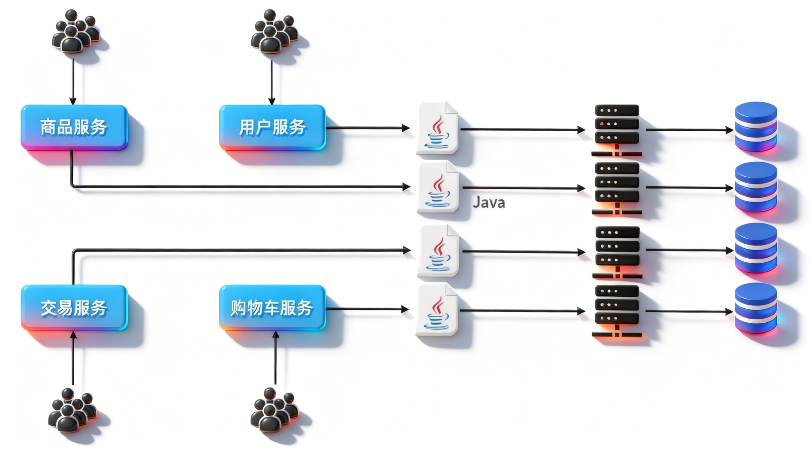
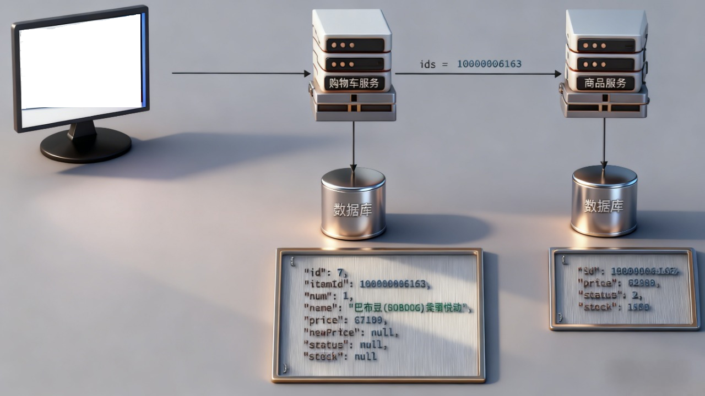

## 1.单体架构

**把所有业务功能集成在以哦个项目中开发，打成一个包部署**
优点：
+ 部署简单
+ 部署成本低
缺点：
+ 团队协作太难了
+ 系统发布效率低
+ 系统可用性差（线上运行，有些并发量搞，如果部署在一台服务器上，可能资源耗尽，等待释放，用户体验差）
**某一个线程并发量太高，就吃完了Tomcat的资源，当访问其他接口的时候就会出现看卡顿/延迟现象**

==总结：单体架构适合开发功能简单，规模较小的项目。==

## 2.微服务

**把单个架构中的功能模块拆分为多个独立项目**

+ 粒度小
+ 团队自治
+ 服务自治
==拆分为多个小的模块之后，编译速度大幅度提高，每个服务独立在一个服务器上，解决了系统可用性差问题，数据库也是隔离的每个服务独立的，避免了高并发访问时的影响其他服务了。==


## 3.微服务技术栈SpringCloud

### 3.1单体拆分成微服务

有纵向拆分和横向拆分
我这里就给大家展示纵向拆分，具体怎么拆分是要看具体的项目的
+ 首先创建一个module
+ 拆分可以是对某个服务进行拆分，从数据库再到整体的业务，要做到：**高内聚，低耦合**
+ 像大型项目--==淘宝==，就是一个project一个project来管理各个服务，实现了**低耦合**
+ 注意拆分出来的每个模块都要配置好依赖，注意端口不要冲突吗，==微服务名称不要冲突==这点比较麻烦，需要细心查看，否则扫描包的时候可能会报错
+ 注意数据库在真实的企业开发中，是一个微服务对应一个数据库容器的，但是这里考虑到资源问题，我直接使用不同的 database 作为隔离


> [!NOTE] 注意
>**在做拆分的时候有些业务不完整，可以先去掉/注释掉**
虽然两个服务的在物理上已经没有关系，完全分割开了，这时候两个服务是没办法调用别的服务的


### 3.2远程调用

**虽然物理上隔开了，但是网络上还是相通的，那为什么我们不能通过网络取请求这些数据呢**
**一旦微服务进行了拆分，数据产生了隔离，服务之间也产生了隔离，这个时候没办法像以前一样去本地调用了==要进行数据查询，查询别人的数据，就必须通过网络调用==**


#### 网络调用怎么做呢？

**可以像前端想后端发起一个网络请求一样，用java代码去使用网络请求**
1. 在启动类创建RestTemplate实例
```java
@Bean  
public RestTemplate restTemplate() {  
    return new RestTemplate();  
}
```
2. 