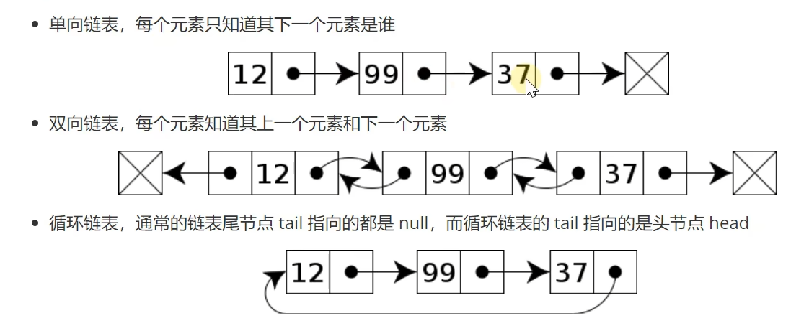

可以分类为


### 性能

不是随机访问，时间复杂度 O(N)

但是插入或删除性能比数组高 
+ 起始位置O(1)
+ 结束位置，知道tail尾节点O(1)，不知道O(N)
+ 中间，根据index查找时间 + O(1)

单向链表代码实现
```java
public class SinglyLinkedList { //单链表整体  
    private Node head =  null;  
  
    private static class Node { //单链表节点类（内部类，对外隐藏实现细节）  
        int value;  
        Node next;  
  
        public Node(int value, Node next) { //有参构造，为了给节点赋初值  
            this.value = value;  
            this.next = next;  
        }  
    }  
  
    public void addFirst(int  value) {  
        //1.链表为空  
//        head = new Node(value,null);  
        //2.链表非空  
        head = new Node(value,head);  
  
    }  
}
```

### 遍历链表

```java
@Override  
    public Iterator<Integer> iterator() { //迭代器  
        return new Iterator<Integer>() {  
            Node p = head;  
  
            @Override  
            public boolean hasNext() { //是否有下一个元素  
                return p != null;  
            }  
  
            @Override  
            public Integer next() { //返回当前值，并指向下一个元素  
                int v = p.value;  
                p = p.next;  
                return v;  
            }  
        };  
    }  
  
    private static class Node { //单链表节点类（内部类，对外隐藏实现细节）  
        int value;  
        Node next;  
  
        public Node(int value, Node next) { //有参构造，为了给节点赋初值  
            this.value = value;  
            this.next = next;  
        }  
    }  
  
    public void addFirst(int  value) {  
        //1.链表为空  
//        head = new Node(value,null);  
        //2.链表非空  
        head = new Node(value,head);  
    }  
  
    public void loop1(Consumer<Integer> consumer) {  
        Node p = head;  
        while (p != null) {  
            consumer.accept(p.value);  
            p = p.next;  
        }  
    }  
  
    public void loop2(Consumer<Integer> consumer) {  
        for (Node p = head; p != null; p = p.next) {  
            consumer.accept(p.value);  
        }  
    }
```

**为什么有的类加 static 有的类不加

匿名内部类（没有名字）

经验：当某一个内部类使用了外部类的成员变量时，就不能给它加 static
		跟外部没联系才能加 static

### 尾部添加
分两步
```java
private Node findLast(){ // 1.先找到最后一个节点  
    if (head == null){ //链表为空  
        return null;  
    }  
  
    Node p;  
    for (p = head; p.next != null; p = p.next) {  
  
    }  
    return p;  
}  
  
public void addLast(int value) {  
    Node last = findLast();  
    if (last == null){  
        addFirst(value);  
        return;  
    }  
  
    last.next = new Node(value,null);  
}
```

### 根据索引获取值
也是分两个步骤
```java
private Node findNode(int index) { //1.找到指定位置的节点  
    int i = 0;  
    for (Node p = head; p != null; p = p.next) {  
        if (i == index) {  
            return p;  
        }  
        i++;  
    }  
    return null; //没找到  
}  
  
public int get(int index) { //2.获取指定位置的元素  
    Node node = findNode(index);  
    if (node == null) {  
        throw new IndexOutOfBoundsException("index:" + index);  
    }  
    return node.value;  
}
```

### 任意位置插入insert
```java
public void insert(int index, int value) {  
    if (index == 0){  
        addFirst(value);  
        return;  
    }  
      
    Node prev = findNode(index - 1); //1.找到上一个位置的节点  
    if (prev == null) {  
        throw new IndexOutOfBoundsException("index:" + index);  
    }  
    //创建新节点  
    prev.next = new Node(value,prev.next);  
}
```

### 删除节点（头删）


### 根据索引删除节点